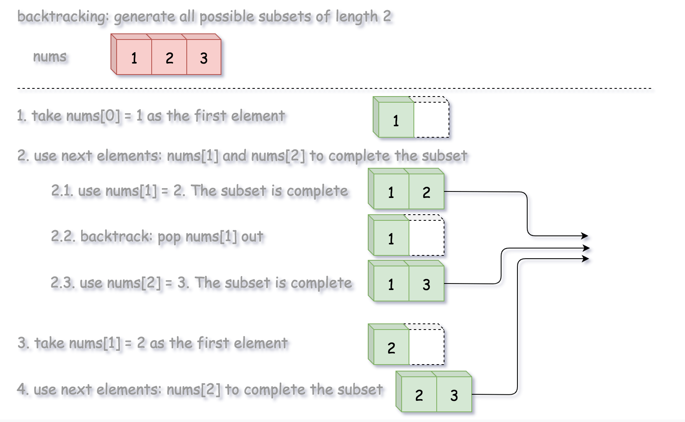

[#0078-subsets]
= 78. 子集

https://leetcode.cn/problems/subsets/[LeetCode - 78. 子集^]

给你一个整数数组 `nums` ，数组中的元素 *互不相同*。返回该数组所有可能的子集（幂集）。

解集 *不能* 包含重复的子集。你可以按 *任意顺序* 返回解集。

*示例 1：*

....
输入：nums = [1,2,3]
输出：[[],[1],[2],[1,2],[3],[1,3],[2,3],[1,2,3]]
....

*示例 2：*

....
输入：nums = [0]
输出：[[],[0]]
....

*提示：*

* `1 \<= nums.length \<= 10`
* `-10 \<= nums[i] \<= 10`
* `nums` 中的所有元素 *互不相同*

== 思路分析

这道题跟 xref:0090-subsets-ii.adoc[90. Subsets II] 类似：使用 xref:0000-25-subsets.adoc[Subsets 子集] 模式即可轻松解决。

以空集为起点，每次都在已有子集后面添加新元素来构建新的子集。处理完所有元素时，就生成了全部子集。

如果元素中有重复元素，那么就需要先对元素排序，遇到重复元素时，就不能对虽有已有元素都添加新元素了（因为前一个元素重复，那么对全部已有元素添加新元素就会有重复自己）。只需要针对上一次新添加的子集添加新元素即可，依次执行，直到有不重复元素则再次恢复成从全部子集添加元素。

image::images/0078-subsets-recursion.png[{image_attr}]

image::images/0078-subsets-combinations.png[{image_attr}]

image::images/0078-subsets-bitmask4.png[{image_attr}]

[[src-0078]]
[tabs]
====
一刷::
+
--
[{java_src_attr}]
----
include::{sourcedir}/_0078_Subsets.java[tag=answer]
----
--

二刷::
+
--
[{java_src_attr}]
----
include::{sourcedir}/_0078_Subsets_2.java[tag=answer]
----
--

三刷::
+
--
[{java_src_attr}]
----
include::{sourcedir}/_0078_Subsets_3.java[tag=answer]
----
--
====

== 参考资料

. https://leetcode.cn/problems/subsets/solutions/2059409/hui-su-bu-hui-xie-tao-lu-zai-ci-pythonja-8tkl/[78. 子集 - 三种写法：选或不选/枚举选哪个/二进制枚举^]
. https://leetcode.cn/problems/subsets/solutions/229569/c-zong-jie-liao-hui-su-wen-ti-lei-xing-dai-ni-gao-/[78. 子集 - C++，总结了回溯问题类型，带你搞懂回溯算法(大量例题)^]
. https://leetcode.cn/problems/subsets/solutions/420294/zi-ji-by-leetcode-solution/[78. 子集 - 官方题解^]
. https://leetcode.cn/problems/subsets/solutions/2566767/dai-ma-sui-xiang-lu-leetcode78zi-ji-by-c-yujc/[78. 子集 - 代码随想录^]
. https://leetcode.cn/problems/subsets/solutions/135419/hui-su-si-xiang-tuan-mie-pai-lie-zu-he-zi-ji-wen-t/[78. 子集 - 回溯思想团灭排列、组合、子集问题^]
