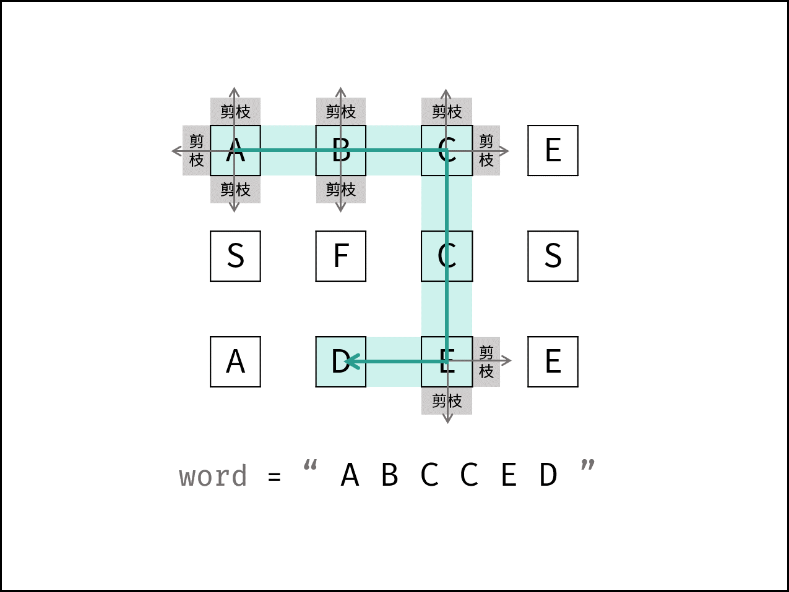

[#0079-word-search]
= 79. 单词搜索

https://leetcode.cn/problems/word-search/[LeetCode - 79. 单词搜索^]

给定一个 `m x n` 二维字符网格 `board` 和一个字符串单词 `word`。如果 `word` 存在于网格中，返回 `true` ；否则，返回 `false` 。

单词必须按照字母顺序，通过相邻的单元格内的字母构成，其中“相邻”单元格是那些水平相邻或垂直相邻的单元格。同一个单元格内的字母不允许被重复使用。

*示例 1：*

image::images/0079-01.jpg[{image_attr}]

....
输入：board = [["A","B","C","E"],["S","F","C","S"],["A","D","E","E"]], word = "ABCCED"
输出：true
....

*示例 2：*

image::images/0079-02.jpg[{image_attr}]

....
输入：board = [["A","B","C","E"],["S","F","C","S"],["A","D","E","E"]], word = "SEE"
输出：true
....

*示例 3：*

image::images/0079-03.jpg[{image_attr}]

....
输入：board = [["A","B","C","E"],["S","F","C","S"],["A","D","E","E"]], word = "ABCB"
输出：false
....

*提示：*

* `m == board.length`
* `n = board[i].length`
* `1 \<= m, n \<= 6`
* `1 \<= word.length \<= 15`
* `board` 和 `word` 仅由大小写英文字母组成

**进阶：**你可以使用搜索剪枝的技术来优化解决方案，使其在 `board` 更大的情况下可以更快解决问题？

== 思路分析

典型的回溯题目，常规剪枝技巧如下：

image:images/0079-02.png[{image_attr}]

除了常规剪枝技巧外，还有两个优化点：

. 先判断字母出现次数是否满足要求。网友戏称为可行性剪枝。
. 如果结尾字母出现次数更少，则将单词翻转，从尾部开始查找，这样可以更少回溯。网友戏称为顺序剪枝。

[[src-0079]]
[tabs]
====
一刷::
+
--
[{java_src_attr}]
----
include::{sourcedir}/_0079_WordSearch.java[tag=answer]
----
--

二刷::
+
--
[{java_src_attr}]
----
include::{sourcedir}/_0079_WordSearch_2.java[tag=answer]
----
--

三刷::
+
--
[{java_src_attr}]
----
include::{sourcedir}/_0079_WordSearch_3.java[tag=answer]
----
--
====

== 参考资料

. https://leetcode.cn/problems/word-search/solutions/2927294/liang-ge-you-hua-rang-dai-ma-ji-bai-jie-g3mmm/[79. 单词搜索 - 极致优化！代码击败接近 100%！^]
. https://leetcode.cn/problems/word-search/solutions/2361646/79-dan-ci-sou-suo-hui-su-qing-xi-tu-jie-5yui2/[79. 单词搜索 - 回溯，清晰图解^]
. https://leetcode.cn/problems/word-search/solutions/411749/shou-hua-tu-jie-79-dan-ci-sou-suo-dfs-si-lu-de-cha/[79. 单词搜索 - 「手画图解」回溯思路的形成与细节^]
. https://leetcode.cn/problems/word-search/solutions/411613/dan-ci-sou-suo-by-leetcode-solution/[79. 单词搜索 - 官方题解^]

