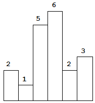
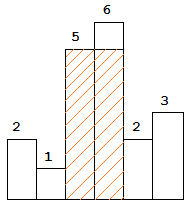
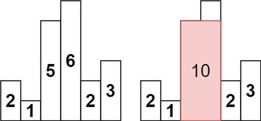
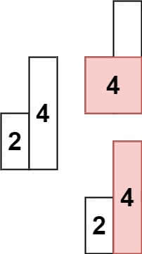

[#0084-largest-rectangle-in-histogram]
= 84. Largest Rectangle in Histogram

{leetcode}/problems/largest-rectangle-in-histogram/[LeetCode - Largest Rectangle in Histogram^]

Given _n_ non-negative integers representing the histogram's bar height where the width of each bar is 1, find the area of largest rectangle in the histogram.

*Example 1:*

[.small]#Above is a histogram where width of each bar is 1, given height = `[2,1,5,6,2,3]`.#

[.small]#The largest rectangle is shown in the shaded area, which has area = `10` unit.#

[subs="verbatim,quotes,macros"]
----
*Input:* [2,1,5,6,2,3]
*Output:* 10
----

*Example 2:*

----
Input: heights = [2,1,5,6,2,3]
Output: 10
Explanation: The above is a histogram where width of each bar is 1.
The largest rectangle is shown in the red area, which has an area = 10 units.
----

*Example 3:*

----
Input: heights = [2,4]
Output: 4
----

[[src-0084]]
[{java_src_attr}]
----
include::{sourcedir}/_0084_LargestRectangleInHistogram.java[tag=answer]
----

