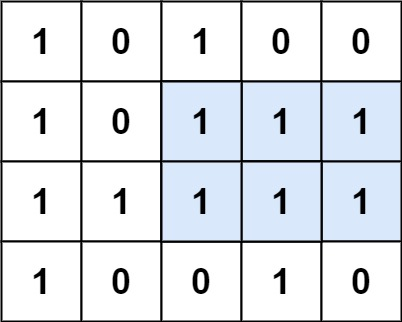

[#0085-maximal-rectangle]
= 85. 最大矩形

https://leetcode.cn/problems/maximal-rectangle/[LeetCode - 85. 最大矩形 ^]

给定一个仅包含 `0` 和 `1` 、大小为 `rows x cols` 的二维二进制矩阵，找出只包含 `1` 的最大矩形，并返回其面积。

*示例 1：*

....
输入：matrix = [
                ["1","0","1","0","0"],
                ["1","0","1","1","1"],
                ["1","1","1","1","1"],
                ["1","0","0","1","0"]
              ]
输出：6
解释：最大矩形如上图所示。
....

*示例 2：*

....
输入：matrix = [["0"]]
输出：0
....

*示例 3：*

....
输入：matrix = [["1"]]
输出：1
....

*提示：*

* `rows == matrix.length`
* `cols == matrix[0].length`
* `+1 <= row, cols <= 200+`
* `matrix[i][j]` 为 `0` 或 `1`

== 思路分析

还想暴力解决，奈何一团浆糊！

计算每一行的高度，利用这个高度，使用与 xref:0084-largest-rectangle-in-histogram.adoc[84. 柱状图中最大的矩形] 中单调栈的思路来解决这个问题！

image::images/0085-10.png[{image_attr}]

[[src-0085]]
[tabs]
====
一刷::
+
--
[{java_src_attr}]
----
include::{sourcedir}/_0085_MaximalRectangle.java[tag=answer]
----
--

// 二刷::
// +
// --
// [{java_src_attr}]
// ----
// include::{sourcedir}/_0085_MaximalRectangle_2.java[tag=answer]
// ----
// --
====

== 参考资料

. https://leetcode.cn/problems/maximal-rectangle/solutions/9535/xiang-xi-tong-su-de-si-lu-fen-xi-duo-jie-fa-by-1-8/[85. 最大矩形 - 详细通俗的思路分析，多解法^] -- 解决非常细致！
. https://leetcode.cn/problems/maximal-rectangle/solutions/535672/zui-da-ju-xing-by-leetcode-solution-bjlu/[85. 最大矩形 - 官方题解^]
. https://leetcode.cn/problems/maximal-rectangle/solutions/535898/python3-qian-zhui-he-dan-diao-zhan-ji-su-vkpp/[85. 最大矩形 - 前缀和+单调栈计算最大矩形^]
