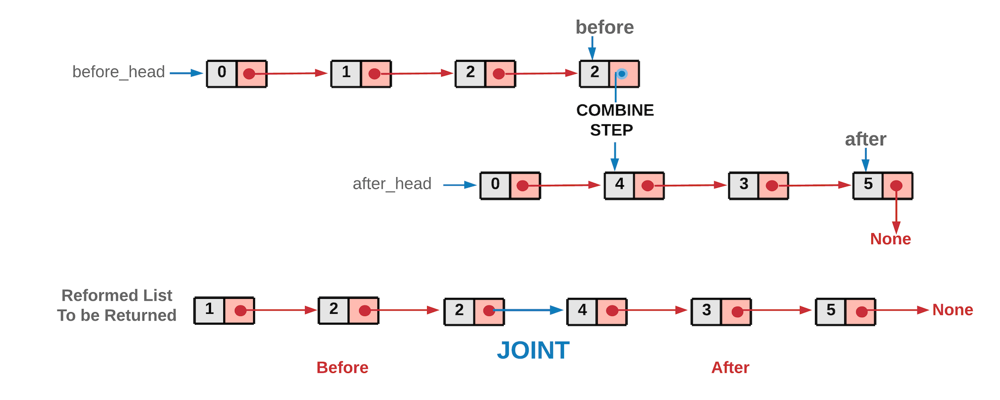

[#0086-partition-list]
= 86. Partition List

https://leetcode.com/problems/partition-list/[LeetCode - Partition List]

Given a linked list and a value `x`, partition it such that all nodes less than `x` come before nodes greater than or equal to `x`.

You should preserve the original relative order of the nodes in each of the two partitions.

.Example:
----
Input: head = 1->4->3->2->5->2, x = 3
Output: 1->2->2->4->3->5
----

== 解题分析

思路很简单，直接双指针维护大小两个队列就好。

image::images/0086-1.png[{image_attr}]

image::images/0086-2.png[{image_attr}]

image::images/0086-4.png[{image_attr}]

Given a linked list and a value _x_, partition it such that all nodes less than _x_ come before nodes greater than or equal to _x_.

You should preserve the original relative order of the nodes in each of the two partitions.

*Example:*

[subs="verbatim,quotes,macros"]
----
*Input:* head = 1->4->3->2->5->2, _x_ = 3
*Output:* 1->2->2->4->3->5
----

[[src-0086]]
[{java_src_attr}]
----
include::{sourcedir}/_0086_PartitionList.java[]
----

