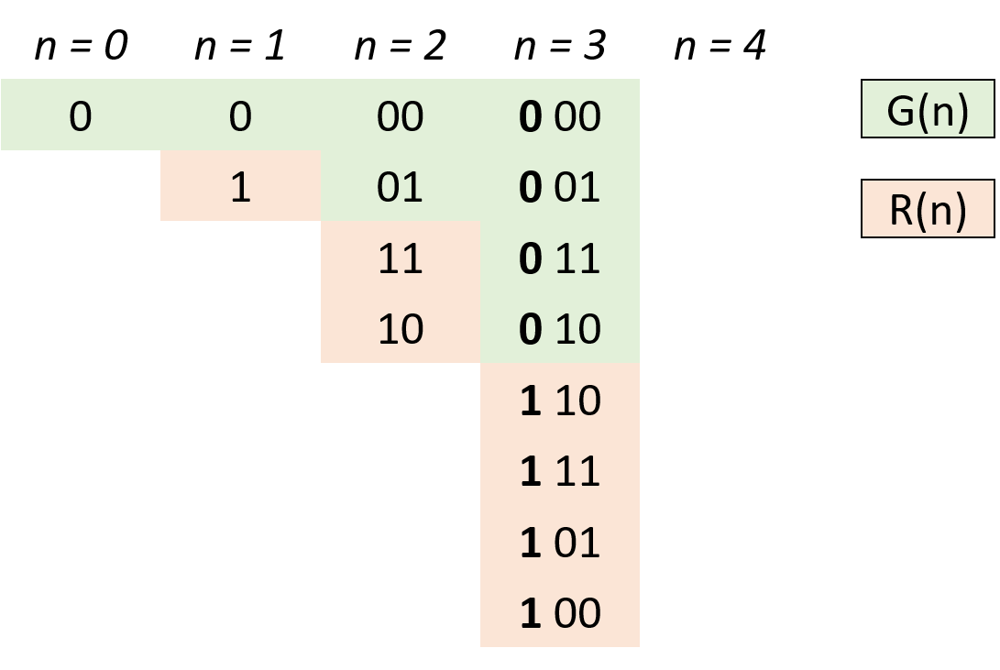

[#0089-gray-code]
= 89. Gray Code

{leetcode}/problems/gray-code/[LeetCode - Gray Code^]

The gray code is a binary numeral system where two successive values differ in only one bit.

Given a non-negative integer `n` representing the total number of bits in the code, print the sequence of gray code. A gray code sequence must begin with `0`.

.Example 1:
----
Input: 2
Output: [0,1,3,2]
Explanation:
00 - 0
01 - 1
11 - 3
10 - 2

For a given n, a gray code sequence may not be uniquely defined.
For example, [0,2,3,1] is also a valid gray code sequence.

00 - 0
10 - 2
11 - 3
01 - 1
----

.Example 2:
----
Input: 0
Output: [0]
Explanation: We define the gray code sequence to begin with 0.
A gray code sequence of n has size = 2^n^, which for n = 0 the size is 2^0^ = 1.
Therefore, for n = 0 the gray code sequence is [0].
----

== 解题分析

* 设 n 阶格雷码集合为 G(n)，则 G(n+1) 阶格雷码为：
** 给 G(n) 阶格雷码每个元素二进制形式前面添加 0，得到 G'(n) ；
** 设 G(n) 集合倒序（镜像）为 R(n)，给 R(n) 每个元素二进制形式前面添加 1，得到 R'(n)；
** G(n+1) = G'(n) ∪ R'(n) 拼接两个集合即可得到下一阶格雷码。
* 根据以上规律，可从 0 阶格雷码推导致任何阶格雷码。
* 代码解析：
** 由于最高位前默认为 00，因此 G'(n) = G(n)，只需在 res(即 G(n) )后添加 R'(n)即可；
** 计算 R'(n)：执行 `head = 1 << i` 计算出对应位数，以给 R(n) 前添加 1 得到对应 R'(n)；
** 倒序遍历 res(即 G(n) )：依次求得 R'(n) 各元素添加至 res 尾端，遍历完成后 res(即 G(n+1))。

这个题的解法跟 xref:0338-counting-bits.adoc[338. Counting Bits] 有异曲同工之妙！

[[src-0089]]
[tabs]
====
一刷::
+
--
[{java_src_attr}]
----
include::{sourcedir}/_0089_GrayCode.java[tag=answer]
----
--

二刷::
+
--
[{java_src_attr}]
----
include::{sourcedir}/_0089_GrayCode_2.java[tag=answer]
----
--
====

== 参考资料

. https://leetcode.cn/problems/gray-code/solutions/13637/gray-code-jing-xiang-fan-she-fa-by-jyd/?envType=study-plan-v2&envId=selected-coding-interview[89. 格雷编码 - 清晰图解^]
. https://en.wikipedia.org/wiki/Gray_code[Gray code - Wikipedia^]
. http://mathworld.wolfram.com/GrayCode.html[Gray Code -- from Wolfram MathWorld^]

