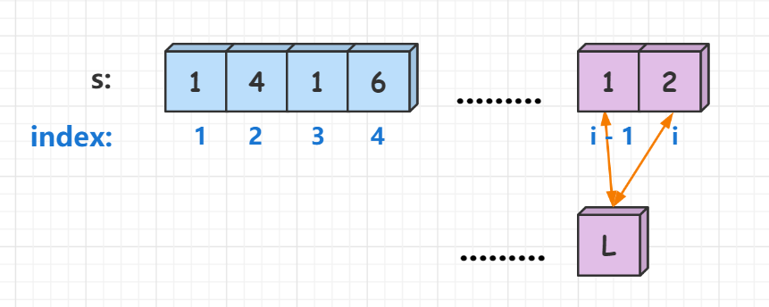

[#0091-decode-ways]
= 91. 解码方法

https://leetcode.cn/problems/decode-ways/[LeetCode - 91. 解码方法^]

一条包含字母 `A-Z` 的消息通过以下映射进行了 *编码* ：

`+"1" -> 'A'+` +
`+"2" -> 'B'+` +
`+...+` +
`+"25" -> 'Y'+` +
`+"26" -> 'Z'+`

然而，在 *解码* 已编码的消息时，你意识到有许多不同的方式来解码，因为有些编码被包含在其它编码当中（`2` 和 `5` 与 `25`）。

例如，`11106` 可以映射为：

* `AAJF` ，将消息分组为 `+(1, 1, 10, 6)+`
* `KJF` ，将消息分组为 `+(11, 10, 6)+`
* 消息不能分组为  `+(1, 11, 06)+` ，因为 `06` 不是一个合法编码（只有
"6" 是合法的）。

注意，可能存在无法解码的字符串。

给你一个只含数字的 *非空* 字符串 `s` ，请计算并返回 *解码* 方法的 *总数*。如果没有合法的方式解码整个字符串，返回 `0`。

题目数据保证答案肯定是一个 *32 位* 的整数。

*示例 1：*

....
输入：s = "12"
输出：2
解释：它可以解码为 "AB"（1 2）或者 "L"（12）。
....

*示例 2：*

....
输入：s = "226"
输出：3
解释：它可以解码为 "BZ" (2 26), "VF" (22 6), 或者 "BBF" (2 2 6) 。
....

*示例 3：*

....
输入：s = "06"
输出：0
解释："06" 无法映射到 "F" ，因为存在前导零（"6" 和 "06" 并不等价）。
....

*提示：*

* `+1 <= s.length <= 100+`
* `s` 只包含数字，并且可能包含前导零。

== 思路分析

image::images/0091-10.png[{image_attr}]

这道题可以使用动态规划算法解决。学习《算法导论》中"动态规划"的解题步骤，再推演几次这个解题方法。

从后向前，一个字符或者两个字符来判断是否可以编码成字母，然后递归调用直到字符串尽头。

[[src-0091]]
[tabs]
====
一刷::
+
--
[{java_src_attr}]
----
include::{sourcedir}/_0091_DecodeWays.java[tag=answer]
----
--

二刷::
+
--
[{java_src_attr}]
----
include::{sourcedir}/_0091_DecodeWays_2.java[tag=answer]
----
--

三刷(暴力破解)::
+
--
[{java_src_attr}]
----
include::{sourcedir}/_0091_DecodeWays_3a.java[tag=answer]
----
--

三刷(备忘录)::
+
--
[{java_src_attr}]
----
include::{sourcedir}/_0091_DecodeWays_3b.java[tag=answer]
----
--

三刷(动态规划)::
+
--
[{java_src_attr}]
----
include::{sourcedir}/_0091_DecodeWays_3c.java[tag=answer]
----
--
====

== 参考资料

. https://leetcode.cn/problems/decode-ways/solutions/1052885/jie-ma-fang-fa-tu-jie-dp-zui-qing-xi-yi-97hng/[91. 解码方法 - 解码方法 | 图解DP | 最清晰易懂的代码^]
. https://leetcode.cn/problems/decode-ways/solutions/730937/gong-shui-san-xie-gen-ju-shu-ju-fan-wei-ug3dd/[91. 解码方法 - 【宫水三叶】根据数据范围切换「递归」与「递推」^]
. https://leetcode.cn/problems/decode-ways/solutions/734344/jie-ma-fang-fa-by-leetcode-solution-p8np/[91. 解码方法 - 官方题解^]
