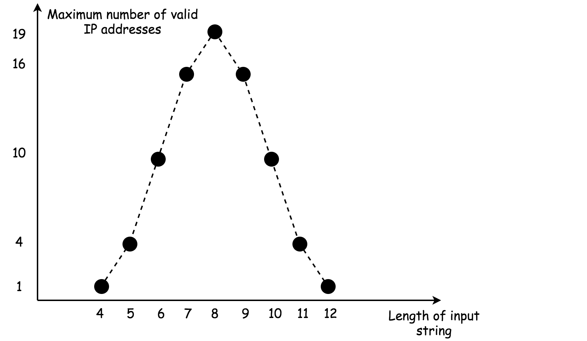

[#0093-restore-ip-addresses]
= 93. Restore IP Addresses

https://leetcode.com/problems/restore-ip-addresses/[LeetCode - Restore IP Addresses^]

Given a string containing only digits, restore it by returning all possible valid IP address combinations.

.Example:
----
Input: "25525511135"
Output: ["255.255.11.135", "255.255.111.35"]
----

== 解题分析

使用回溯，每次做一次字符串切割，如果切割的字符串符合 IP 的大小值，则前进一步，直到把字符串切割完毕并且正好切割四份。

== 参考资料

. https://leetcode-cn.com/problems/restore-ip-addresses/solution/fu-yuan-ipdi-zhi-by-leetcode/[复原IP地址 - 复原IP地址 - 力扣（LeetCode）^]

Given a string containing only digits, restore it by returning all possible valid IP address combinations.

*Example:*

[subs="verbatim,quotes,macros"]
----
*Input:* "25525511135"
*Output:* `["255.255.11.135", "255.255.111.35"]`
----

[[src-0093]]
[{java_src_attr}]
----
include::{sourcedir}/_0093_RestoreIPAddresses.java[tag=answer]
----

