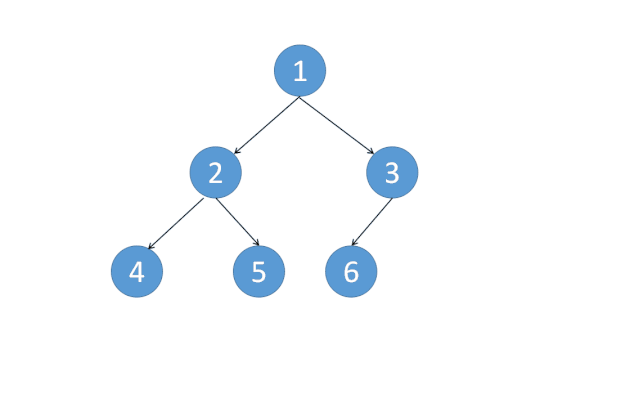

[#0094-binary-tree-inorder-traversal]
= 94. 二叉树的中序遍历

https://leetcode.cn/problems/binary-tree-inorder-traversal/[LeetCode - 94. 二叉树的中序遍历^]

给定一个二叉树的根节点 `root` ，返回 _它的 *中序* 遍历_。

*示例 1：*

image::images/0094-01.jpg[{image_attr}]

....
输入：root = [1,null,2,3]
输出：[1,3,2]
....

*示例 2：*

....
输入：root = []
输出：[]
....

*示例 3：*

....
输入：root = [1]
输出：[1]
....

*提示：*

* 树中节点数目在范围 `[0, 100]` 内
* `+-100 <= Node.val <= 100+`

*进阶:* 递归算法很简单，你可以通过迭代算法完成吗？

== 思路分析

迭代的方式，还不是很理解，还需要再思考思考。

迭代的办法就是用栈来模拟递归：有左节点就入栈；没有左节点就出栈，然后把有节点再入栈；以此类推。注意，入栈左右子树节点时，要把上下级的关联给斩断，否则会造成死循环。

TIP: 看官方题解，如果使用两层循环就不需要改变树的结构。自己想一想怎么实现？

image::images/0094-10.gif[{image_attr}]

“变形”莫里斯算法也是非常有趣：

NOTE: 详细介绍见： <<morris-traversal>>。

[[src-0094]]
[tabs]
====
一刷::
+
--
[{java_src_attr}]
----
include::{sourcedir}/_0094_BinaryTreeInorderTraversal.java[tag=answer]
----
--

二刷（递归）::
+
--
[{java_src_attr}]
----
include::{sourcedir}/_0094_BinaryTreeInorderTraversal_Recur.java[tag=answer]
----
--

二刷（栈）::
+
--
[{java_src_attr}]
----
include::{sourcedir}/_0094_BinaryTreeInorderTraversal_Stack.java[tag=answer]
----
--

三刷::
+
--
[{java_src_attr}]
----
include::{sourcedir}/_0094_BinaryTreeInorderTraversal_3.java[tag=answer]
----
--
====

== 参考资料

. https://leetcode.cn/problems/binary-tree-inorder-traversal/solutions/25220/yan-se-biao-ji-fa-yi-chong-tong-yong-qie-jian-ming/[94. 二叉树的中序遍历 - 颜色标记法，一种通用且简明的树遍历方法^]
. https://leetcode.cn/problems/binary-tree-inorder-traversal/solutions/96765/dong-hua-yan-shi-94-er-cha-shu-de-zhong-xu-bian-li/[94. 二叉树的中序遍历 - 动画演示+三种实现^]
. https://leetcode.cn/problems/binary-tree-inorder-traversal/solutions/412886/er-cha-shu-de-zhong-xu-bian-li-by-leetcode-solutio/[94. 二叉树的中序遍历 - 官方题解^]
