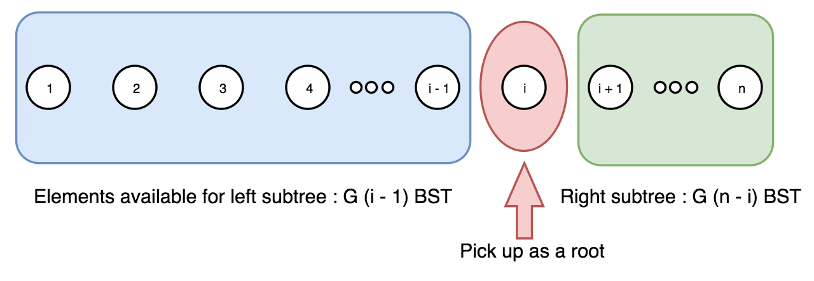
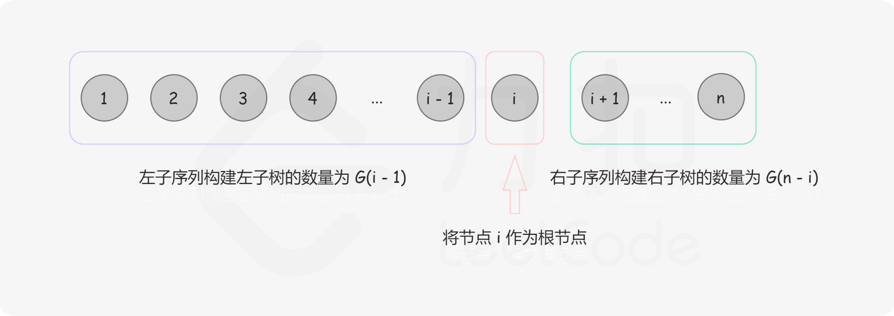

[#0096-unique-binary-search-trees]
= 96. Unique Binary Search Trees

:stem: latexmath

https://leetcode.com/problems/unique-binary-search-trees/[LeetCode - Unique Binary Search Trees]

Given _n_, how many structurally unique *BST's* (binary search trees) that store values __1 ... n__?

.Example:
[source]
----
Input: 3
Output: 5
Explanation:
Given n = 3, there are a total of 5 unique BST's:

   1         3     3      2      1
    \       /     /      / \      \
     3     2     1      1   3      2
    /     /       \                 \
   2     1         2                 3
----

给定一个有序序列 `1 ... n`，为了根据序列构建一棵二叉搜索树。我们可以遍历每个数字 `i`，将该数字作为树根，`1 ... (i-1)` 序列将成为左子树，`(i+1) ... n` 序列将成为右子树。于是，我们可以递归地从子序列构建子树。

在上述方法中，由于根各自不同，每棵二叉树都保证是独特的。

可见，问题可以分解成规模较小的子问题。因此，我们可以存储并复用子问题的解，而不是递归的（也重复的）解决这些子问题，这就是动态规划法。

给定序列 `1 ... n`，我们选出数字 `i` 作为根，则对于根 `i` 的不同二叉搜索树数量 latexmath:[F(i, n)]，是左右子树个数的笛卡尔积，如下图所示:

== 公式推到过程

[asciimath]
++++

G_{(n)} \text { 长度为 n 的序列能构成的不同二叉搜索树的个数 }

F_{(i, n)} \text { 以 i 为根、序列长度为 n 的不同二叉搜索树个数 (1≤i≤n)。 }

G_{n}=\sum_{i=1}^{n} F_{(i, n)} = F_{(1, n)} + F_{(2, n)} + ... + F_{(n-1, n)} + F_{(n, n)}

F_{(i, n)} = G_{(i-1)} \cdot G_{(n-i)}

G_{(n)} = \sum_{i=1}^n G_{(i-1)} \cdot G_{(n-i)} = G_{0} \cdot G_{(n-1)} + ... + G_{(n-1)} \cdot G_{0}

C_{n+1}=\frac{2(2 n+1)}{n+2} C_{n}   \text { 明安图数 或 卡特兰数}
++++

TIP: 注意：题目要是二叉搜索树！

没想到这里还埋了一个数学知识：Catalan number：

[asciimath]
++++
C_{0}=1 \quad \text { and } \quad C_{n+1}=\sum_{i=0}^{n} C_{i} C_{n-i} \quad \text { for } n \geq 0

C_{0}=1 \text { and } C_{1}=1

C_{n}=\sum_{i=1}^{n} C_{i-1} C_{n-i} \quad

C_{0}=1, \quad C_{n+1}=\frac{2(2 n+1)}{n+2} C_{n}
++++

附加题：参考资料显示，关于 Catalan number 有好多好玩的东西可以把玩。查资料把玩把玩。

== 参考资料

. https://en.wikipedia.org/wiki/Catalan_number[Catalan number - Wikipedia]
. https://leetcode-cn.com/problems/unique-binary-search-trees/solution/bu-tong-de-er-cha-sou-suo-shu-by-leetcode/[不同的二叉搜索树 - 不同的二叉搜索树 - 力扣（LeetCode）]
. https://blog.csdn.net/Hackbuteer1/article/details/7450250[Catalan数——卡特兰数_Hackbuteer1的专栏-CSDN博客]

Given _n_, how many structurally unique *BST's* (binary search trees) that store values 1 ... _n_?

*Example:*

[subs="verbatim,quotes,macros"]
----
*Input:* 3
*Output:* 5
*Explanation:
*Given _n_ = 3, there are a total of 5 unique BST's:

   1         3     3      2      1
    \       /     /      / \      \
     3     2     1      1   3      2
    /     /       \                 \
   2     1         2                 3
----

[[src-0096]]
[{java_src_attr}]
----
include::{sourcedir}/_0096_UniqueBinarySearchTrees.java[]
----

[{java_src_attr}]
----
include::{sourcedir}/_0096_UniqueBinarySearchTrees_2.java[]
----

