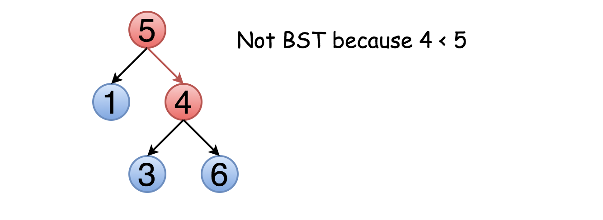
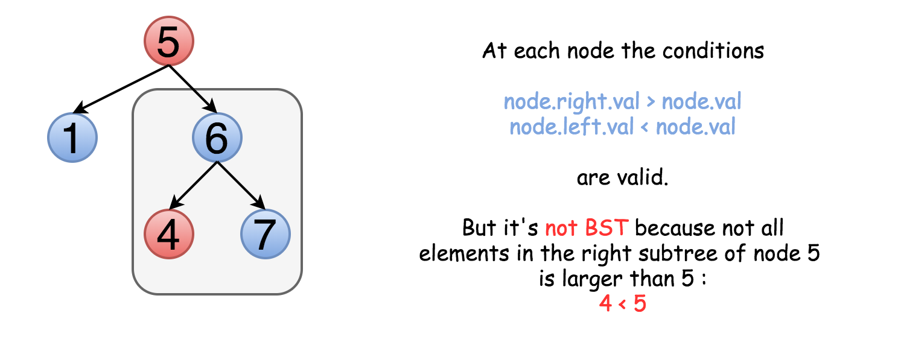

== 98. Validate Binary Search Tree

https://leetcode.com/problems/validate-binary-search-tree/[LeetCode - Validate Binary Search Tree]

思路很简单，利用搜索二叉树的定义，界定好树的上下界，然后递归比较就好。

Given a binary tree, determine if it is a valid binary search tree (BST).

Assume a BST is defined as follows:

* The left subtree of a node contains only nodes with keys *less than* the node's key.
* The right subtree of a node contains only nodes with keys *greater than* the node's key.
* Both the left and right subtrees must also be binary search trees.

 

*Example 1:*

[subs="verbatim,quotes,macros"]
----
    2
   / \
  1   3

*Input:* [2,1,3]
*Output:* true
----

*Example 2:*

[subs="verbatim,quotes,macros"]
----
    5
   / \
  1   4
     / \
    3   6

*Input:* [5,1,4,null,null,3,6]
*Output:* false
*Explanation:* The root node's value is 5 but its right child's value is 4.
----

