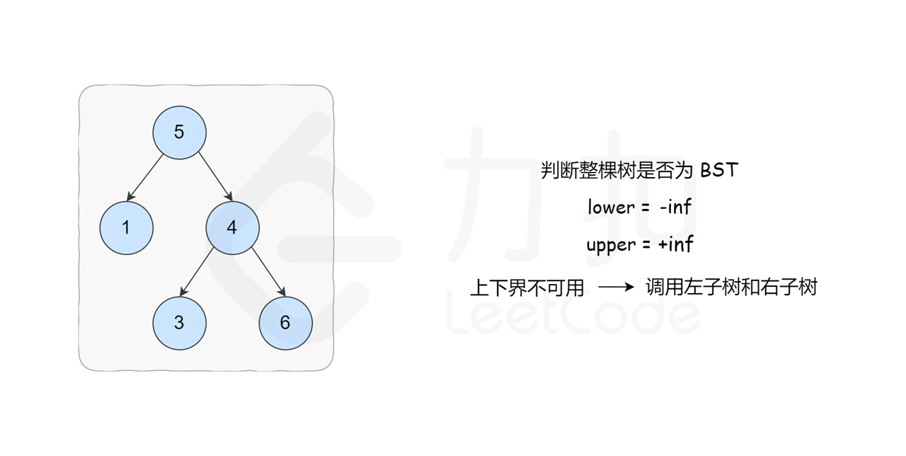
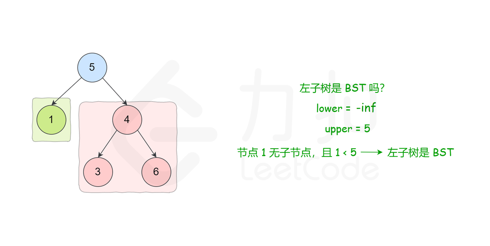
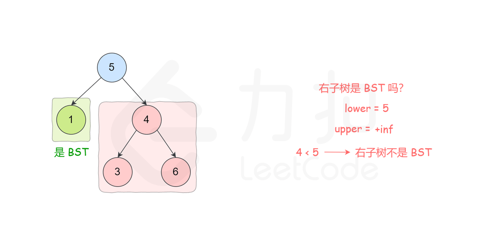
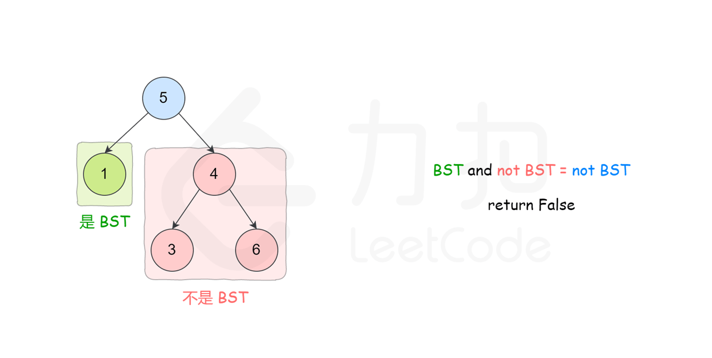

[#0098-validate-binary-search-tree]
= 98. Validate Binary Search Tree

https://leetcode.com/problems/validate-binary-search-tree/[LeetCode - Validate Binary Search Tree]

image::images/0098-1.png[{image_attr}]

image::images/0098-2.png[{image_attr}]

思路很简单，利用搜索二叉树的定义，界定好树的上下界，然后递归比较就好。

Given a binary tree, determine if it is a valid binary search tree (BST).

Assume a BST is defined as follows:

* The left subtree of a node contains only nodes with keys *less than* the node's key.
* The right subtree of a node contains only nodes with keys *greater than* the node's key.
* Both the left and right subtrees must also be binary search trees.

 

*Example 1:*

[subs="verbatim,quotes,macros"]
----
    2
   / \
  1   3

*Input:* [2,1,3]
*Output:* true
----

*Example 2:*

[subs="verbatim,quotes,macros"]
----
    5
   / \
  1   4
     / \
    3   6

*Input:* [5,1,4,null,null,3,6]
*Output:* false
*Explanation:* The root node's value is 5 but its right child's value is 4.
----

[[src-0098]]
[{java_src_attr}]
----
include::{sourcedir}/_0098_ValidateBinarySearchTree.java[tag=answer]
----

[{java_src_attr}]
----
include::{sourcedir}/_0098_ValidateBinarySearchTree_2.java[tag=answer]
----

直接使用“树形DP套路”+剪枝技巧，速度直接击败 100%。

这里有一点需要注意：最大值最小值用 `Long.MIN_VALUE` 和 `Long.MAX_VALUE`，这样可以防止单节点树 `Integer.MAX_VALUE` （最小值的单节点树应该也会有问题）造成的错误。

另外，查看了官方题解后，发现可以使用树的中序排列来检查（二叉搜索树中序排列是升序），这样跟前几天在牛客网上做的那个“发现二叉搜索树中的两个错误节点”的思路就一致了。回头尝试一下。

== 参考资料

. https://leetcode.cn/problems/validate-binary-search-tree/solutions/230256/yan-zheng-er-cha-sou-suo-shu-by-leetcode-solution/[98. 验证二叉搜索树 - 官方题解^]
