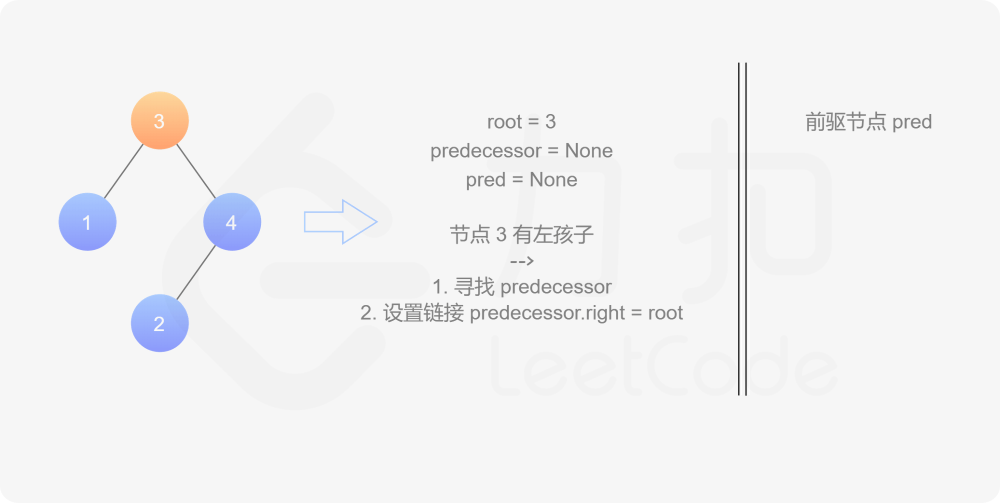
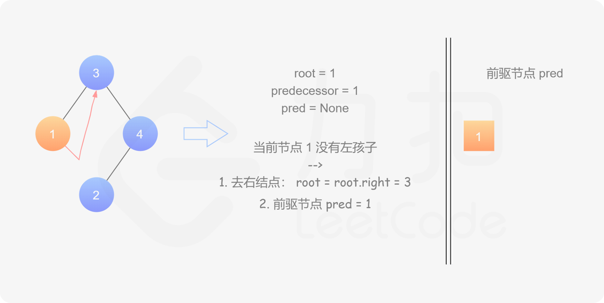
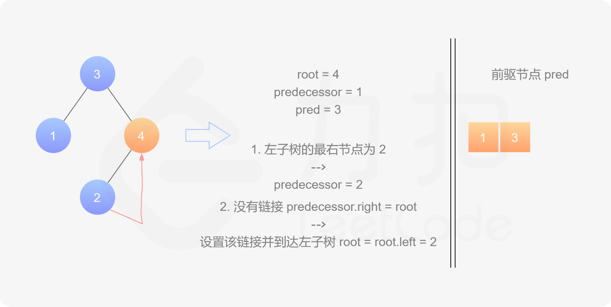
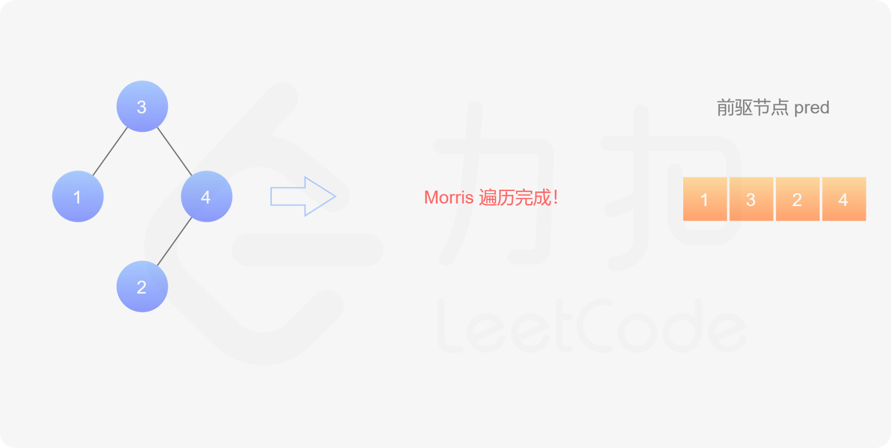

[#0099-recover-binary-search-tree]
= 99. Recover Binary Search Tree

https://leetcode.com/problems/recover-binary-search-tree/[LeetCode - Recover Binary Search Tree]

Two elements of a binary search tree (BST) are swapped by mistake.

Recover the tree without changing its structure.

*Example 1:*

[subs="verbatim,quotes,macros"]
----
*Input:* [1,3,null,null,2]

   1
  /
 3
  \
   2

*Output:* [3,1,null,null,2]

   3
  /
 1
  \
   2
----

*Example 2:*

[subs="verbatim,quotes,macros"]
----
*Input:* [3,1,4,null,null,2]

  3
 / \
1   4
   /
  2

*Output:* [2,1,4,null,null,3]

  2
 / \
1   4
   /
  3
----

*Follow up:*

* A solution using O(_n_) space is pretty straight forward.
* Could you devise a constant space solution?

== 思路分析

二叉搜索树中序遍历时，就是一个升序排列的序列，在遍历过程中，就可以检查序列的大小。要求使用 O(1) 的空间复杂度，那么只能使用 Morris 遍历。

[[src-0099]]
[{java_src_attr}]
----
include::{sourcedir}/_0099_RecoverBinarySearchTree.java[]
----

== 参考资料

. https://leetcode.cn/problems/recover-binary-search-tree/solutions/365385/hui-fu-er-cha-sou-suo-shu-by-leetcode-solution/[99. 恢复二叉搜索树 - 官方题解^]
