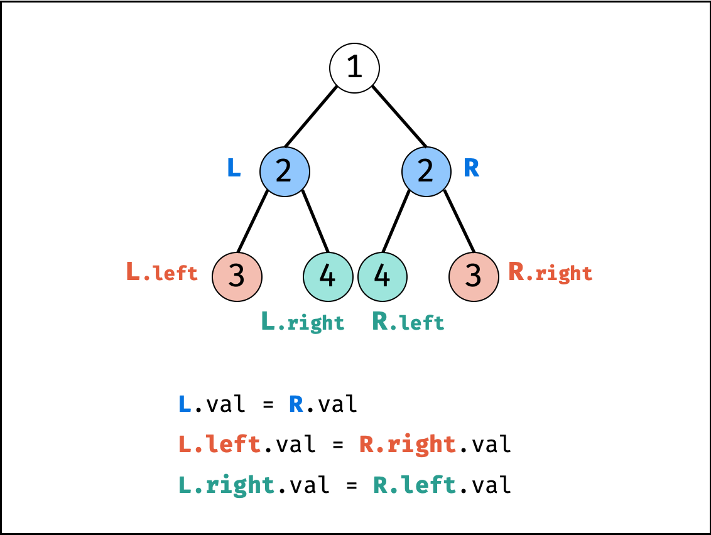
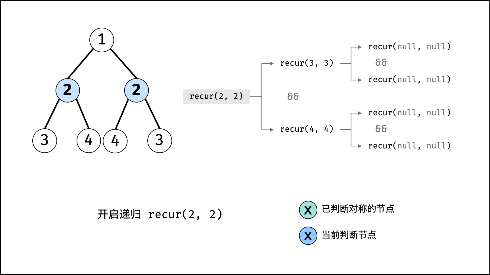
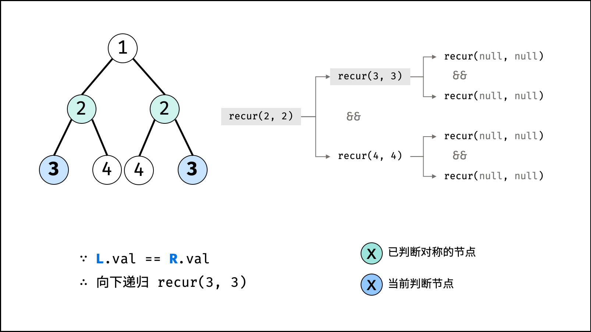
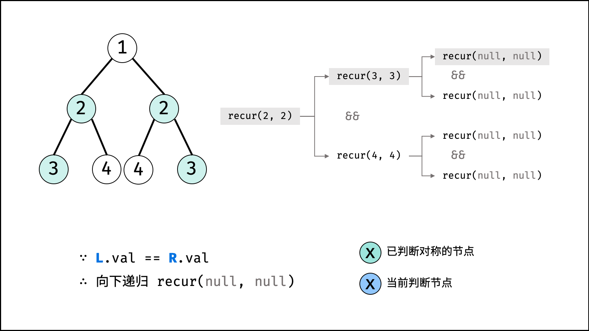
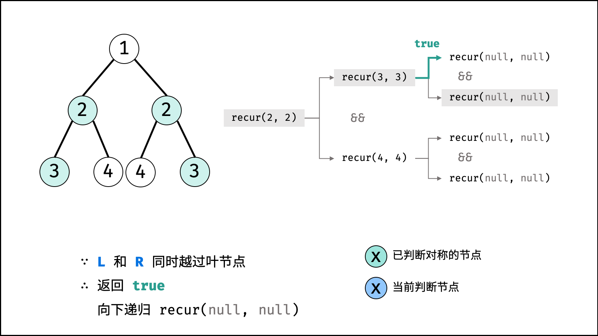
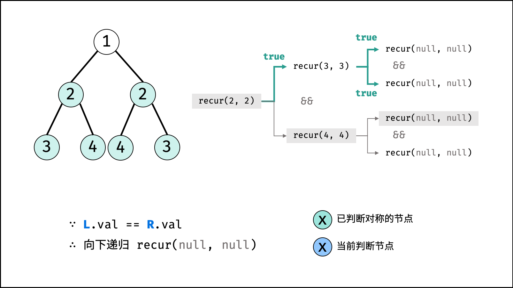
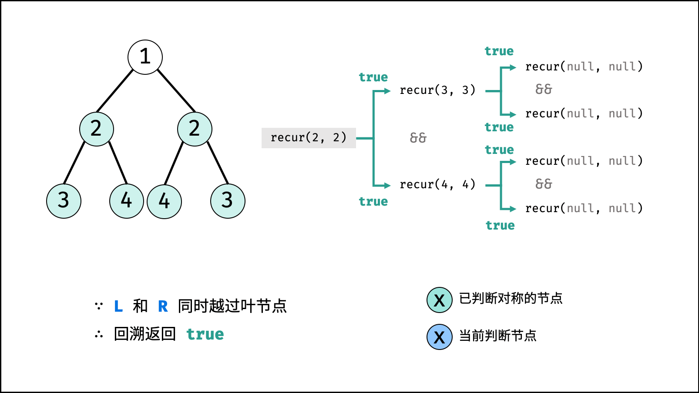
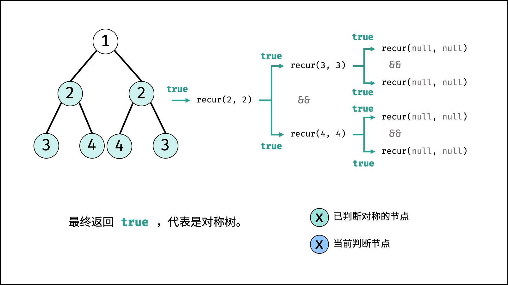

[#0101-symmetric-tree.adoc]
= 101. Symmetric Tree

https://leetcode.com/problems/symmetric-tree/[LeetCode - Symmetric Tree]

为什么执行结果显示递归更快？而不是队列呢？

Given a binary tree, check whether it is a mirror of itself (ie, symmetric around its center).

For example, this binary tree `[1,2,2,3,4,4,3]` is symmetric:

[subs="verbatim,quotes,macros"]
----
    1
   / \
  2   2
 / \ / \
3  4 4  3
----

 

But the following `[1,2,2,null,3,null,3]` is not:

[subs="verbatim,quotes,macros"]
----
    1
   / \
  2   2
   \   \
   3    3
----

 

*Note:*

Bonus points if you could solve it both recursively and iteratively.

== 思路分析

image::images/0101-07.png[]

[[src-0101]]
[{java_src_attr}]
----
include::{sourcedir}/_0101_SymmetricTree.java[]
----

[{java_src_attr}]
----
include::{sourcedir}/_0101_SymmetricTree_2.java[]
----

