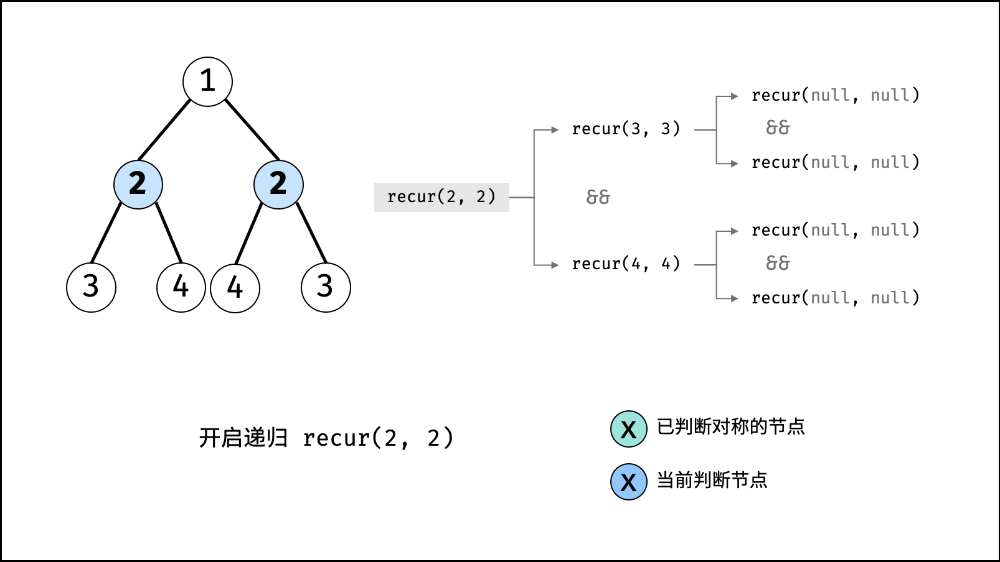
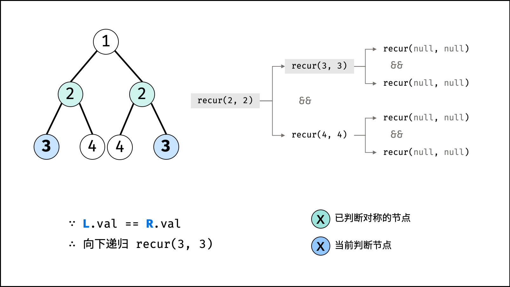
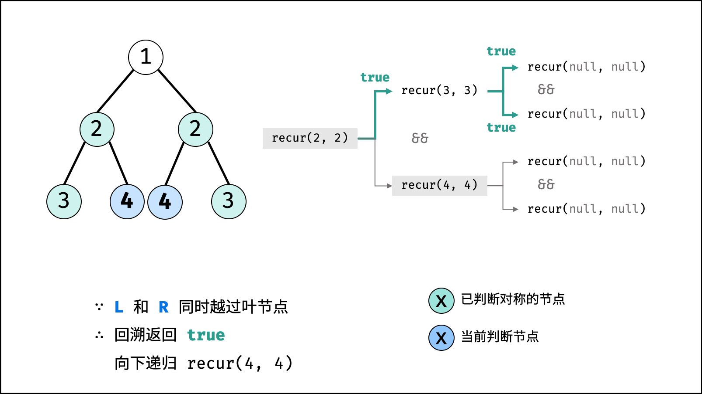
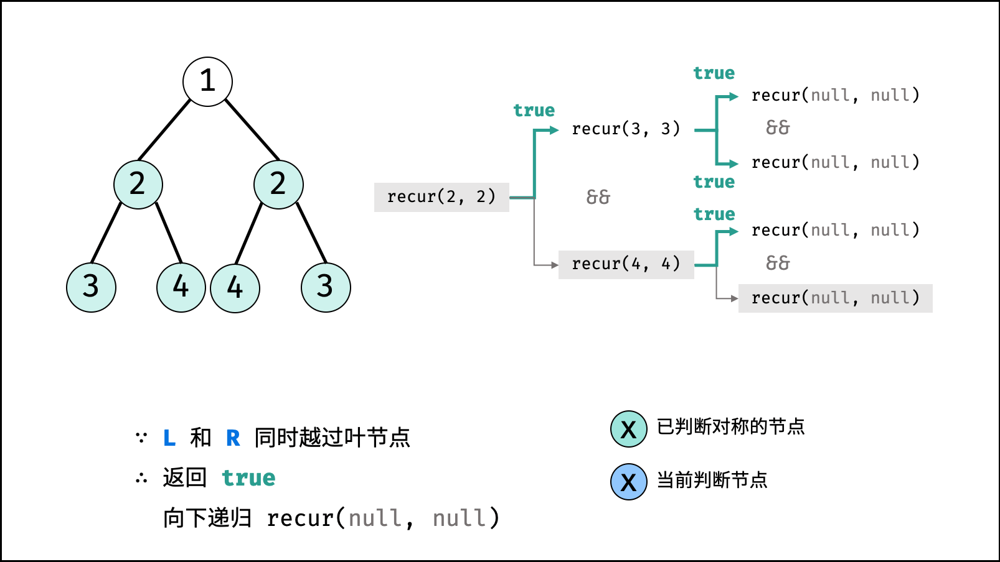
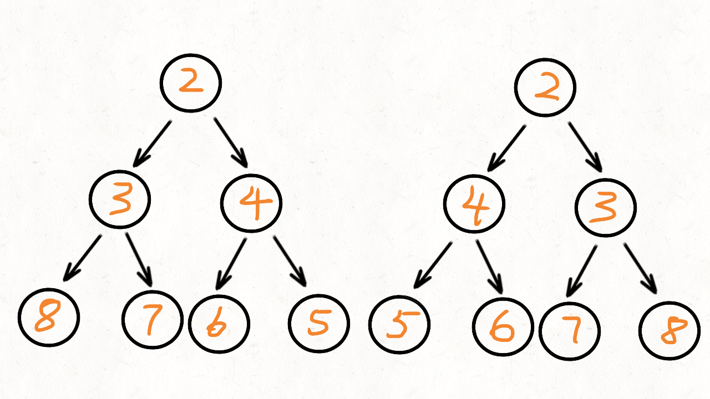
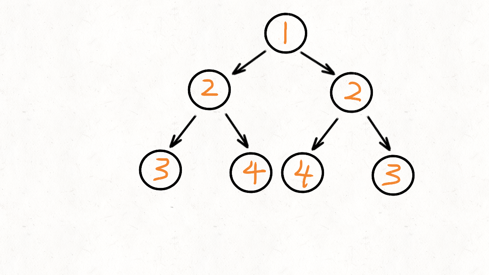

[#0101-symmetric-tree]
= 101. 对称二叉树

https://leetcode.cn/problems/symmetric-tree/[LeetCode - 101. 对称二叉树^]

给你一个二叉树的根节点 `root`， 检查它是否轴对称。

*示例 1：*

image::images/0101-01.png[{image_attr}]

....
输入：root = [1,2,2,3,4,4,3]
输出：true
....

*示例 2：*

image::images/0101-02.png[{image_attr}]

....
输入：root = [1,2,2,null,3,null,3]
输出：false
....

*提示：*

* 树中节点数目在范围 `[1, 1000]` 内
* `+-100 <= Node.val <= 100+`

**进阶：**你可以运用递归和迭代两种方法解决这个问题吗？

== 思路分析

为什么执行结果显示递归更快？而不是队列呢？

使用广度优先搜索解决对称问题。

image::images/0101-18.png[{image_attr}]

[[src-0101]]
[tabs]
====
一刷::
+
--
[{java_src_attr}]
----
include::{sourcedir}/_0101_SymmetricTree.java[tag=answer]
----
--

二刷::
+
--
[{java_src_attr}]
----
include::{sourcedir}/_0101_SymmetricTree_2.java[tag=answer]
----
--

三刷::
+
--
[{java_src_attr}]
----
include::{sourcedir}/_0101_SymmetricTree_3.java[tag=answer]
----
--

四刷::
+
--
[{java_src_attr}]
----
include::{sourcedir}/_0101_SymmetricTree_4.java[tag=answer]
----
--
====

== 参考资料

. https://leetcode.cn/problems/symmetric-tree/solutions/268109/dui-cheng-er-cha-shu-by-leetcode-solution/[101. 对称二叉树 - 官方题解^]
. https://leetcode.cn/problems/symmetric-tree/solutions/2361627/101-dui-cheng-er-cha-shu-fen-zhi-qing-xi-8oba/[101. 对称二叉树 - 深度优先搜索，清晰图解^]
. https://leetcode.cn/problems/symmetric-tree/solutions/46560/dong-hua-yan-shi-101-dui-cheng-er-cha-shu-by-user7/[101. 对称二叉树 - 动画演示+多种实现 101. 对称二叉树^]

