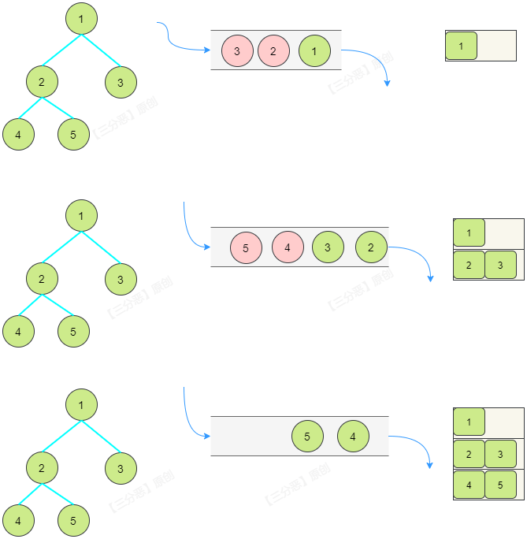

[#0102-binary-tree-level-order-traversal]
= 102. Binary Tree Level Order Traversal

{leetcode}/problems/binary-tree-level-order-traversal/[LeetCode - Binary Tree Level Order Traversal^]

这个题其实很简单，只要保持需要读取值的那一层的节点就可以了。

Given a binary tree, return the _level order_ traversal of its nodes' values. (ie, from left to right, level by level).

For example:

Given binary tree `[3,9,20,null,null,15,7]`,

[subs="verbatim,quotes,macros"]
----
    3
   / \
  9  20
    /  \
   15   7
----

return its level order traversal as:

[subs="verbatim,quotes,macros"]
----
[
  [3],
  [9,20],
  [15,7]
]
----

[[src-0102]]
[{java_src_attr}]
----
include::{sourcedir}/_0102_BinaryTreeLevelOrderTraversal.java[tag=answer]
----

[{java_src_attr}]
----
include::{sourcedir}/_0102_BinaryTreeLevelOrderTraversal_2.java[tag=answer]
----

TIP: TODO：还可以优化成只用一个队列对象，思考如何实现？

== 拓展题

. xref:0199-binary-tree-right-side-view.adoc[199. Binary Tree Right Side View]

== 参考资料

. https://cloud.tencent.com/developer/article/1875052[LeetCode通关：连刷三十九道二叉树，刷疯了！^]

