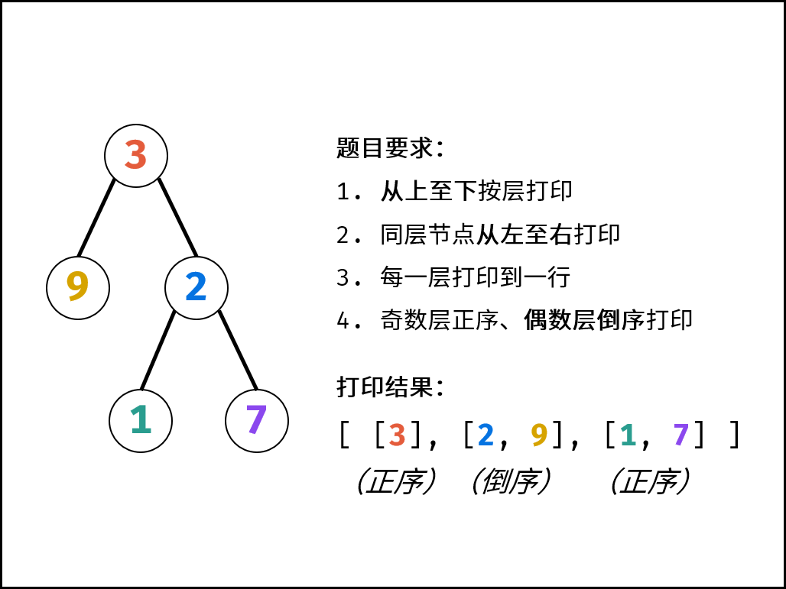

= 103. Binary Tree Zigzag Level Order Traversal

https://leetcode.com/problems/binary-tree-zigzag-level-order-traversal/[LeetCode - Binary Tree Zigzag Level Order Traversal]

思考题：思考一下如何使用深度优先来解决这个问题？

Given a binary tree, return the _zigzag level order_ traversal of its nodes' values. (ie, from left to right, then right to left for the next level and alternate between).

For example:

Given binary tree `[3,9,20,null,null,15,7]`,

[subs="verbatim,quotes,macros"]
----
    3
   / \
  9  20
    /  \
   15   7
----

return its zigzag level order traversal as:

[subs="verbatim,quotes,macros"]
----
[
  [3],
  [20,9],
  [15,7]
]
----

[[src-0103]]
[{java_src_attr}]
----
include::{sourcedir}/_0103_BinaryTreeZigzagLevelOrderTraversal.java[]
----

[{java_src_attr}]
----
include::{sourcedir}/_0103_BinaryTreeZigzagLevelOrderTraversal_2.java[]
----

