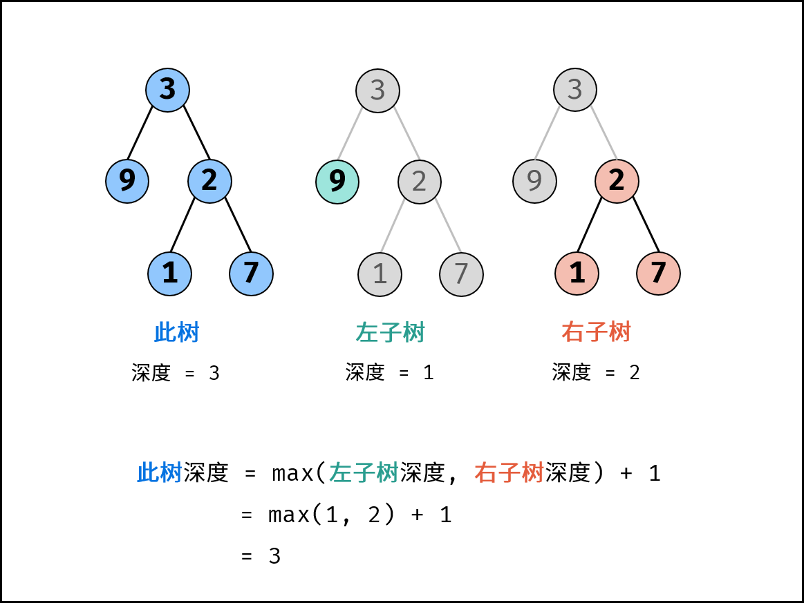

[#0104-maximum-depth-of-binary-tree]
= 104. Maximum Depth of Binary Tree

{leetcode}/problems/maximum-depth-of-binary-tree/[LeetCode - Maximum Depth of Binary Tree^]

Given a binary tree, find its maximum depth.

The maximum depth is the number of nodes along the longest path from the root node down to the farthest leaf node.

*Note:* A leaf is a node with no children.

*Example:*

Given binary tree `[3,9,20,null,null,15,7]`,

[subs="verbatim,quotes,macros"]
----
    3
   / \
  9  20
    /  \
   15   7
----

return its depth = 3.

== 思路分析

后根遍历，当然也可以使用BFS遍历。

[[src-0104]]
[tabs]
====
一刷::
+
--
[{java_src_attr}]
----
include::{sourcedir}/_0104_MaximumDepthOfBinaryTree.java[tag=answer]
----
--

二刷::
+
--
[{java_src_attr}]
----
include::{sourcedir}/_0104_MaximumDepthOfBinaryTree_2.java[tag=answer]
----
--

三刷::
+
--
[{java_src_attr}]
----
include::{sourcedir}/_0104_MaximumDepthOfBinaryTree_3.java[tag=answer]
----
--
====

思考题：尝试使用迭代方式来解决一下。

== 参考资料

. https://leetcode.cn/problems/maximum-depth-of-binary-tree/solutions/349250/er-cha-shu-de-zui-da-shen-du-by-leetcode-solution/[104. 二叉树的最大深度 - 官方题解^]
. https://leetcode.cn/problems/maximum-depth-of-binary-tree/solutions/2361697/104-er-cha-shu-de-zui-da-shen-du-hou-xu-txzrx/[104. 二叉树的最大深度 -后序或层序遍历，清晰图解^]
