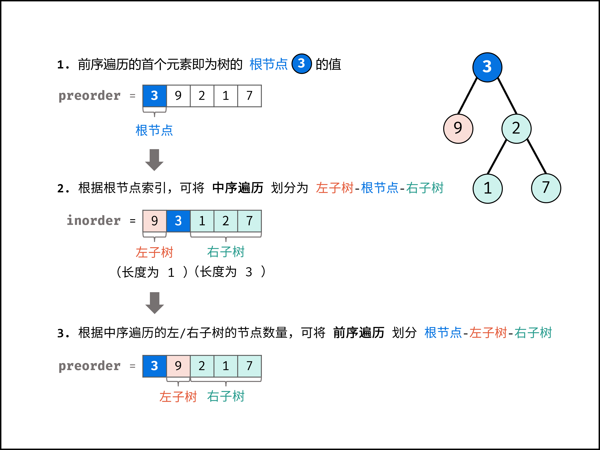
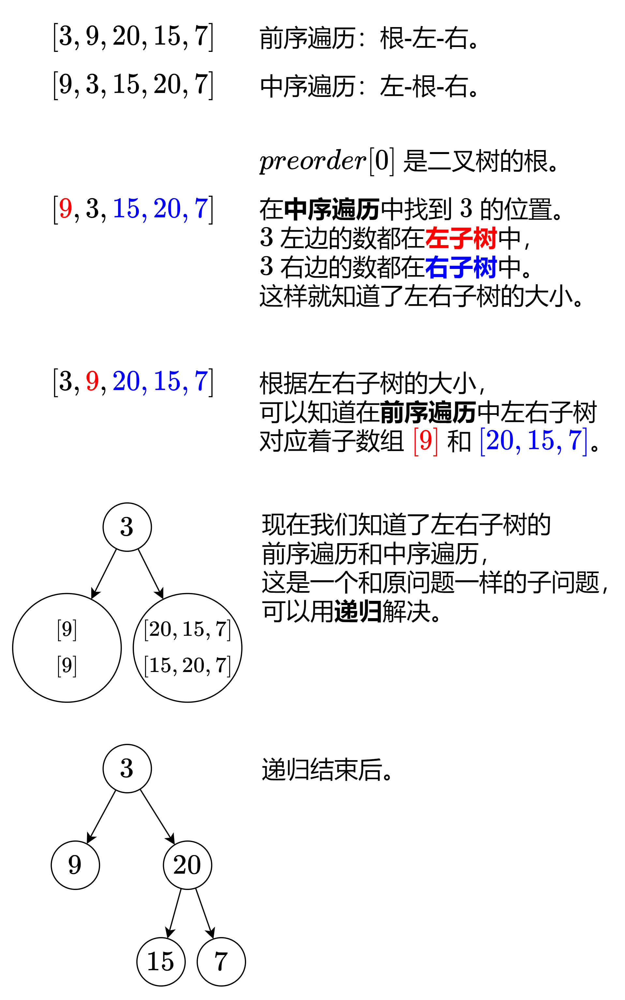

[#0105-construct-binary-tree-from-preorder-and-inorder-traversal]
= 105. 从前序与中序遍历序列构造二叉树

https://leetcode.cn/problems/construct-binary-tree-from-preorder-and-inorder-traversal/[LeetCode - 105. 从前序与中序遍历序列构造二叉树^]

给定两个整数数组 `preorder` 和 `inorder` ，其中 `preorder` 是二叉树的**先序遍历**，`inorder` 是同一棵树的**中序遍历**，请构造二叉树并返回其根节点。

*示例 1:*

image::images/0105-01.jpg[{image_attr}]

....
输入: preorder = [3,9,20,15,7], inorder = [9,3,15,20,7]
输出: [3,9,20,null,null,15,7]
....

*示例 2:*

....
输入: preorder = [-1], inorder = [-1]
输出: [-1]
....

*提示:*

* `+1 <= preorder.length <= 3000+`
* `inorder.length == preorder.length`
* `+-3000 <= preorder[i], inorder[i] <= 3000+`
* `preorder` 和 `inorder` 均 *无重复* 元素
* `inorder` 均出现在 `preorder`
* `preorder` *保证* 为二叉树的前序遍历序列
* `inorder` *保证* 为二叉树的中序遍历序列

== 思路分析

[[src-0105]]
[tabs]
====
一刷::
+
--
[{java_src_attr}]
----
include::{sourcedir}/_0105_ConstructBinaryTreeFromPreorderAndInorderTraversal.java[tag=answer]
----
--

二刷::
+
--
[{java_src_attr}]
----
include::{sourcedir}/_0105_ConstructBinaryTreeFromPreorderAndInorderTraversal_2.java[tag=answer]
----
--

二刷::
+
--
[{java_src_attr}]
----
include::{sourcedir}/_0105_ConstructBinaryTreeFromPreorderAndInorderTraversal_3.java[tag=answer]
----
--
====

== 思考题

迭代构建如何实现？ 参考： https://leetcode.cn/problems/construct-binary-tree-from-preorder-and-inorder-traversal/solutions/255811/cong-qian-xu-yu-zhong-xu-bian-li-xu-lie-gou-zao-9/[105. 从前序与中序遍历序列构造二叉树^]。

== 参考资料

. https://leetcode.cn/problems/construct-binary-tree-from-preorder-and-inorder-traversal/solutions/2646359/tu-jie-cong-on2-dao-onpythonjavacgojsrus-aob8/[105. 从前序与中序遍历序列构造二叉树 - 【图解】从 O(n^2^) 到 O(n)^]
. https://leetcode.cn/problems/construct-binary-tree-from-preorder-and-inorder-traversal/solutions/2361558/105-cong-qian-xu-yu-zhong-xu-bian-li-xu-4lvkz/[105. 从前序与中序遍历序列构造二叉树 - 分治，清晰图解^]
. https://leetcode.cn/problems/construct-binary-tree-from-preorder-and-inorder-traversal/solutions/255811/cong-qian-xu-yu-zhong-xu-bian-li-xu-lie-gou-zao-9/[105. 从前序与中序遍历序列构造二叉树 - 官方题解^]
. https://leetcode.cn/problems/construct-binary-tree-from-preorder-and-inorder-traversal/solutions/15244/xiang-xi-tong-su-de-si-lu-fen-xi-duo-jie-fa-by--22/[105. 从前序与中序遍历序列构造二叉树 - 详细通俗的思路分析，多解法^]
. https://leetcode.cn/problems/construct-binary-tree-from-preorder-and-inorder-traversal/solutions/8946/qian-xu-bian-li-python-dai-ma-java-dai-ma-by-liwei/[105. 从前序与中序遍历序列构造二叉树 - 利用前序遍历确定根结点，利用中序遍历分割左右子树^]

