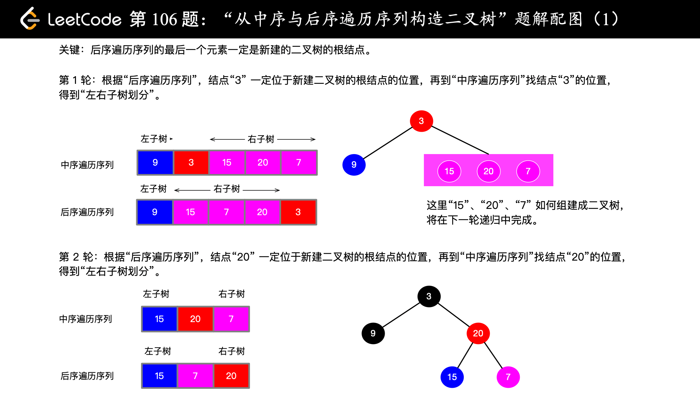
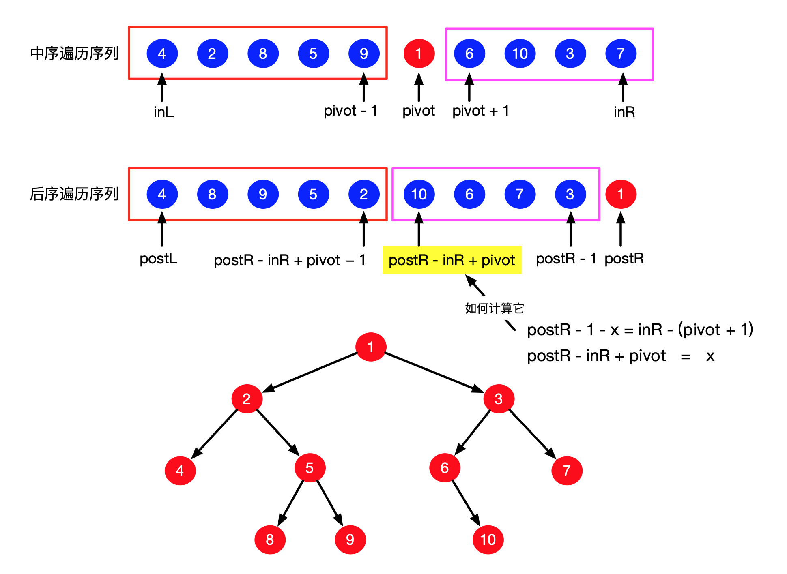
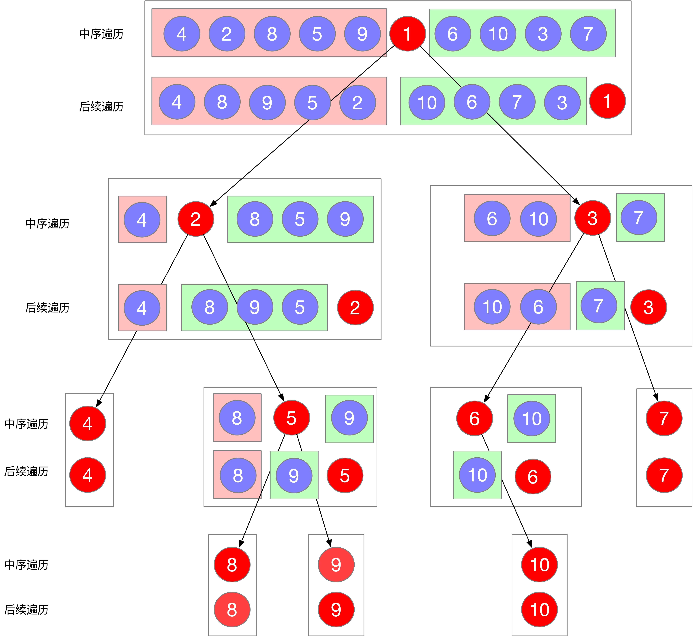

[#0106-construct-binary-tree-from-inorder-and-postorder-traversal]
= 106. Construct Binary Tree from Inorder and Postorder Traversal

https://leetcode.com/problems/construct-binary-tree-from-inorder-and-postorder-traversal/[LeetCode - Construct Binary Tree from Inorder and Postorder Traversal]

Given inorder and postorder traversal of a tree, construct the binary tree.

*Note:*

You may assume that duplicates do not exist in the tree.

For example, given

----
inorder = [9,3,15,20,7]
postorder = [9,15,7,20,3]
----

Return the following binary tree:

----
    3
   / \
  9  20
    /  \
   15   7
----

== 解题分析

使用递归，从底层向上构建整个树。

== 参考资料

. https://leetcode-cn.com/problems/construct-binary-tree-from-inorder-and-postorder-traversal/solution/hou-xu-bian-li-python-dai-ma-java-dai-ma-by-liwe-2/[分治法（Python、Java） - 从中序与后序遍历序列构造二叉树 - 力扣（LeetCode）]

[[src-0106]]
[{java_src_attr}]
----
include::{sourcedir}/_0106_ConstructBinaryTreeFromInorderAndPostorderTraversal.java[]
----

[{java_src_attr}]
----
include::{sourcedir}/_0106_ConstructBinaryTreeFromInorderAndPostorderTraversal_2.java[]
----

== 图解树的还原过程

图片来自： https://leetcode.cn/problems/construct-binary-tree-from-inorder-and-postorder-traversal/solutions/50561/tu-jie-gou-zao-er-cha-shu-wei-wan-dai-xu-by-user72/comments/396129

== 思考题

如何使用迭代来构建二叉树？参考： https://leetcode.cn/problems/construct-binary-tree-from-inorder-and-postorder-traversal/solutions/426738/cong-zhong-xu-yu-hou-xu-bian-li-xu-lie-gou-zao-14
