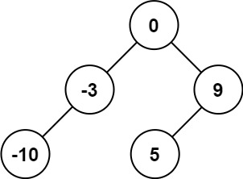

[#0108-convert-sorted-array-to-binary-search-tree]
= 108. 将有序数组转换为二叉搜索树

https://leetcode.cn/problems/convert-sorted-array-to-binary-search-tree/[LeetCode - 108. 将有序数组转换为二叉搜索树 ^]

给你一个整数数组 `nums` ，其中元素已经按 *升序* 排列，请你将其转换为一棵 平衡 二叉搜索树。

*示例 1：*

....
输入：nums = [-10,-3,0,5,9]
输出：[0,-3,9,-10,null,5]
解释：[0,-10,5,null,-3,null,9] 也将被视为正确答案：
....

*示例 2：*

image::images/0108-02.jpg[{image_attr}]

....
输入：nums = [1,3]
输出：[3,1]
解释：[1,null,3] 和 [3,1] 都是高度平衡二叉搜索树。
....

*提示：*

* `1 \<= nums.length \<= 10^4^`
* `-10^4^ \<= nums[i] \<= 10^4^`
* `nums` 按 *严格递增* 顺序排列

== 思路分析

这道题跟 xref:0109-convert-sorted-list-to-binary-search-tree.adoc[109. Convert Sorted List to Binary Search Tree] 类似。

代码还可以再简化一下。

[[src-0108]]
[tabs]
====
一刷::
+
--
[{java_src_attr}]
----
include::{sourcedir}/_0108_ConvertSortedArrayToBinarySearchTree.java[tag=answer]
----
--

// 二刷::
// +
// --
// [{java_src_attr}]
// ----
// include::{sourcedir}/_0108_ConvertSortedArrayToBinarySearchTree_2.java[tag=answer]
// ----
// --
====

== 参考资料
