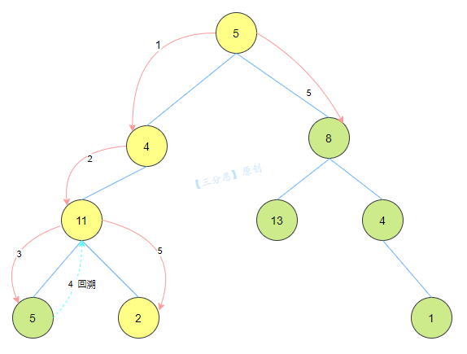

[#0112-path-sum]
= 112. Path Sum

https://leetcode.com/problems/path-sum/[LeetCode - Path Sum]

Given a binary tree and a sum, determine if the tree has a root-to-leaf path such that adding up all the values along the path equals the given sum.

*Note:* A leaf is a node with no children.

*Example:*

Given the below binary tree and `sum = 22`,

[subs="verbatim,quotes,macros"]
----
      *5*
     */* \
    *4*   8
   */*   / \
  *11*  13  4
 /  *\*      \
7    *2*      1
----

return true, as there exist a root-to-leaf path `5->4->11->2` which sum is 22.

== 解题分析

减去当前节点值的只，然后递归调用，到叶子节点和目标值相等即可。

注意把代码写简化点！

这道题和 xref:0129-sum-root-to-leaf-numbers.adoc[129. Sum Root to Leaf Numbers] 类似。

[[src-0112]]
[{java_src_attr}]
----
include::{sourcedir}/_0112_PathSum.java[tag=answer]
----

[{java_src_attr}]
----
include::{sourcedir}/_0112_PathSum_2.java[tag=answer]
----

很简单的一道题。本来是想找另外一道题（见 <<0112-additional-question>>），结果找到了这道题。

也可以利用回溯来解答。如图：

[#0112-additional-question]
== 思考题

给定一颗二叉树和一个整数 sum，求累加和为 sum 的最长路径长度。路径是指从某个节点往下，每次最多选择一个孩子节点或者不选所形成的节点链。

== 参考资料

. https://leetcode.cn/problems/path-sum/solutions/318487/lu-jing-zong-he-by-leetcode-solution/[112. 路径总和 - 官方题解^]
. https://leetcode.cn/problems/path-sum/solutions/319149/lu-jing-zong-he-de-si-chong-jie-fa-dfs-hui-su-bfs-/[112. 路径总和 - 四种解法：DFS、回溯、BFS、栈^]
