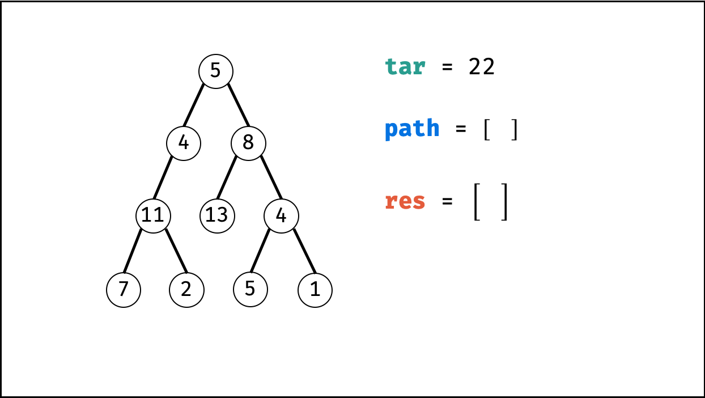
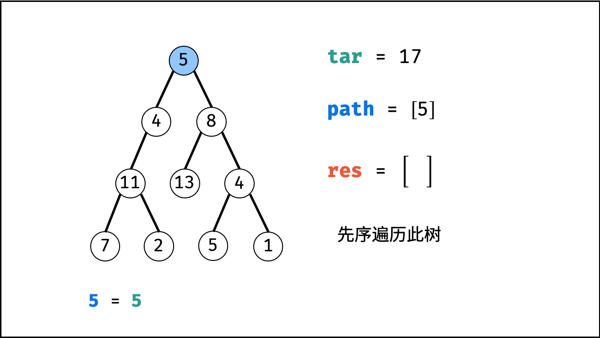
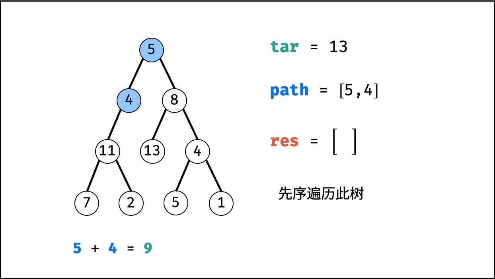
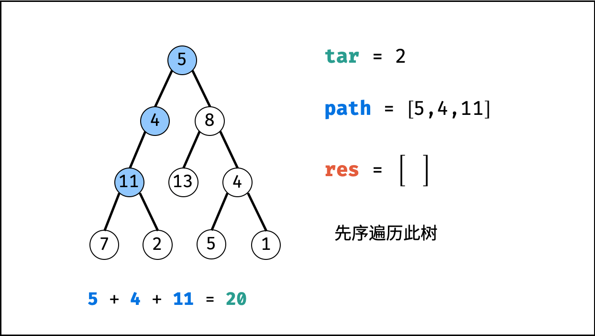
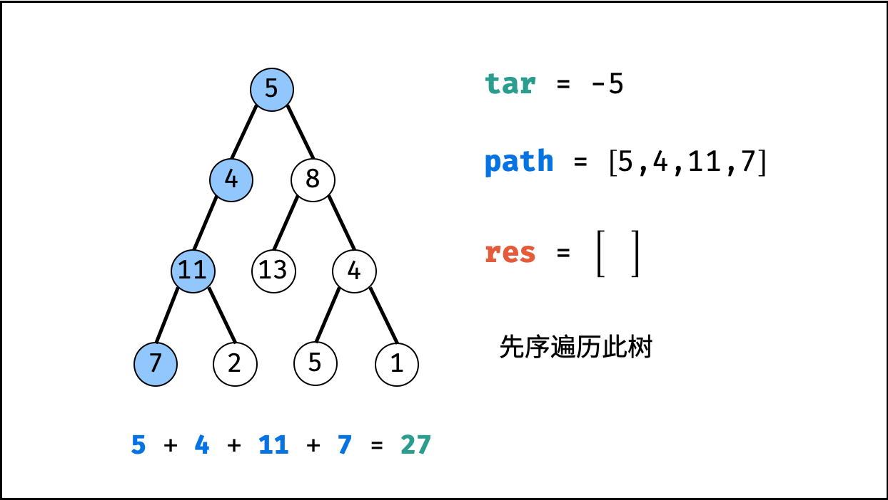
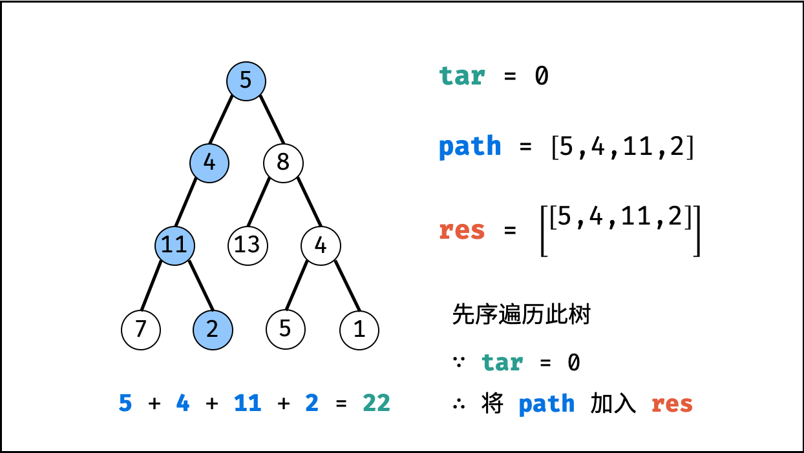
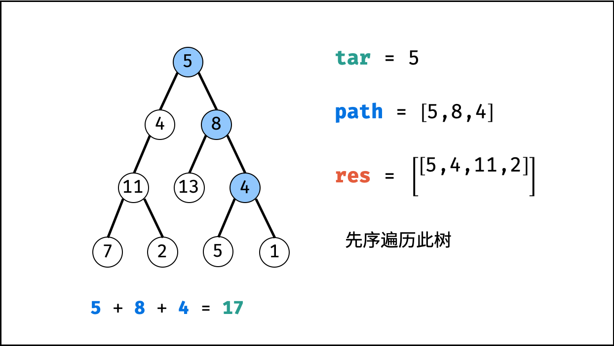
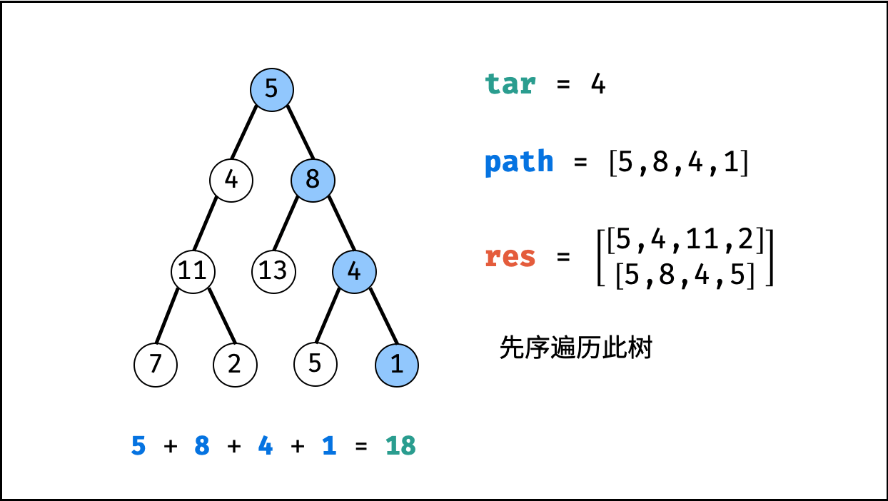
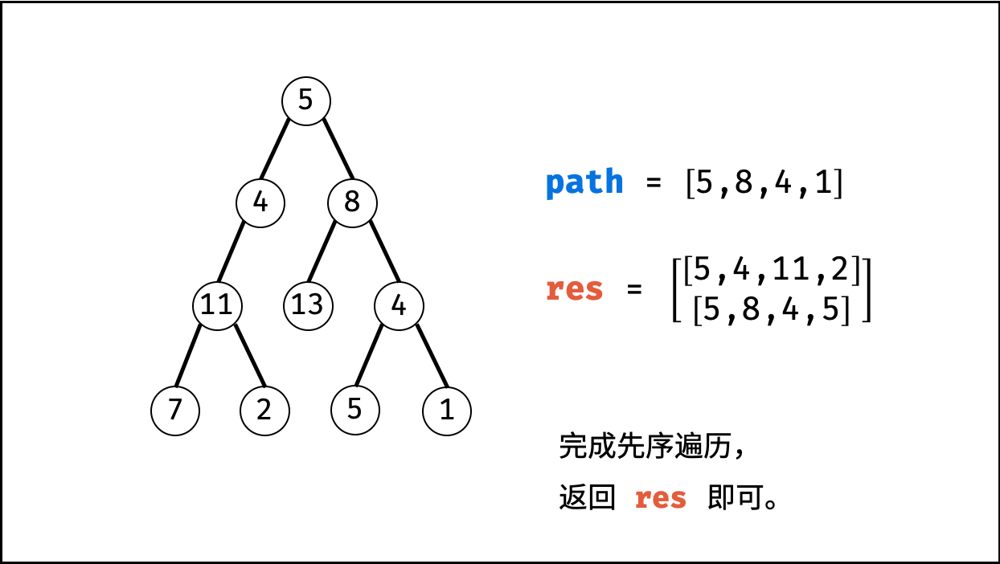

[#0113-path-sum-ii]
= 113. Path Sum II

https://leetcode.com/problems/path-sum-ii/[LeetCode - Path Sum II]

Given a binary tree and a sum, find all root-to-leaf paths where each path's sum equals the given sum.

*Note:* A leaf is a node with no children.

*Example:*

Given the below binary tree and `sum = 22`,

[subs="verbatim,quotes,macros"]
----
      *5*
     */ \*
    *4   8*
   */*   / *\*
  *11*  13  *4*
 /  *\*    */* \
7    *2*  *5*   1
----

Return:

[subs="verbatim,quotes,macros"]
----
[
   [5,4,11,2],
   [5,8,4,5]
]
----

== 解题分析

利用回溯+深度优先搜索即可解决。

这样要重点注意的是：回溯时，前进和后退要成对出现。

== 参考资料

. https://leetcode-cn.com/problems/path-sum-ii/solution/dfs-by-powcai-2/[DFS - 路径总和 II - 力扣（LeetCode）]

[[src-0113]]
[{java_src_attr}]
----
include::{sourcedir}/_0113_PathSumII.java[]
----

== 未优化版

[{java_src_attr}]
----
include::{sourcedir}/_0113_PathSumII_2.java[]
----

== 优化版

[{java_src_attr}]
----
include::{sourcedir}/_0113_PathSumII_21.java[]
----

TIP: 非常典型的回溯问题！

image::images/0113-07.png[]

image::images/0113-08.png[]

