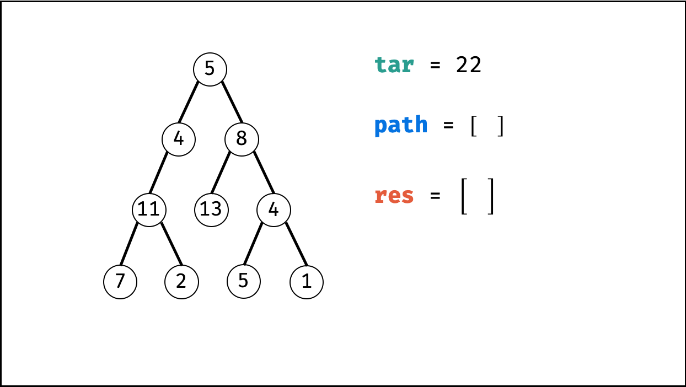
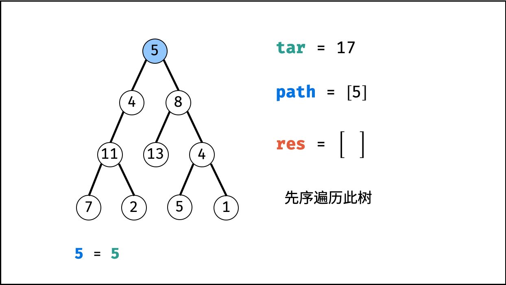

[#0113-path-sum-ii]
= 113. 路径总和 II

https://leetcode.cn/problems/path-sum-ii/[LeetCode - 113. 路径总和 II ^]

给你二叉树的根节点 `root` 和一个整数目标和 `targetSum` ，找出所有 *从根节点到叶子节点* 路径总和等于给定目标和的路径。

*叶子节点* 是指没有子节点的节点。

*示例 1：*

image::images/0113-01.jpg[{image_attr}]

....
输入：root = [5,4,8,11,null,13,4,7,2,null,null,5,1], targetSum = 22
输出：[[5,4,11,2],[5,8,4,5]]
....

*示例 2：*

image::images/0113-02.jpg[{image_attr}]

....
输入：root = [1,2,3], targetSum = 5
输出：[]
....

*示例 3：*

....
输入：root = [1,2], targetSum = 0
输出：[]
....

*提示：*

* 树中节点总数在范围 `[0, 5000]` 内
* `-1000 \<= Node.val \<= 1000`
* `-1000 \<= targetSum \<= 1000`

== 解题分析

利用回溯+深度优先搜索即可解决。

这样要重点注意的是：回溯时，前进和后退要成对出现。

TIP: 非常典型的回溯问题！

image::images/0113-14.png[{image_attr}]

image::images/0113-15.png[{image_attr}]

image::images/0113-18.png[{image_attr}]

[[src-0113]]
[tabs]
====
一刷::
+
--
[{java_src_attr}]
----
include::{sourcedir}/_0113_PathSumII.java[tag=answer]
----
--

二刷（待优化）::
+
--
[{java_src_attr}]
----
include::{sourcedir}/_0113_PathSumII_2.java[tag=answer]
----
--

二刷（优化）::
+
--
[{java_src_attr}]
----
include::{sourcedir}/_0113_PathSumII_21.java[tag=answer]
----
--

三刷::
+
--
[{java_src_attr}]
----
include::{sourcedir}/_0113_PathSumII_3.java[tag=answer]
----
--

四刷::
+
--
[{java_src_attr}]
----
include::{sourcedir}/_0113_PathSumII_4.java[tag=answer]
----
--
====

== 参考资料

. https://leetcode-cn.com/problems/path-sum-ii/solution/dfs-by-powcai-2/[DFS - 路径总和 II - 力扣（LeetCode）^]

