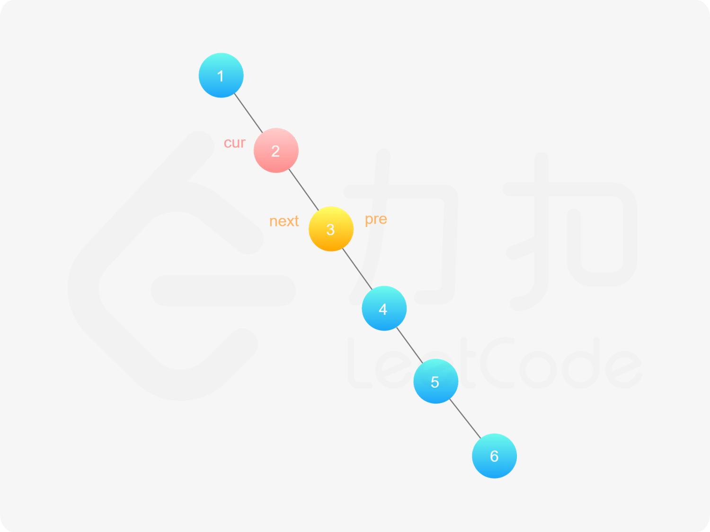

[#0114-flatten-binary-tree-to-linked-list]
= 114. Flatten Binary Tree to Linked List

https://leetcode.com/problems/flatten-binary-tree-to-linked-list/[LeetCode - Flatten Binary Tree to Linked List]

Given a binary tree, flatten it to a linked list in-place.

For example, given the following tree:

----
    1
   / \
  2   5
 / \   \
3   4   6
----

The flattened tree should look like:

----
1
 \
  2
   \
    3
     \
      4
       \
        5
         \
          6
----

这道题本质上来讲可以说是要做一个先根遍历。但是，却可以将这个过程逆向过来，从底向上建立起关联。不可谓不精巧。

思考题：看题解中，可以逐级将左树并入到右树。尝试一下。

== 参考资料

. https://leetcode-cn.com/problems/flatten-binary-tree-to-linked-list/solution/xiang-xi-tong-su-de-si-lu-fen-xi-duo-jie-fa-by--26/[详细通俗的思路分析，多解法 - 二叉树展开为链表 - 力扣（LeetCode）]
. https://leetcode.wang/leetcode-114-Flatten-Binary-Tree-to-Linked-List.html[114. Flatten Binary Tree to Linked List · leetcode]

Given a binary tree, flatten it to a linked list in-place.

For example, given the following tree:

[subs="verbatim,quotes,macros"]
----
    1
   / \
  2   5
 / \   \
3   4   6
----

The flattened tree should look like:

[subs="verbatim,quotes,macros"]
----
1
 \
  2
   \
    3
     \
      4
       \
        5
         \
          6
----

[[src-0114]]
[{java_src_attr}]
----
include::{sourcedir}/_0114_FlattenBinaryTreeToLinkedList.java[]
----

image::images/0114-01.png[]

image::images/0114-02.png[]

image::images/0114-03.png[]

image::images/0114-04.png[]

image::images/0114-06.png[]

image::images/0114-08.png[]

image::images/0114-10.png[]

image::images/0114-12.png[]

image::images/0114-15.png[]

image::images/0114-16.png[]

image::images/0114-17.png[]

[{java_src_attr}]
----
include::{sourcedir}/_0114_FlattenBinaryTreeToLinkedList_2.java[]
----

== 思考题

如何使用递归来实现？
