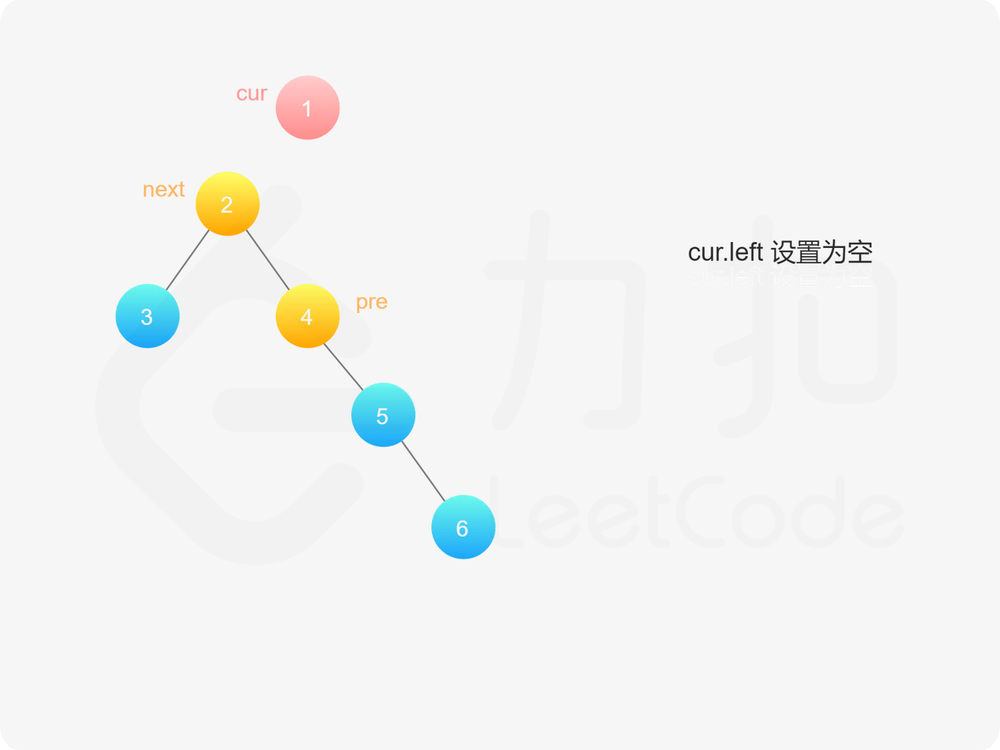
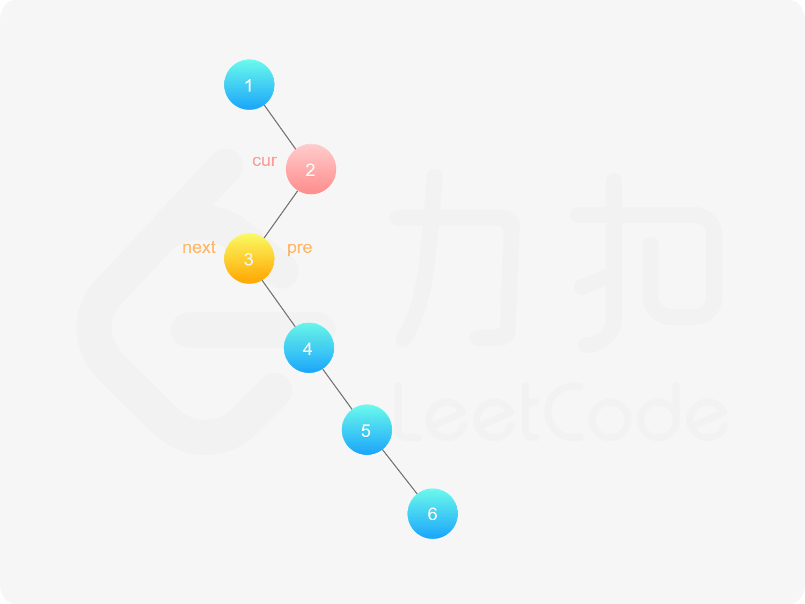

[#0114-flatten-binary-tree-to-linked-list]
= 114. 二叉树展开为链表

https://leetcode.cn/problems/flatten-binary-tree-to-linked-list/[LeetCode - 114. 二叉树展开为链表^]

给你二叉树的根结点 `root` ，请你将它展开为一个单链表：

* 展开后的单链表应该同样使用 `TreeNode` ，其中 `right` 子指针指向链表中下一个结点，而左子指针始终为 `null` 。
* 展开后的单链表应该与二叉树 https://baike.baidu.com/item/%E5%85%88%E5%BA%8F%E9%81%8D%E5%8E%86/6442839?fr=aladdin[*先序遍历*] 顺序相同。

*示例 1：*

image::images/0114-01.jpg[{image_attr}]

....
输入：root = [1,2,5,3,4,null,6]
输出：[1,null,2,null,3,null,4,null,5,null,6]
....

*示例 2：*

....
输入：root = []
输出：[]
....

*示例 3：*

....
输入：root = [0]
输出：[0]
....

*提示：*

* 树中结点数在范围 `[0, 2000]` 内
* `+-100 <= Node.val <= 100+`

**进阶：**你可以使用原地算法（stem:[O(1)] 额外空间）展开这棵树吗？

== 思路分析

这道题本质上来讲可以说是要做一个先根遍历。但是，却可以将这个过程逆向过来，从底向上建立起关联。不可谓不精巧。

思考题：看题解中，可以逐级将左树并入到右树。尝试一下。

image::images/0114-05.png[{image_attr}]

image::images/0114-07.png[{image_attr}]

image::images/0114-09.png[{image_attr}]

image::images/0114-11.png[{image_attr}]

image::images/0114-13.png[{image_attr}]

image::images/0114-14.png[{image_attr}]

image::images/0114-18.png[{image_attr}]

[[src-0114]]
[tabs]
====
一刷::
+
--
[{java_src_attr}]
----
include::{sourcedir}/_0114_FlattenBinaryTreeToLinkedList.java[tag=answer]
----
--

二刷::
+
--
[{java_src_attr}]
----
include::{sourcedir}/_0114_FlattenBinaryTreeToLinkedList_2.java[tag=answer]
----
--

三刷::
+
--
[{java_src_attr}]
----
include::{sourcedir}/_0114_FlattenBinaryTreeToLinkedList_3.java[tag=answer]
----
--

四刷::
+
--
[{java_src_attr}]
----
include::{sourcedir}/_0114_FlattenBinaryTreeToLinkedList_4.java[tag=answer]
----
--

五刷::
+
--
[{java_src_attr}]
----
include::{sourcedir}/_0114_FlattenBinaryTreeToLinkedList_5.java[tag=answer]
----
--

六刷::
+
--
[{java_src_attr}]
----
include::{sourcedir}/_0114_FlattenBinaryTreeToLinkedList_6.java[tag=answer]
----
--
====

== 思考题

如何使用递归来实现？

[{java_src_attr}]
----
include::{sourcedir}/_0114_FlattenBinaryTreeToLinkedList_3rec.java[tag=answer]
----

== 参考资料

. https://leetcode.cn/problems/flatten-binary-tree-to-linked-list/solutions/2992172/liang-chong-fang-fa-tou-cha-fa-fen-zhi-p-h9bg/[114. 二叉树展开为链表 - 两种方法：头插法/分治^]
. https://leetcode.cn/problems/flatten-binary-tree-to-linked-list/solutions/17274/xiang-xi-tong-su-de-si-lu-fen-xi-duo-jie-fa-by--26/[114. 二叉树展开为链表 - 详细通俗的思路分析，多解法^]
. https://leetcode.cn/problems/flatten-binary-tree-to-linked-list/solutions/356853/er-cha-shu-zhan-kai-wei-lian-biao-by-leetcode-solu/[114. 二叉树展开为链表 - 官方题解^]
. https://leetcode.wang/leetcode-114-Flatten-Binary-Tree-to-Linked-List.html[114. Flatten Binary Tree to Linked List · leetcode^]
