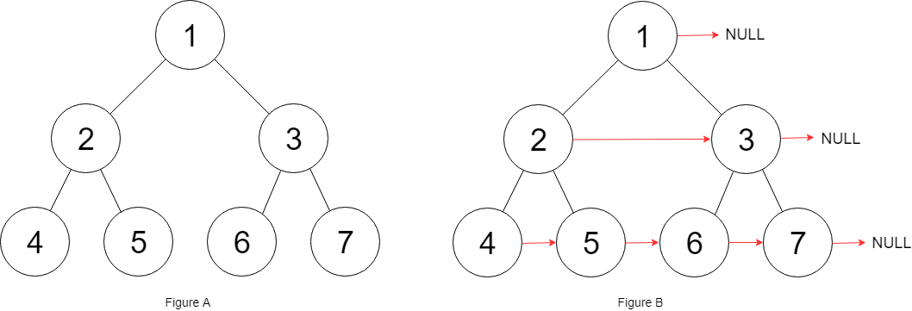
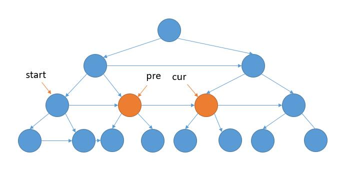
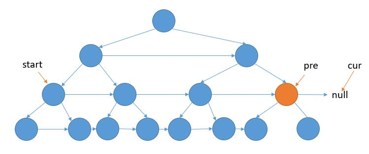

== 116. Populating Next Right Pointers in Each Node

https://leetcode.com/problems/populating-next-right-pointers-in-each-node/[LeetCode - Populating Next Right Pointers in Each Node]

这道题的关键是在上层遍历中，把下层的链接关系建立起来。

因为是完全二叉树。所以，如果左下节点为空则到达最后一层；向右节点为空，则到达行尾需要换行。

=== 参考资料

. https://leetcode-cn.com/problems/populating-next-right-pointers-in-each-node/solution/xiang-xi-tong-su-de-si-lu-fen-xi-duo-jie-fa-by--27/[详细通俗的思路分析，多解法 - 填充每个节点的下一个右侧节点指针 - 力扣（LeetCode）]