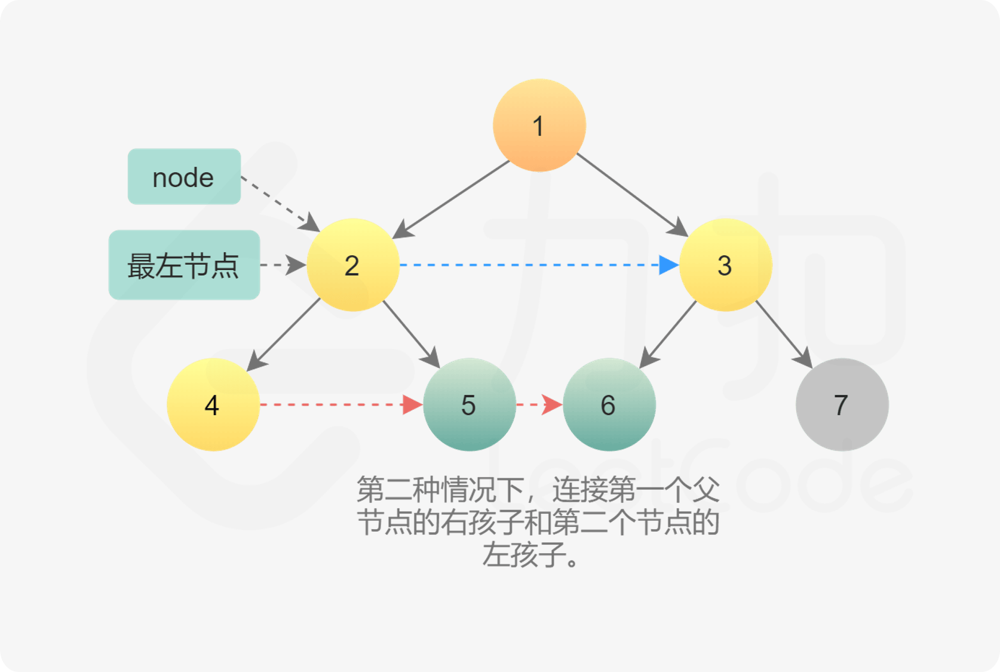

[#0116-populating-next-right-pointers-in-each-node]
= 116. Populating Next Right Pointers in Each Node

{leetcode}/problems/populating-next-right-pointers-in-each-node/[LeetCode - Populating Next Right Pointers in Each Node^]

You are given a *perfect binary tree* where all leaves are on the same level, and every parent has two children. The binary tree has the following definition:

[source,c]
[subs="verbatim,quotes,macros"]
----
struct Node {
  int val;
  Node *left;
  Node *right;
  Node *next;
}
----

Populate each next pointer to point to its next right node. If there is no next right node, the next pointer should be set to `NULL`.

Initially, all next pointers are set to `NULL`.

*Follow up:*

* You may only use constant extra space.
* Recursive approach is fine, you may assume implicit stack space does not count as extra space for this problem.

*Example 1:*

[subs="verbatim,quotes,macros"]
----
*Input:* root = [1,2,3,4,5,6,7]
*Output:* [1,#,2,3,#,4,5,6,7,#]
*Explanation:* Given the above perfect binary tree (Figure A), your function should populate each next pointer to point to its next right node, just like in Figure B. The serialized output is in level order as connected by the next pointers, with '#' signifying the end of each level.
----

*Constraints:*

* The number of nodes in the given tree is less than `4096`.
* `-1000 <= node.val <= 1000`

== 解题分析

这道题和 xref:0117-populating-next-right-pointers-in-each-node-ii.adoc[117. Populating Next Right Pointers in Each Node II] 算是姊妹题。

image::images/0116-01.jpg[{image_attr}]

这道题的关键是在上层遍历中，把下层的链接关系建立起来。

根据这个提示，再重新实现这个题目时，在思考的过程发现，最重要的就是保存每一层的最左节点。（这点也是根据树的 Morris 遍历得到的启发）这是每一层的起始位置。另外，每层循环的结束是当前节点为 `null` 了。（每层最后的一个节点没有 `next` 节点）。

因为是完全二叉树。所以，如果左下节点为空则到达最后一层；向右节点为空，则到达行尾需要换行。

[[src-0116]]
[{java_src_attr}]
----
include::{sourcedir}/_0116_PopulatingNextRightPointersInEachNode.java[tag=answer]
----

=== 常规解法

[{java_src_attr}]
----
include::{sourcedir}/_0116_PopulatingNextRightPointersInEachNode_2.java[tag=answer]
----

=== 常数空间复杂度解法

[{java_src_attr}]
----
include::{sourcedir}/_0116_PopulatingNextRightPointersInEachNode_21.java[tag=answer]
----

== 参考资料

. https://leetcode.cn/problems/populating-next-right-pointers-in-each-node/solutions/17870/xiang-xi-tong-su-de-si-lu-fen-xi-duo-jie-fa-by--27/[详细通俗的思路分析，多解法 - 填充每个节点的下一个右侧节点指针 - 力扣（LeetCode）^]
