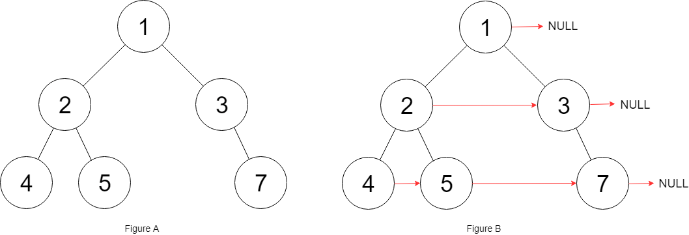
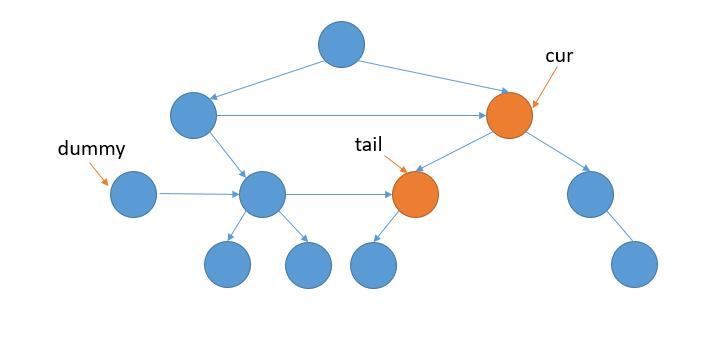

== 117. Populating Next Right Pointers in Each Node II

https://leetcode.com/problems/populating-next-right-pointers-in-each-node-ii/[LeetCode - Populating Next Right Pointers in Each Node II]

Given a binary tree

[source,c]
[subs="verbatim,quotes,macros"]
----
struct Node {
  int val;
  Node *left;
  Node *right;
  Node *next;
}
----

Populate each next pointer to point to its next right node. If there is no next right node, the next pointer should be set to `NULL`.

Initially, all next pointers are set to `NULL`.

*Follow up:*

* You may only use constant extra space.
* Recursive approach is fine, you may assume implicit stack space does not count as extra space for this problem.

*Example 1:*

[subs="verbatim,quotes,macros"]
----
*Input:* root = [1,2,3,4,5,null,7]
*Output:* [1,#,2,3,#,4,5,7,#]
*Explanation:* Given the above binary tree (Figure A), your function should populate each next pointer to point to its next right node, just like in Figure B. The serialized output is in level order as connected by the next pointers, with '#' signifying the end of each level.
----

*Constraints:*

* The number of nodes in the given tree is less than `6000`.
* `-100 <= node.val <= 100`

=== 解题分析

这道题和 xref:0116-populating-next-right-pointers-in-each-node.adoc[116. Populating Next Right Pointers in Each Node] 算是姊妹题。

最简单的方式，使用 `Deque` 来保存每一层节点，然后建立起来"连接"。但是，很明显，这种方案不符合空间复杂度要求。

基于上面这种解法，再深入思考一步，上面使用 `Deque` 就是想要保存接下来需要访问的元素，并且保存访问的前后顺序。现在 `Node` 上有 `next` 字段，可以利用这个字段，打通这条链表，遍历上一层时，打通下一次的链接结构。这里需要保存的就有两点：

. 这条链表的头结点，用于下一层的遍历；
. 这条链表的尾节点，用于添加下一个节点。

这样，把第一种解法的代码稍作修改就可以了。

=== 参考资料

. https://leetcode-cn.com/problems/populating-next-right-pointers-in-each-node-ii/solution/xiang-xi-tong-su-de-si-lu-fen-xi-duo-jie-fa-by-28/[详细通俗的思路分析，多解法 - 填充每个节点的下一个右侧节点指针 II - 力扣（LeetCode）]
. https://leetcode.wang/leetcode-117-Populating-Next-Right-Pointers-in-Each-NodeII.html[117. Populating Next Right Pointers in Each Node II · leetcode]
