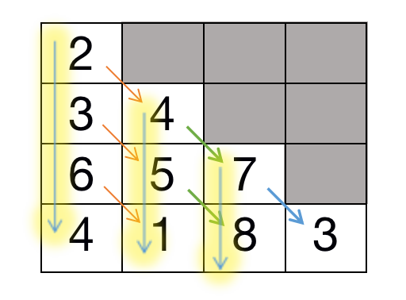

== 120. Triangle

https://leetcode.com/problems/triangle/[LeetCode - Triangle]

Given a triangle, find the minimum path sum from top to bottom. Each step you may move to adjacent numbers on the row below.

For example, given the following triangle

[subs="verbatim,quotes"]
----
[
     [*2*],
    [*3*,4],
   [6,*5*,7],
  [4,*1*,8,3]
]
----

The minimum path sum from top to bottom is `11` (i.e., *2* + *3* + *5* + *1* = 11).

*Note:*

Bonus point if you are able to do this using only _O_(_n_) extra space, where _n_ is the total number of rows in the triangle.

=== 解题分析

一图胜千言！

自底向上计算逐层每个元素的最小和。最后即可得出最小路径和。

=== 思考题

尝试一下动态规划的思路。

=== 参考资料

. https://leetcode-cn.com/problems/triangle/solution/120-san-jiao-xing-zui-xiao-lu-jing-he-by-alexer-66/[120. 三角形最小路径和 - 三角形最小路径和 - 力扣（LeetCode）]
. https://leetcode-cn.com/problems/triangle/solution/di-gui-ji-yi-hua-sou-suo-zai-dao-dp-by-crsm/[【Java】递归，记忆化搜索，再到DP - 三角形最小路径和 - 力扣（LeetCode）]