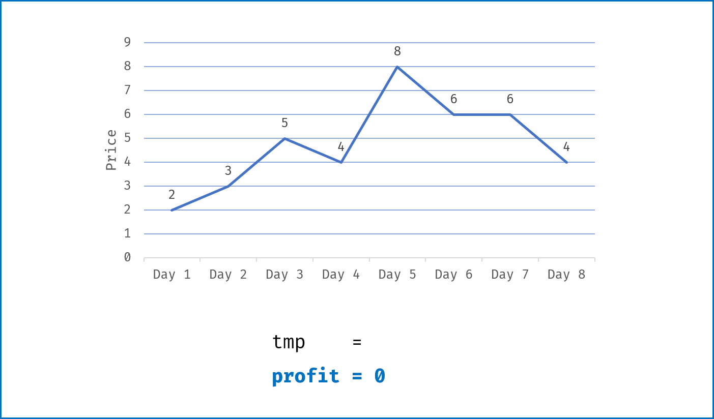
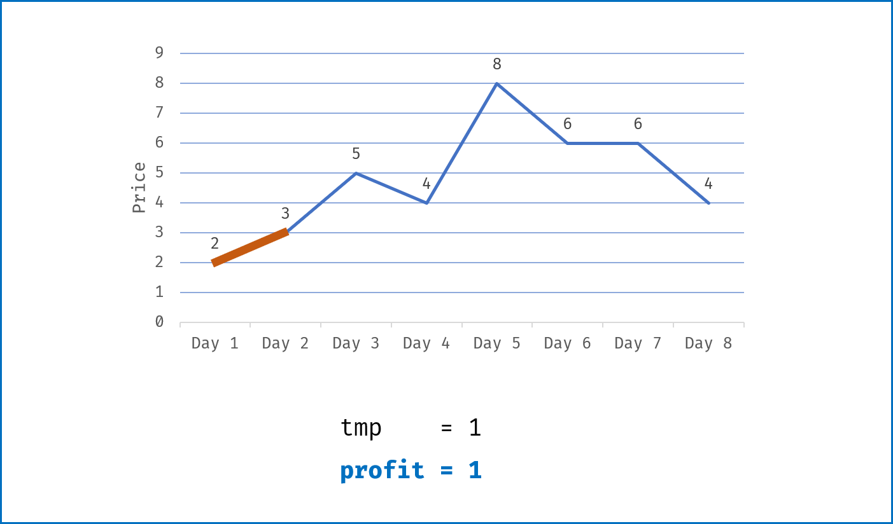
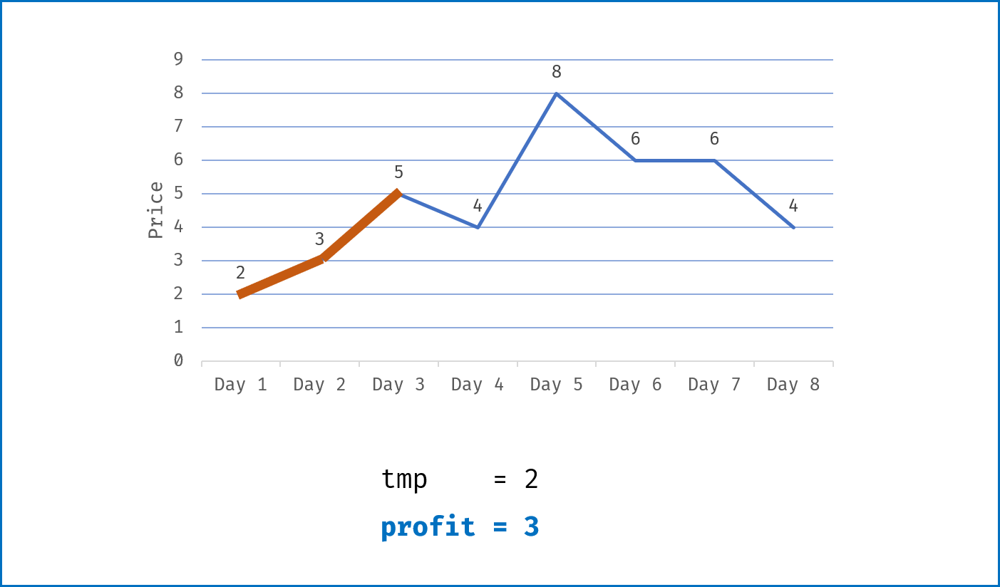
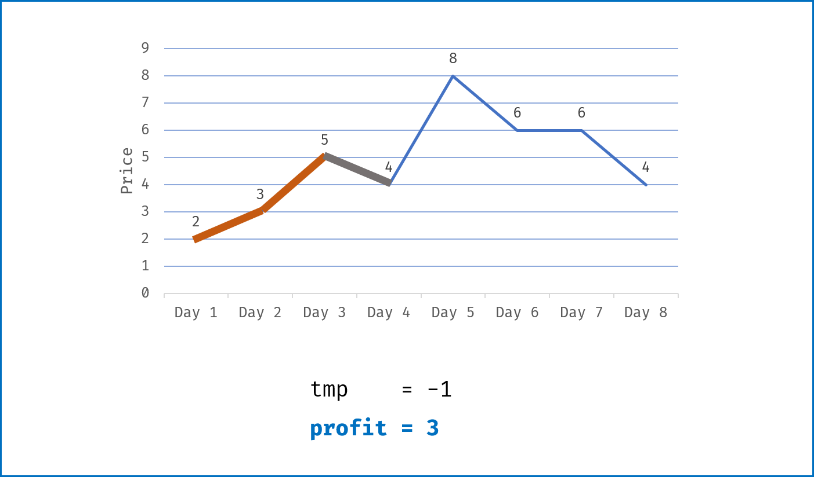
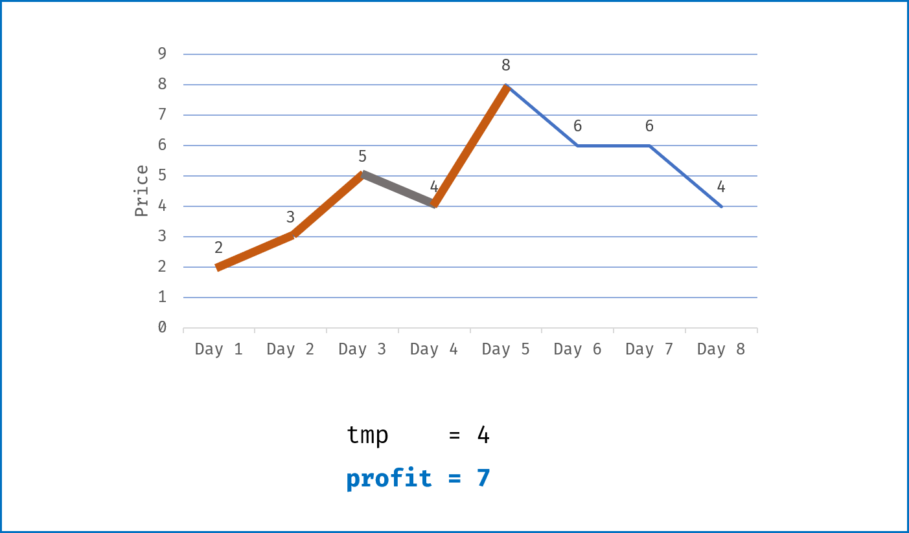
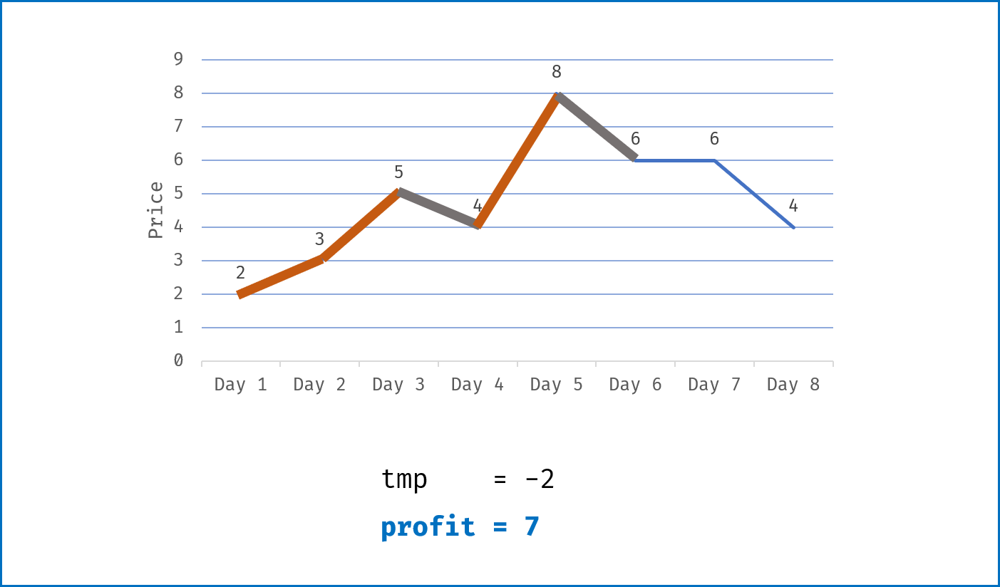
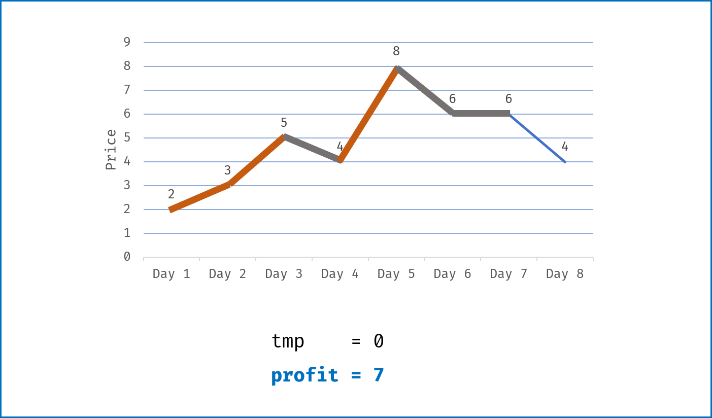
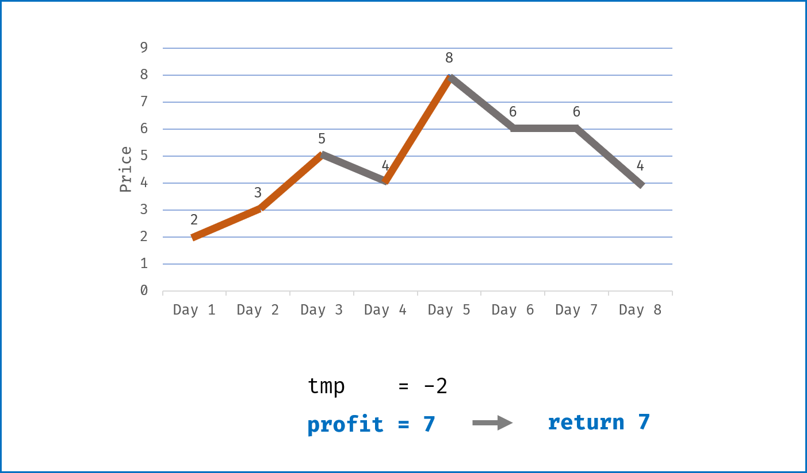

[#0122-best-time-to-buy-and-sell-stock-ii]
= 122. 买卖股票的最佳时机 II

https://leetcode.cn/problems/best-time-to-buy-and-sell-stock-ii/[LeetCode - 122. 买卖股票的最佳时机 II ^]

给你一个整数数组 `prices` ，其中 `prices[i]` 表示某支股票第 `i` 天的价格。

在每一天，你可以决定是否购买和/或出售股票。你在任何时候 *最多* 只能持有 *一股* 股票。你也可以先购买，然后在 *同一天* 出售。

返回 _你能获得的 *最大* 利润_ 。

*示例 1：*

....
输入：prices = [7,1,5,3,6,4]
输出：7
解释：在第 2 天（股票价格 = 1）的时候买入，在第 3 天（股票价格 = 5）的时候卖出, 这笔交易所能获得利润 = 5 - 1 = 4。
随后，在第 4 天（股票价格 = 3）的时候买入，在第 5 天（股票价格 = 6）的时候卖出, 这笔交易所能获得利润 = 6 - 3 = 3。
最大总利润为 4 + 3 = 7 。
....

*示例 2：*

....
输入：prices = [1,2,3,4,5]
输出：4
解释：在第 1 天（股票价格 = 1）的时候买入，在第 5 天 （股票价格 = 5）的时候卖出, 这笔交易所能获得利润 = 5 - 1 = 4。
最大总利润为 4 。
....

*示例 3：*

....
输入：prices = [7,6,4,3,1]
输出：0
解释：在这种情况下, 交易无法获得正利润，所以不参与交易可以获得最大利润，最大利润为 0。
....

*提示：*

* `1 \<= prices.length \<= 3 * 10^4^`
* `0 \<= prices[i] \<= 10^4^`

== 思路分析

针对 https://leetcode-cn.com/problems/best-time-to-buy-and-sell-stock-with-cooldown/solution/yi-ge-fang-fa-tuan-mie-6-dao-gu-piao-wen-ti-by-lab/[一个方法团灭 6 道股票问题 - 最佳买卖股票时机含冷冻期 - 力扣（LeetCode）^] 这个解题框架，进行小试牛刀。

[[src-0122]]
[tabs]
====
一刷::
+
--
[{java_src_attr}]
----
include::{sourcedir}/_0122_BestTimeToBuyAndSellStockII.java[tag=answer]
----
--

二刷::
+
--
[{java_src_attr}]
----
include::{sourcedir}/_0122_BestTimeToBuyAndSellStockII_2.java[tag=answer]
----
--

三刷::
+
--
[{java_src_attr}]
----
include::{sourcedir}/_0122_BestTimeToBuyAndSellStockIi_3.java[tag=answer]
----
--
====

== 参考资料

. https://leetcode.cn/problems/best-time-to-buy-and-sell-stock-with-cooldown/solutions/8610/yi-ge-fang-fa-tuan-mie-6-dao-gu-piao-wen-ti-by-lab/[309. 买卖股票的最佳时机含冷冻期 - 一个方法团灭 6 道股票问题^]
. https://leetcode.cn/problems/best-time-to-buy-and-sell-stock-with-cooldown/solutions/31589/dong-tai-gui-hua-shen-ru-fen-xi-by-wang-yan-19/[309. 买卖股票的最佳时机含冷冻期 - 动态规划深入分析^]
. https://leetcode.cn/problems/best-time-to-buy-and-sell-stock-ii/solutions/12625/best-time-to-buy-and-sell-stock-ii-zhuan-hua-fa-ji/?envType=study-plan-v2&envId=selected-coding-interview[122. 买卖股票的最佳时机 II - 贪心，清晰图解^]
. https://leetcode.cn/circle/discuss/qiAgHn/[分享｜股票问题系列通解（转载翻译）^]

