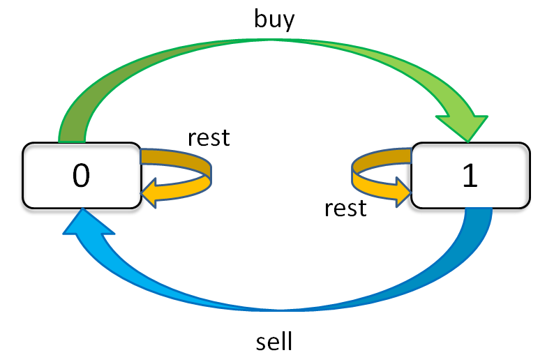

== 123. Best Time to Buy and Sell Stock III

https://leetcode.com/problems/best-time-to-buy-and-sell-stock-iii/[LeetCode - Best Time to Buy and Sell Stock III]

Say you have an array for which the _i^th^_ element is the price of a given stock on day _i_.

Design an algorithm to find the maximum profit. You may complete at most two transactions.

*Note:* You may not engage in multiple transactions at the same time (i.e., you must sell the stock before you buy again).

.Example 1:
----
Input: [3,3,5,0,0,3,1,4]
Output: 6
Explanation: Buy on day 4 (price = 0) and sell on day 6 (price = 3), profit = 3-0 = 3.
             Then buy on day 7 (price = 1) and sell on day 8 (price = 4), profit = 4-1 = 3.
----

.Example 2:
----
Input: [1,2,3,4,5]
Output: 4
Explanation: Buy on day 1 (price = 1) and sell on day 5 (price = 5), profit = 5-1 = 4.
             Note that you cannot buy on day 1, buy on day 2 and sell them later, as you are
             engaging multiple transactions at the same time. You must sell before buying again.
----

.Example 3:
----
Input: [7,6,4,3,1]
Output: 0
Explanation: In this case, no transaction is done, i.e. max profit = 0.
----

针对 https://leetcode-cn.com/problems/best-time-to-buy-and-sell-stock-with-cooldown/solution/yi-ge-fang-fa-tuan-mie-6-dao-gu-piao-wen-ti-by-lab/[一个方法团灭 6 道股票问题 - 最佳买卖股票时机含冷冻期 - 力扣（LeetCode）] 这个解题框架，进行小试牛刀。

思考题：将表格改成变量时，还需要再思考思考。

=== 参考资料

. https://leetcode-cn.com/problems/best-time-to-buy-and-sell-stock-with-cooldown/solution/yi-ge-fang-fa-tuan-mie-6-dao-gu-piao-wen-ti-by-lab/[一个方法团灭 6 道股票问题 - 最佳买卖股票时机含冷冻期 - 力扣（LeetCode）]
. https://leetcode-cn.com/problems/best-time-to-buy-and-sell-stock-with-cooldown/solution/dong-tai-gui-hua-shen-ru-fen-xi-by-wang-yan-19/[动态规划深入分析 - 最佳买卖股票时机含冷冻期 - 力扣（LeetCode）]

Say you have an array for which the _i_^th^ element is the price of a given stock on day _i_.

Design an algorithm to find the maximum profit. You may complete at most _two_ transactions.

*Note: *You may not engage in multiple transactions at the same time (i.e., you must sell the stock before you buy again).

*Example 1:*

[subs="verbatim,quotes,macros"]
----
*Input:* [3,3,5,0,0,3,1,4]
*Output:* 6
*Explanation:* Buy on day 4 (price = 0) and sell on day 6 (price = 3), profit = 3-0 = 3.
             Then buy on day 7 (price = 1) and sell on day 8 (price = 4), profit = 4-1 = 3.
----

*Example 2:*

[subs="verbatim,quotes,macros"]
----
*Input:* [1,2,3,4,5]
*Output:* 4
*Explanation:* Buy on day 1 (price = 1) and sell on day 5 (price = 5), profit = 5-1 = 4.
             Note that you cannot buy on day 1, buy on day 2 and sell them later, as you are
             engaging multiple transactions at the same time. You must sell before buying again.

----

*Example 3:*

[subs="verbatim,quotes,macros"]
----
*Input:* [7,6,4,3,1]
*Output:* 0
*Explanation:* In this case, no transaction is done, i.e. max profit = 0.
----

