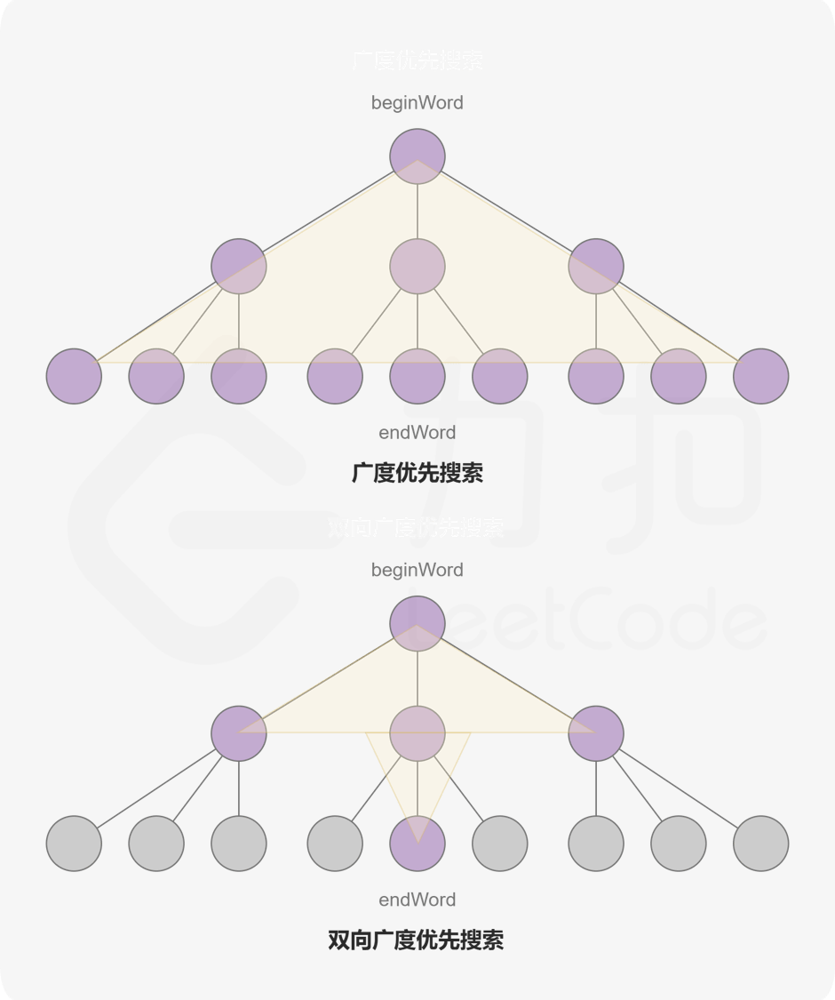
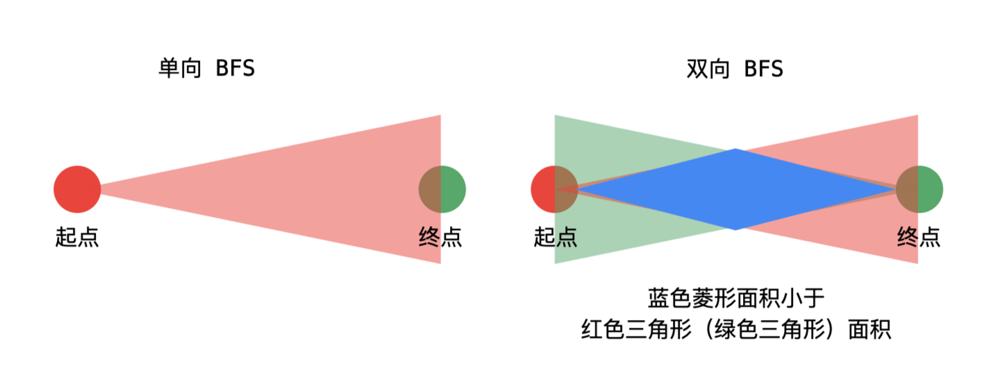

[#0127-word-ladder]
= 127. Word Ladder

https://leetcode.com/problems/word-ladder/[LeetCode - Word Ladder^]

通过 https://leetcode.com/problems/word-ladder/solution/[Word Ladder - LeetCode^] 讲解，竟然可以抽象成无向无权图，然后通过 `Queue` 将其串联起来，实在好精巧。

image::images/0127-1.png[{image_attr}]

image::images/0127-2.png[{image_attr}]

Given two words (_beginWord_ and _endWord_), and a dictionary's word list, find the length of shortest transformation sequence from _beginWord_ to _endWord_, such that:

* Only one letter can be changed at a time.
* Each transformed word must exist in the word list. Note that _beginWord_ is _not_ a transformed word.

*Note:*

* Return 0 if there is no such transformation sequence.
* All words have the same length.
* All words contain only lowercase alphabetic characters.
* You may assume no duplicates in the word list.
* You may assume _beginWord_ and _endWord_ are non-empty and are not the same.

*Example 1:*

[subs="verbatim,quotes,macros"]
----
*Input:*
beginWord = "hit",
endWord = "cog",
wordList = ["hot","dot","dog","lot","log","cog"]

*Output:* 5

*Explanation:* As one shortest transformation is "hit" -> "hot" -> "dot" -> "dog" -> "cog",
return its length 5.
----

*Example 2:*

[subs="verbatim,quotes,macros"]
----
*Input:*
beginWord = "hit"
endWord = "cog"
wordList = ["hot","dot","dog","lot","log"]

*Output:* 0

*Explanation:* The endWord "cog" is not in wordList, therefore no possible* *transformation.
----

== 思路分析

BFS 解题思路，与 xref:0752-open-the-lock.adoc[752. Open the Lock] 的套路是一样的。

[[src-0127]]
[{java_src_attr}]
----
include::{sourcedir}/_0127_WordLadder.java[tag=answer]
----

[{java_src_attr}]
----
include::{sourcedir}/_0127_WordLadder_2.java[tag=answer]
----

== 参考资料

. https://leetcode.cn/problems/word-ladder/solutions/473600/dan-ci-jie-long-by-leetcode-solution/[127. 单词接龙 - 官方题解^]
. https://leetcode.cn/problems/word-ladder/solutions/276923/yan-du-you-xian-bian-li-shuang-xiang-yan-du-you-2/[127. 单词接龙 - 广度优先遍历、双向广度优先遍历（Java）^]
. https://leetcode.cn/problems/word-ladder/solutions/102383/suan-fa-shi-xian-he-you-hua-javashuang-xiang-bfs23/[127. 单词接龙 - 算法实现和优化（Java 双向 BFS，23ms）^] -- 优化思路非常值得学习！

