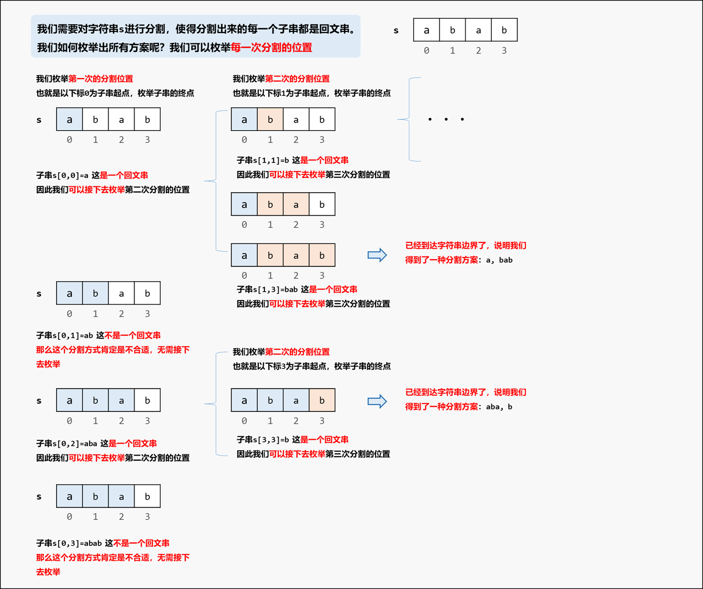
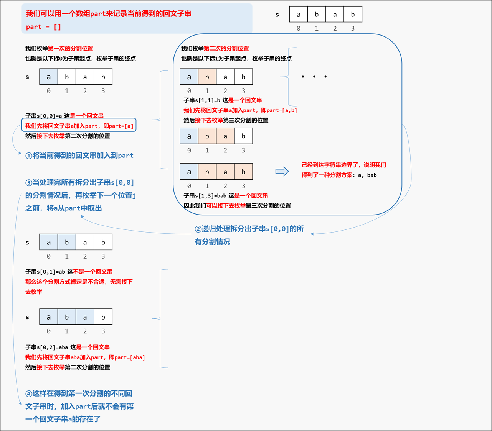
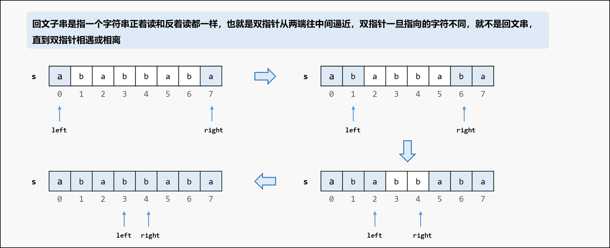
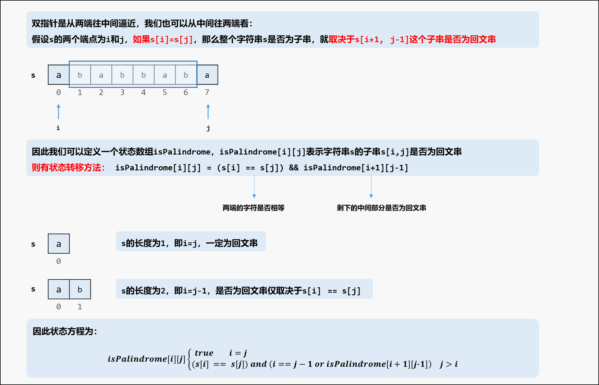

[#0131-palindrome-partitioning]
= 131. 分割回文串

https://leetcode.cn/problems/palindrome-partitioning/[LeetCode - 131. 分割回文串^]

给你一个字符串 `s`，请你将 `s` 分割成一些子串，使每个子串都是 *回文串*。返回 `s` 所有可能的分割方案。

*示例 1：*

....
输入：s = "aab"
输出：[["a","a","b"],["aa","b"]]
....

*示例 2：*

....
输入：s = "a"
输出：[["a"]]
....

*提示：*

* `+1 <= s.length <= 16+`
* `s` 仅由小写英文字母组成

== 思路分析

回溯：截取子串，判断是否为回文，如果是，则向前推进，截取下一个子串；否则，坐标向前移位。

[[src-0131]]
[tabs]
====
一刷::
+
--
[{java_src_attr}]
----
include::{sourcedir}/_0131_PalindromePartitioning.java[tag=answer]
----
--

二刷::
+
--
[{java_src_attr}]
----
include::{sourcedir}/_0131_PalindromePartitioning_2.java[tag=answer]
----
--

三刷::
+
--
[{java_src_attr}]
----
include::{sourcedir}/_0131_PalindromePartitioning_3.java[tag=answer]
----
--
====

== 参考资料

. https://leetcode.cn/problems/palindrome-partitioning/solutions/2059414/hui-su-bu-hui-xie-tao-lu-zai-ci-pythonja-fues/[131. 分割回文串 - 回溯不会写？套路在此！^]
. https://leetcode.cn/problems/palindrome-partitioning/solutions/54233/hui-su-you-hua-jia-liao-dong-tai-gui-hua-by-liweiw/[131. 分割回文串 - 回溯算法、优化（使用动态规划预处理数组）^]
. https://leetcode.cn/problems/palindrome-partitioning/solutions/639633/fen-ge-hui-wen-chuan-by-leetcode-solutio-6jkv/[131. 分割回文串 - 官方题解^]
. https://leetcode.cn/problems/palindrome-partitioning/solutions/3592780/javapython3chui-su-shuang-zhi-zhen-dong-6cvor/[131. 分割回文串 - 回溯 + 双指针 / 动态规划：拆分子串进行判断【图解】^]
. https://leetcode.cn/problems/palindrome-partitioning/solutions/639915/shou-hua-tu-jie-san-chong-jie-fa-hui-su-q5zjt/[131. 分割回文串 - 「手画图解」三种写法：回溯，加入记忆化，结合DP | 附回溯题解合集^]
