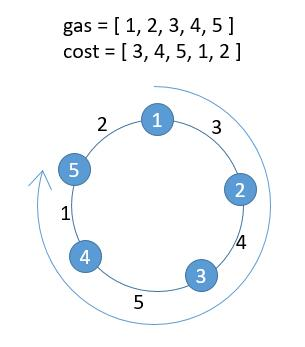

[#0134-gas-station]
= 134. 加油站

https://leetcode.cn/problems/gas-station/[LeetCode - 134. 加油站 ^]

在一条环路上有 `n` 个加油站，其中第 `i` 个加油站有汽油 `gas[i]` 升。

你有一辆油箱容量无限的的汽车，从第 `i` 个加油站开往第 `i+1` 个加油站需要消耗汽油 `cost[i]` 升。你从其中的一个加油站出发，开始时油箱为空。

给定两个整数数组 `gas` 和 `cost`，如果你可以按顺序绕环路行驶一周，则返回出发时加油站的编号，否则返回 `-1` 。如果存在解，则 *保证* 它是 *唯一* 的。

*示例 1:*

....
输入: gas = [1,2,3,4,5], cost = [3,4,5,1,2]
输出: 3
解释:
从 3 号加油站(索引为 3 处)出发，可获得 4 升汽油。此时油箱有 = 0 + 4 = 4 升汽油
开往 4 号加油站，此时油箱有 4 - 1 + 5 = 8 升汽油
开往 0 号加油站，此时油箱有 8 - 2 + 1 = 7 升汽油
开往 1 号加油站，此时油箱有 7 - 3 + 2 = 6 升汽油
开往 2 号加油站，此时油箱有 6 - 4 + 3 = 5 升汽油
开往 3 号加油站，你需要消耗 5 升汽油，正好足够你返回到 3 号加油站。
因此，3 可为起始索引。
....

*示例 2:*

....
输入: gas = [2,3,4], cost = [3,4,3]
输出: -1
解释:
你不能从 0 号或 1 号加油站出发，因为没有足够的汽油可以让你行驶到下一个加油站。
我们从 2 号加油站出发，可以获得 4 升汽油。 此时油箱有 = 0 + 4 = 4 升汽油
开往 0 号加油站，此时油箱有 4 - 3 + 2 = 3 升汽油
开往 1 号加油站，此时油箱有 3 - 3 + 3 = 3 升汽油
你无法返回 2 号加油站，因为返程需要消耗 4 升汽油，但是你的油箱只有 3 升汽油。
因此，无论怎样，你都不可能绕环路行驶一周。
....

*提示:*

* `gas.length == n`
* `cost.length == n`
* `1 \<= n \<= 10^5^`
* `0 \<= gas[i], cost[i] \<= 10^4^`

== 思路分析

image::images/0134-1.png[{image_attr}]

image::images/0134-2.png[{image_attr}]

image::images/0134-3.png[{image_attr}]

image::images/0134-11.png[{image_attr}]

这道题首先要明白题意是什么？最关键是有几点：

. 总的油量是否够消耗？
. 首次发车的车站是否够行驶到下一个车站？

核心思路：“已经在谷底了，怎么走都是向上。”这个贪心算法还是很有趣的！

[[src-0134]]
[tabs]
====
一刷::
+
--
[{java_src_attr}]
----
include::{sourcedir}/_0134_GasStation.java[tag=answer]
----
--

二刷::
+
--
[{java_src_attr}]
----
include::{sourcedir}/_0134_GasStation_2.java[tag=answer]
----
--
====

== 参考资料

. https://leetcode.cn/problems/gas-station/solutions/54278/shi-yong-tu-de-si-xiang-fen-xi-gai-wen-ti-by-cyayc/[134. 加油站 - 使用图的思想分析该问题^] -- 用一句比较容易理解的话来概括：油量最低的那一步要放在最后一步走，考前面的每步给后面奶油。
. https://leetcode.cn/problems/gas-station/solutions/488622/134-jia-you-zhan-tan-xin-jing-dian-ti-mu-xiang-jie/[134. 加油站 - 「代码随想录」带你学透贪心算法！^]
. https://leetcode.cn/problems/gas-station/solutions/25644/xiang-xi-tong-su-de-si-lu-fen-xi-duo-jie-fa-by--30/[134. 加油站 - 详细通俗的思路分析，多解法^]
. https://leetcode.cn/problems/gas-station/solutions/2933132/yong-zhe-xian-tu-zhi-guan-li-jie-pythonj-qccr/[134. 加油站 - 用【折线图】直观理解^]
