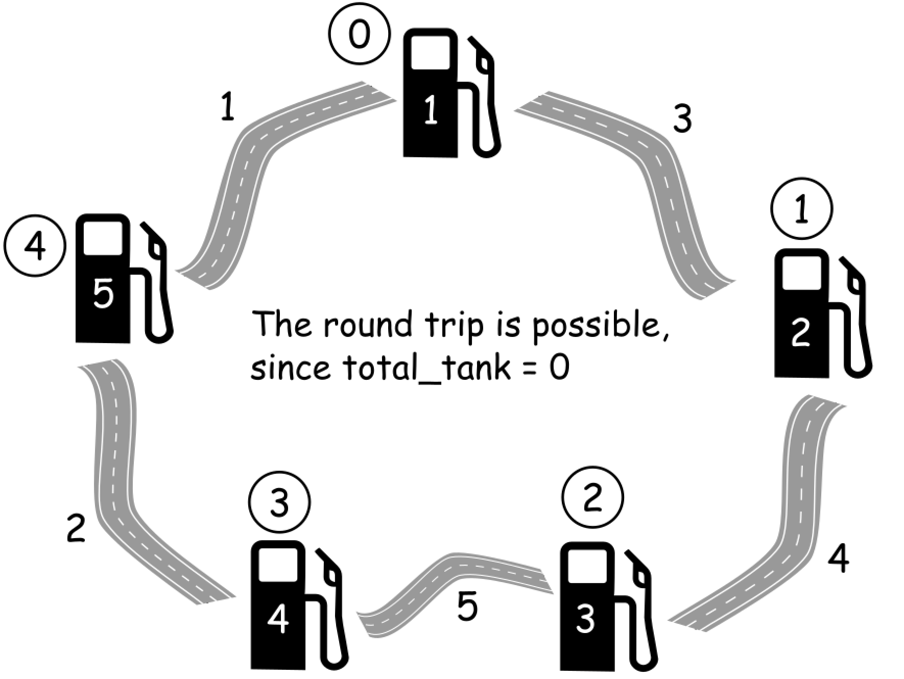
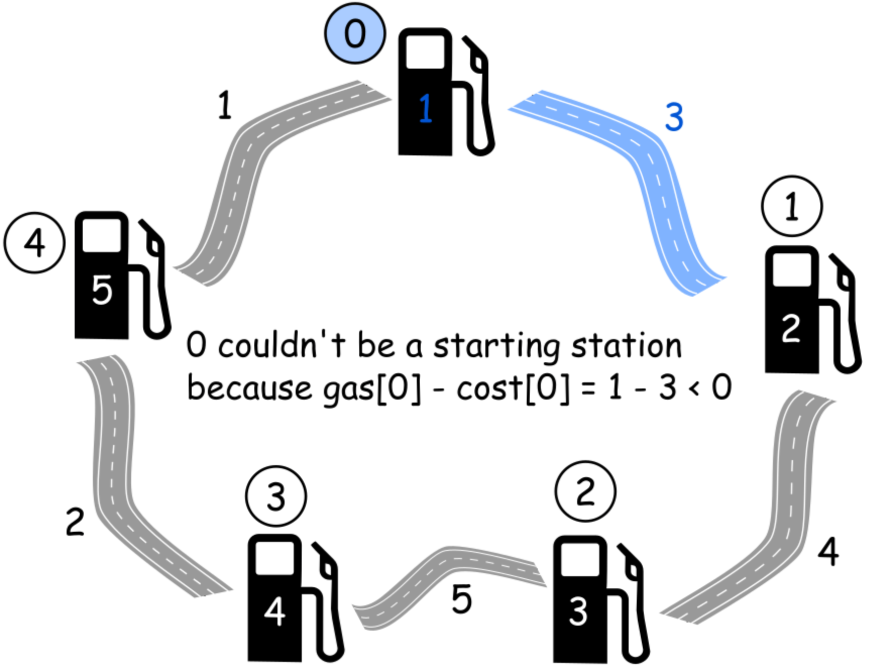
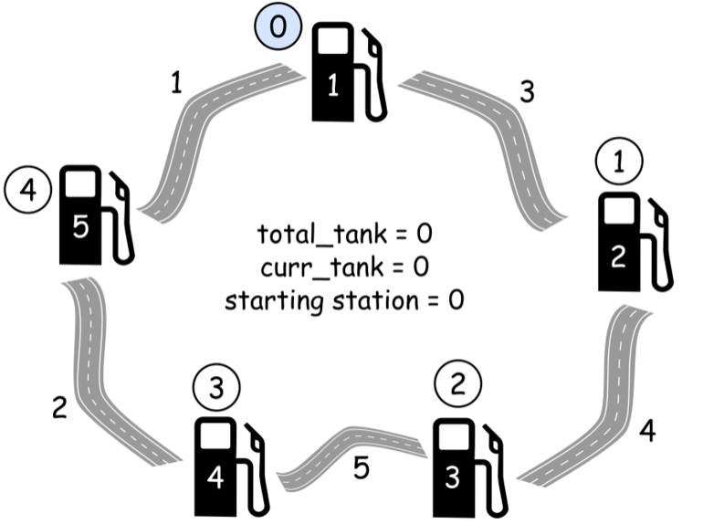

[#0134-gas-station]
= 134. Gas Station

https://leetcode.com/problems/gas-station/[LeetCode - Gas Station^]

这道题首先要明白题意是什么？最关键是有几点：

. 总的油量是否够消耗？
. 首次发车的车站是否够行驶到下一个车站？

There are _N_ gas stations along a circular route, where the amount of gas at station _i_ is `gas[i]`.

You have a car with an unlimited gas tank and it costs `cost[i]` of gas to travel from station _i_ to its next station (_i_+1). You begin the journey with an empty tank at one of the gas stations.

Return the starting gas station's index if you can travel around the circuit once in the clockwise direction, otherwise return -1.

*Note:*

* If there exists a solution, it is guaranteed to be unique.
* Both input arrays are non-empty and have the same length.
* Each element in the input arrays is a non-negative integer.

*Example 1:*

[subs="verbatim,quotes,macros"]
----
*Input:* 
gas  = [1,2,3,4,5]
cost = [3,4,5,1,2]

*Output:* 3

*Explanation:
*Start at station 3 (index 3) and fill up with 4 unit of gas. Your tank = 0 + 4 = 4
Travel to station 4. Your tank = 4 - 1 + 5 = 8
Travel to station 0. Your tank = 8 - 2 + 1 = 7
Travel to station 1. Your tank = 7 - 3 + 2 = 6
Travel to station 2. Your tank = 6 - 4 + 3 = 5
Travel to station 3. The cost is 5. Your gas is just enough to travel back to station 3.
Therefore, return 3 as the starting index.
----

*Example 2:*

[subs="verbatim,quotes,macros"]
----
*Input:* 
gas  = [2,3,4]
cost = [3,4,3]

*Output:* -1

*Explanation:
*You can't start at station 0 or 1, as there is not enough gas to travel to the next station.
Let's start at station 2 and fill up with 4 unit of gas. Your tank = 0 + 4 = 4
Travel to station 0. Your tank = 4 - 3 + 2 = 3
Travel to station 1. Your tank = 3 - 3 + 3 = 3
You cannot travel back to station 2, as it requires 4 unit of gas but you only have 3.
Therefore, you can't travel around the circuit once no matter where you start.
----

[[src-0134]]
[{java_src_attr}]
----
include::{sourcedir}/_0134_GasStation.java[tag=answer]
----

