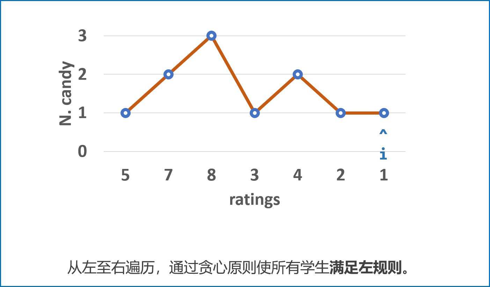
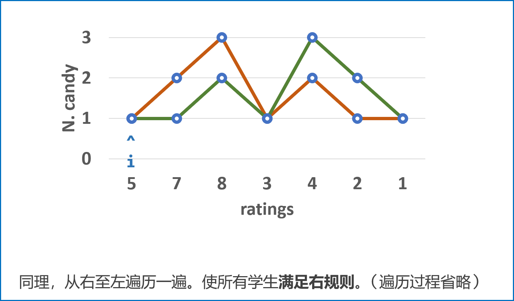
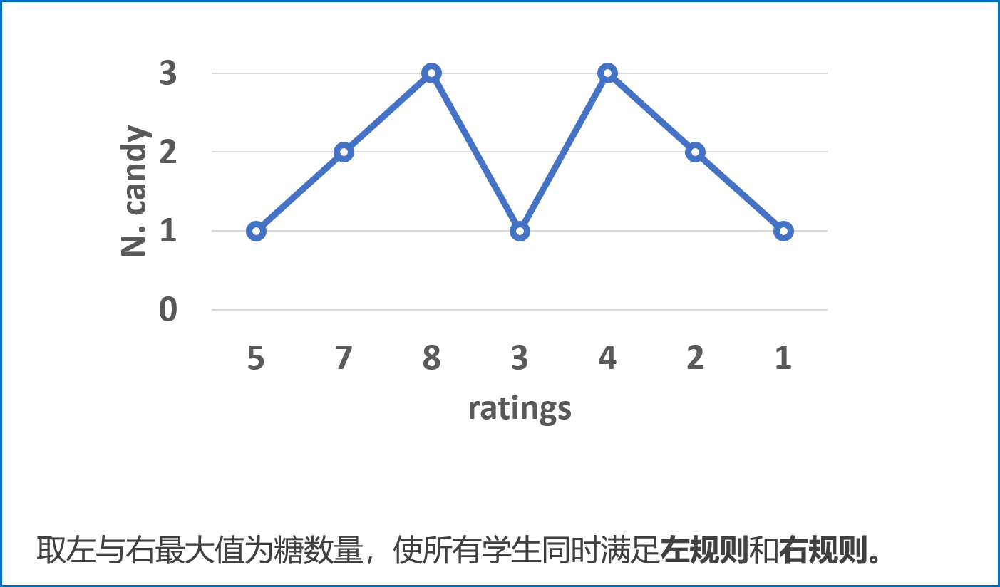

[#0135-candy]
= 135. Candy

{leetcode}/problems/candy/[LeetCode - Candy^]

There are _N_ children standing in a line. Each child is assigned a rating value.

You are giving candies to these children subjected to the following requirements:

* Each child must have at least one candy.
* Children with a higher rating get more candies than their neighbors.

What is the minimum candies you must give?

*Example 1:*

[subs="verbatim,quotes,macros"]
----
*Input:* [1,0,2]
*Output:* 5
*Explanation:* You can allocate to the first, second and third child with 2, 1, 2 candies respectively.
----

*Example 2:*

[subs="verbatim,quotes,macros"]
----
*Input:* [1,2,2]
*Output:* 4
*Explanation:* You can allocate to the first, second and third child with 1, 2, 1 candies respectively.
             The third child gets 1 candy because it satisfies the above two conditions.
----

== 思路分析

从左右两端分两次遍历，分别跟左右两边的数比较，自身大则比对应的糖果多一个。最后，取两次比较中，每个座位对应糖果最大值相加即可。

[[src-0135]]
[tabs]
====
一刷::
+
--
[{java_src_attr}]
----
include::{sourcedir}/_0135_Candy.java[tag=answer]
----
--

// 二刷::
// +
// --
// [{java_src_attr}]
// ----
// include::{sourcedir}/_0135_Candy_2.java[tag=answer]
// ----
// --
====

== 参考资料

. https://leetcode.cn/problems/candy/solutions/17847/candy-cong-zuo-zhi-you-cong-you-zhi-zuo-qu-zui-da-/?envType=study-plan-v2&envId=selected-coding-interview[135. 分发糖果 - 贪心思想，线性复杂度，清晰图解^]

