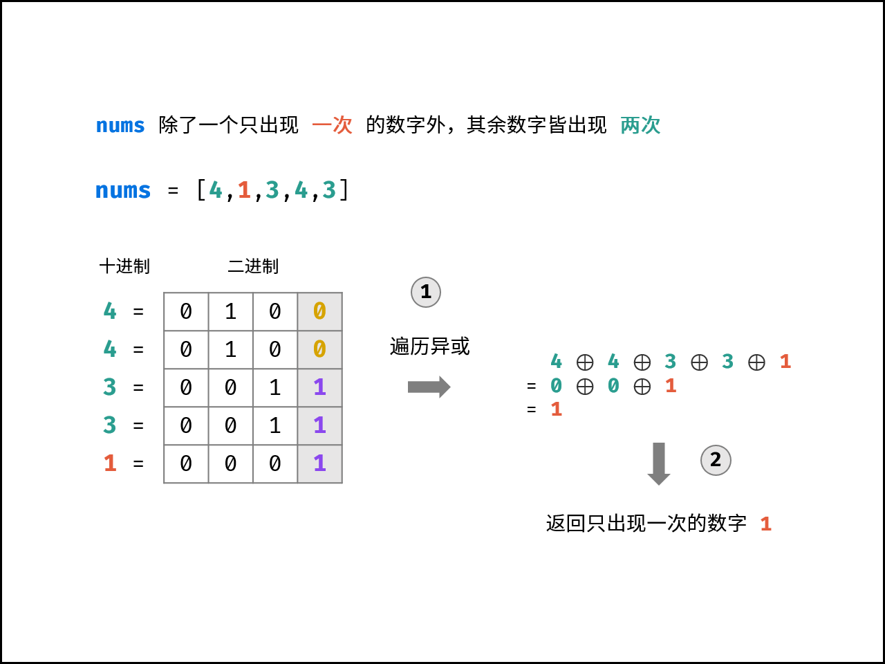

[#0136-single-number]
= 136. 只出现一次的数字

https://leetcode.cn/problems/single-number/[LeetCode - 136. 只出现一次的数字^]

给你一个 *非空* 整数数组 `nums`，除了某个元素只出现一次以外，其余每个元素均出现两次。找出那个只出现了一次的元素。

你必须设计并实现线性时间复杂度的算法来解决此问题，且该算法只使用常量额外空间。

*示例 1 ：*

....
输入：nums = [2,2,1]
输出：1
....

*示例 2 ：*

....
输入：nums = [4,1,2,1,2]
输出：4
....

*示例 3 ：*

....
输入：nums = [1]
输出：1
....

*提示：*

* `1 \<= nums.length \<= 3 * 10^4^`
* `+-3 * 10^4^ <= nums[i] <= 3 * 10^4^`
* 除了某个元素只出现一次以外，其余每个元素均出现两次。

== 思路分析

只有一个数出现一次，其余数字出现两次，则可以用异或来找出该数。异或两位相异得 `1`，相同得 `0`，则出现两次的数字都全部得 `0`，留下了数字即为只出现一次的数字。

[[src-0136]]
[tabs]
====
一刷::
+
--
[{java_src_attr}]
----
include::{sourcedir}/_0136_SingleNumber.java[tag=answer]
----
--

二刷::
+
--
[{java_src_attr}]
----
include::{sourcedir}/_0136_SingleNumber_2.java[tag=answer]
----
--

三刷::
+
--
[{java_src_attr}]
----
include::{sourcedir}/_0136_SingleNumber_3.java[tag=answer]
----
--
====

== 参考资料

. https://leetcode.cn/problems/single-number/solutions/2361995/136-zhi-chu-xian-yi-ci-de-shu-zi-wei-yun-iyd0/[136. 只出现一次的数字 - 位运算，清晰图解^]
. https://leetcode.cn/problems/single-number/solutions/2481594/li-yong-yi-huo-de-xing-zhi-fu-ti-dan-pyt-oizc/[136. 只出现一次的数字 - O(n) 一次遍历，附位运算题单^]

