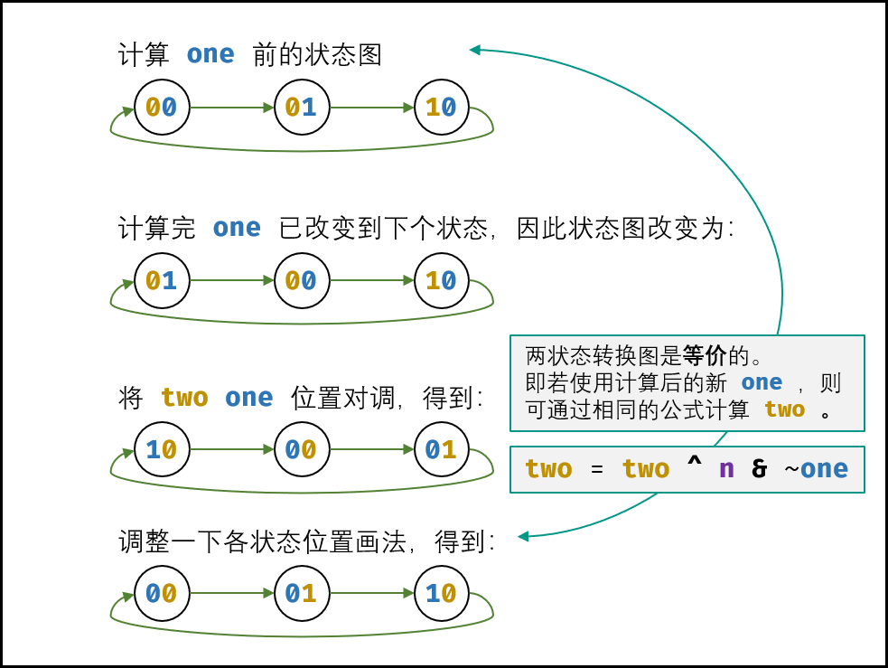

[#0137-single-number-ii]
= 137. 只出现一次的数字 II

https://leetcode.cn/problems/single-number-ii/[LeetCode - 137. 只出现一次的数字 II ^]

给你一个整数数组 `nums` ，除某个元素仅出现 *一次* 外，其余每个元素都恰出现 **三次**。请你找出并返回那个只出现了一次的元素。

你必须设计并实现线性时间复杂度的算法且使用常数级空间来解决此问题。

*示例 1：*

....
输入：nums = [2,2,3,2]
输出：3
....

*示例 2：*

....
输入：nums = [0,1,0,1,0,1,99]
输出：99
....

*提示：*

* `1 \<= nums.length \<= 3 * 10^4^`
* `-2^31^ \<= nums[i] \<= 2^31^ - 1`
* `nums` 中，除某个元素仅出现 *一次* 外，其余每个元素都恰出现 *三次*

== 思路分析

由于除了唯一数外，其余数字都出现了三次，那么将每个数字的每位相加，除以 `3`，余数即为唯一数。

image::images/0137-01.png[{image_attr}]

image::images/0137-11.png[{image_attr}]

image::images/0137-12.png[{image_attr}]

[[src-0137]]
[tabs]
====
一刷::
+
--
[{java_src_attr}]
----
include::{sourcedir}/_0137_SingleNumberII.java[tag=answer]
----
--

二刷::
+
--
[{java_src_attr}]
----
include::{sourcedir}/_0137_SingleNumberIi_2.java[tag=answer]
----
--
====

== 参考资料

. https://leetcode.cn/problems/single-number-ii/solutions/8944/single-number-ii-mo-ni-san-jin-zhi-fa-by-jin407891/[137. 只出现一次的数字 II - 有限状态自动机 + 位运算，清晰图解^]

