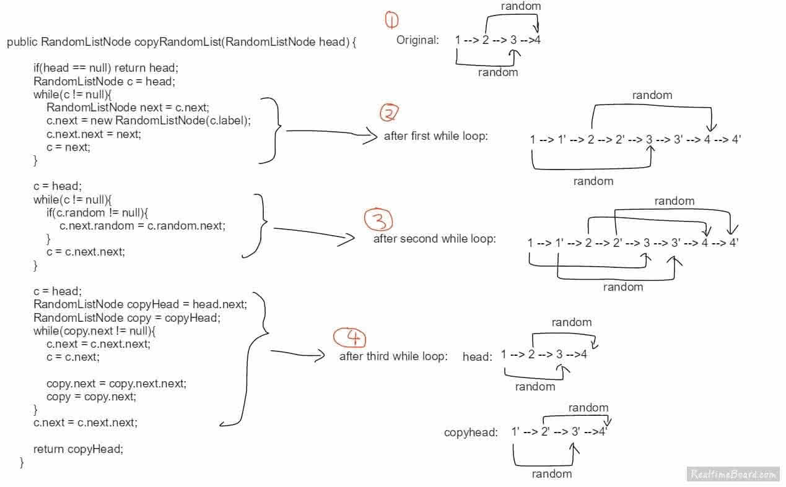
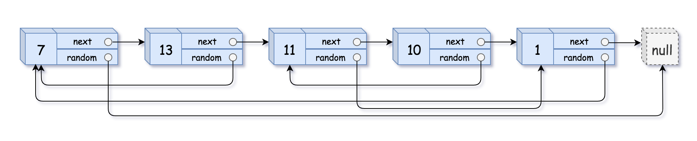

== 138. Copy List with Random Pointer

https://leetcode.com/problems/copy-list-with-random-pointer/[LeetCode - Copy List with Random Pointer]

video::OvpKeraoxW0[youtube]

这个解法非常精妙！

使用 `Map` 的解法也好巧妙啊！

A linked list is given such that each node contains an additional random pointer which could point to any node in the list or null.

Return a https://en.wikipedia.org/wiki/Object_copying#Deep_copy[*deep copy*] of the list.

The Linked List is represented in the input/output as a list of `n` nodes. Each node is represented as a pair of `[val, random_index]` where:

* `val`: an integer representing `Node.val`
* `random_index`: the index of the node (range from `0` to `n-1`) where random pointer points to, or `null` if it does not point to any node.

 
*Example 1:*

[subs="verbatim,quotes"]
----
*Input:* head = [[7,null],[13,0],[11,4],[10,2],[1,0]]
*Output:* [[7,null],[13,0],[11,4],[10,2],[1,0]]
----

*Example 2:*

[subs="verbatim,quotes"]
----
*Input:* head = [[1,1],[2,1]]
*Output:* [[1,1],[2,1]]
----

*Example 3:*

**

[subs="verbatim,quotes"]
----
*Input:* head = [[3,null],[3,0],[3,null]]
*Output:* [[3,null],[3,0],[3,null]]
----

*Example 4:*

[subs="verbatim,quotes"]
----
*Input:* head = []
*Output:* []
*Explanation:* Given linked list is empty (null pointer), so return null.
----

 
*Constraints:*

* `-10000 <= Node.val <= 10000`
* `Node.random` is null or pointing to a node in the linked list.
* Number of Nodes will not exceed 1000.

