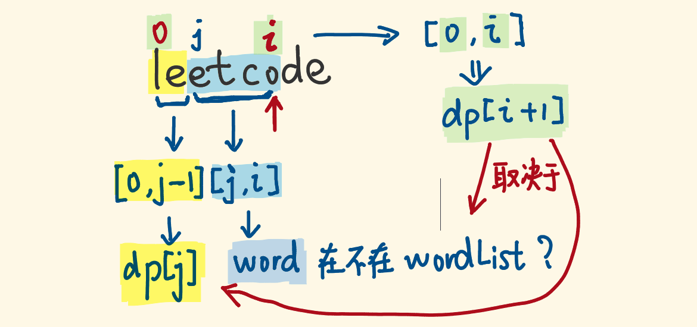

[#0139-word-break]
= 139. 单词拆分

https://leetcode.cn/problems/word-break/[LeetCode - 139. 单词拆分 ^]

给你一个字符串 `s` 和一个字符串列表 `wordDict` 作为字典。如果可以利用字典中出现的一个或多个单词拼接出 `s` 则返回 `true`。

**注意：**不要求字典中出现的单词全部都使用，并且字典中的单词可以重复使用。

*示例 1：*

....
输入: s = "leetcode", wordDict = ["leet", "code"]
输出: true
解释: 返回 true 因为 "leetcode" 可以由 "leet" 和 "code" 拼接成。
....

*示例 2：*

....
输入: s = "applepenapple", wordDict = ["apple", "pen"]
输出: true
解释: 返回 true 因为 "applepenapple" 可以由 "apple" "pen" "apple" 拼接成。
     注意，你可以重复使用字典中的单词。
....

*示例 3：*

....
输入: s = "catsandog", wordDict = ["cats", "dog", "sand", "and", "cat"]
输出: false
....

*提示：*

* `+1 <= s.length <= 300+`
* `+1 <= wordDict.length <= 1000+`
* `+1 <= wordDict[i].length <= 20+`
* `s` 和 `wordDict[i]` 仅由小写英文字母组成
* `wordDict` 中的所有字符串 *互不相同*

== 思路分析

回溯+备忘录：

image::images/0139-01.png[{image_attr}]

动态规划

image::images/0139-02.png[{image_attr}]

image::images/0139-03.png[{image_attr}]

我的思路：

stem:[dp\[i+j\] = dp\[i\] & s\[i, i+j\] in dict]

从 stem:[0] 到 stem:[i] 已经确定。从当前位置 stem:[i] 向前推进到 stem:[i+j]，其中 stem:[j] 是某个一个单词的长度。

[[src-0139]]
[tabs]
====
一刷::
+
--
[{java_src_attr}]
----
include::{sourcedir}/_0139_WordBreak.java[tag=answer]
----
--

二刷（回溯+备忘录）::
+
--
[{java_src_attr}]
----
include::{sourcedir}/_0139_WordBreak_20.java[tag=answer]
----
--

二刷（动态规划）::
+
--
[{java_src_attr}]
----
include::{sourcedir}/_0139_WordBreak_21.java[tag=answer]
----
--
====

== 参考资料

. https://leetcode.cn/problems/word-break/solutions/302779/shou-hui-tu-jie-san-chong-fang-fa-dfs-bfs-dong-tai/[139. 单词拆分 - 「手画图解」剖析三种解法: DFS, BFS, 动态规划^] -- 这个题解非常好，从回溯，到加备忘录
. https://leetcode.cn/problems/word-break/solutions/50986/dong-tai-gui-hua-ji-yi-hua-hui-su-zhu-xing-jie-shi/[139. 单词拆分 - 动态规划+记忆化回溯 逐行解释 Python3^]
