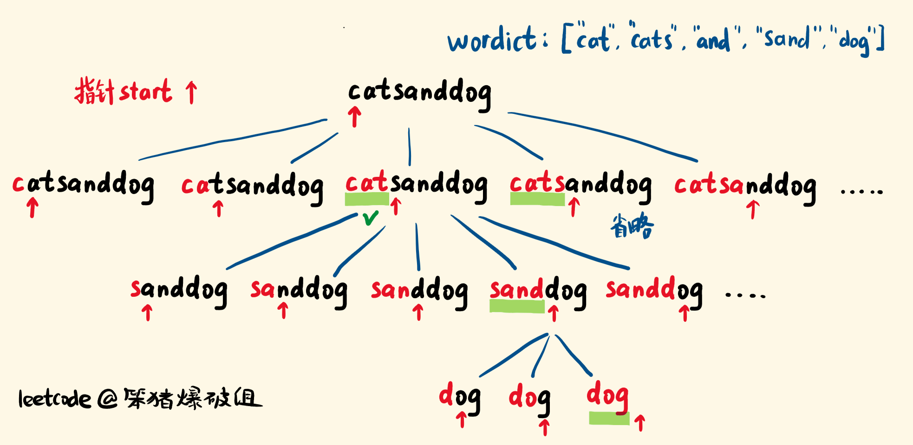

[#0140-word-break-ii]
= 140. 单词拆分 II

https://leetcode.cn/problems/word-break-ii/[LeetCode - 140. 单词拆分 II ^]

给定一个字符串 `s` 和一个字符串字典 `wordDict`，在字符串 `s` 中增加空格来构建一个句子，使得句子中所有的单词都在词典中。*以任意顺序* 返回所有这些可能的句子。

**注意：**词典中的同一个单词可能在分段中被重复使用多次。

*示例 1：*

....
输入:s = "catsanddog", wordDict = ["cat","cats","and","sand","dog"]
输出:["cats and dog","cat sand dog"]
....

*示例 2：*

....
输入:s = "pineapplepenapple", wordDict = ["apple","pen","applepen","pine","pineapple"]
输出:["pine apple pen apple","pineapple pen apple","pine applepen apple"]
解释: 注意你可以重复使用字典中的单词。
....

*示例 3：*

....
输入:s = "catsandog", wordDict = ["cats","dog","sand","and","cat"]
输出:[]
....

*提示：*

* `+1 <= s.length <= 20+`
* `+1 <= wordDict.length <= 1000+`
* `+1 <= wordDict[i].length <= 10+`
* `s` 和 `wordDict[i]` 仅有小写英文字母组成
* `wordDict` 中所有字符串都 *不同*

== 思路分析

看到所有可能就知道是回溯。

使用 xref:0139-word-break.adoc[139. Word Break] 中的提到的回溯模式即可，感觉还不如 xref:0139-word-break.adoc[139. Word Break] 更有挑战。

[[src-0140]]
[tabs]
====
一刷::
+
--
[{java_src_attr}]
----
include::{sourcedir}/_0140_WordBreakIi.java[tag=answer]
----
--

// 二刷::
// +
// --
// [{java_src_attr}]
// ----
// include::{sourcedir}/_0140_WordBreakIi_2.java[tag=answer]
// ----
// --
====

== 思考题

探索一下如何加上备忘录提高效率？

== 参考资料

. https://leetcode.cn/problems/word-break-ii/solutions/468624/shou-hua-tu-jie-dan-ci-chai-fen-ii-cong-di-gui-dao/[140. 单词拆分 II - 「手画图解」单词拆分 II | 记忆化递归 | 思路剖析^]
