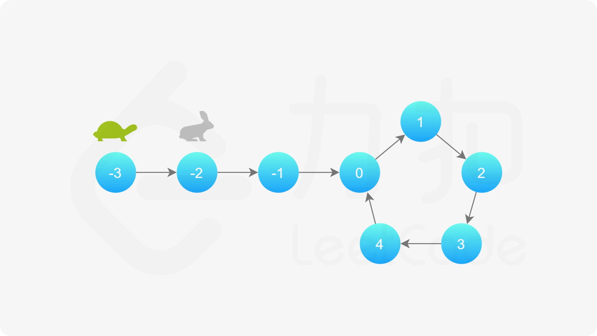
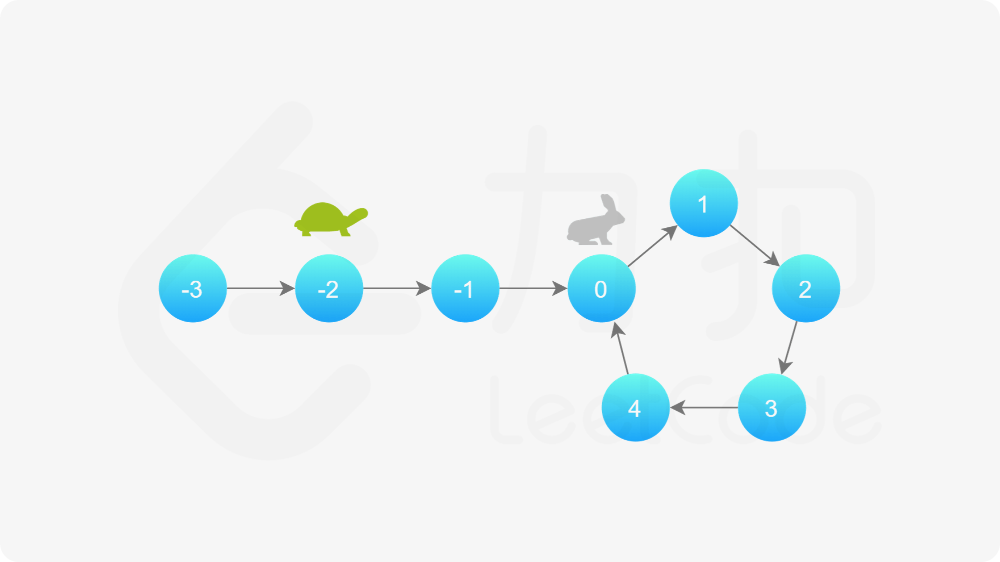
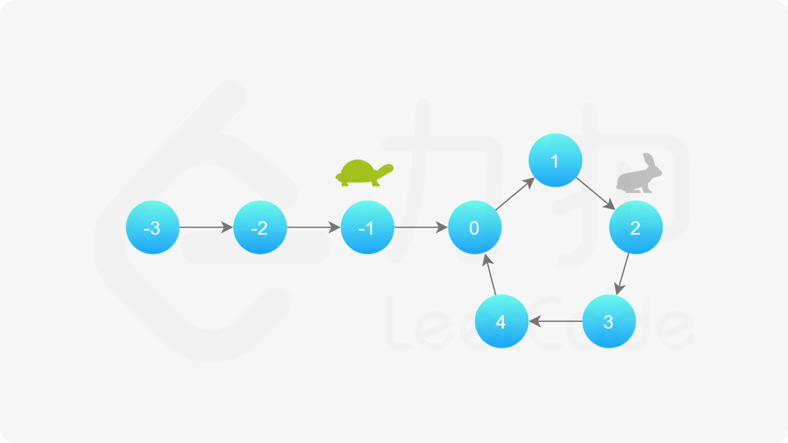
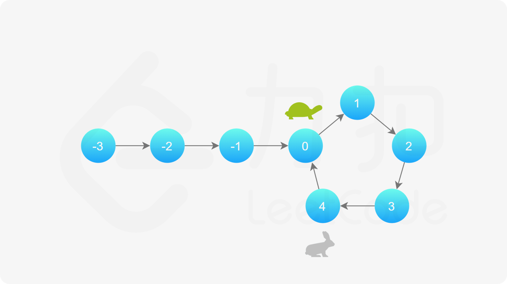
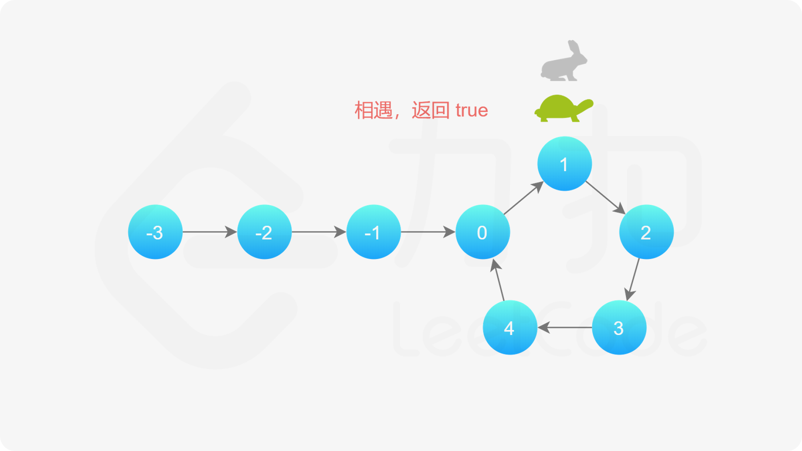

[#0141-linked-list-cycle]
= 141. Linked List Cycle

https://leetcode.com/problems/linked-list-cycle/[LeetCode - Linked List Cycle]

Given a linked list, determine if it has a cycle in it.

To represent a cycle in the given linked list, we use an integer `pos` which represents the position (0-indexed) in the linked list where tail connects to. If `pos` is `-1`, then there is no cycle in the linked list.

*Example 1:*

[subs="verbatim,quotes,macros"]
----
*Input:* head = [3,2,0,-4], pos = 1
*Output:* true
*Explanation:* There is a cycle in the linked list, where tail connects to the second node.
----

image::images/0141-00.png[{image_attr}]

*Example 2:*

[subs="verbatim,quotes,macros"]
----
*Input:* head = [1,2], pos = 0
*Output:* true
*Explanation:* There is a cycle in the linked list, where tail connects to the first node.
----

image::images/0141-01.png[{image_attr}]

*Example 3:*

[subs="verbatim,quotes,macros"]
----
*Input:* head = [1], pos = -1
*Output:* false
*Explanation:* There is no cycle in the linked list.
----

*Follow up:*

Can you solve it using _O(1)_ (i.e. constant) memory?

== 思路分析

除了双指针外，还可以使用 `Map` 来解决。只是空间复杂度要高一些。

[[src-0141]]
[{java_src_attr}]
----
include::{sourcedir}/_0141_LinkedListCycle.java[]
----

[{java_src_attr}]
----
include::{sourcedir}/_0141_LinkedListCycle_2.java[]
----

== 参考资料

. https://leetcode.cn/problems/linked-list-cycle/solutions/440042/huan-xing-lian-biao-by-leetcode-solution/[141. 环形链表 - 官方题解^]
. https://leetcode.cn/problems/linked-list-cycle/solutions/175734/yi-wen-gao-ding-chang-jian-de-lian-biao-wen-ti-h-2/[141. 环形链表 - 一文搞定常见的链表问题^]

