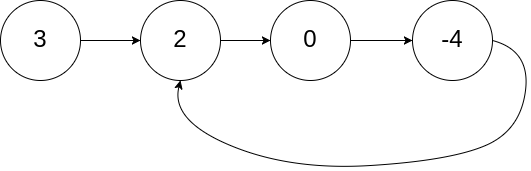
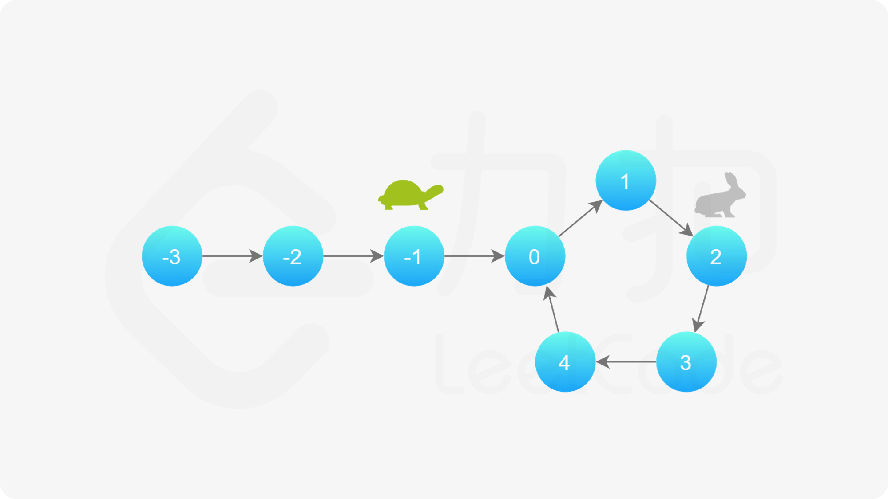

[#0141-linked-list-cycle]
= 141. 环形链表

https://leetcode.cn/problems/linked-list-cycle/[LeetCode - 141. 环形链表 ^]

给你一个链表的头节点 `head` ，判断链表中是否有环。

如果链表中有某个节点，可以通过连续跟踪 `next` 指针再次到达，则链表中存在环。为了表示给定链表中的环，评测系统内部使用整数 `pos` 来表示链表尾连接到链表中的位置（索引从 0 开始）。*注意：`pos` 不作为参数进行传递*。仅仅是为了标识链表的实际情况。

_如果链表中存在环_ ，则返回 `true` 。 否则，返回 `false` 。

*示例 1：*

....
输入：head = [3,2,0,-4], pos = 1
输出：true
解释：链表中有一个环，其尾部连接到第二个节点。
....

*示例 2：*

image::images/0141-01.png[{image_attr}]

....
输入：head = [1,2], pos = 0
输出：true
解释：链表中有一个环，其尾部连接到第一个节点。
....

*示例 3：*

image::images/0141-03.png[{image_attr}]

....
输入：head = [1], pos = -1
输出：false
解释：链表中没有环。
....

*提示：*

* 链表中节点的数目范围是 `[0, 10^4^]`
* `-10^5^ \<= Node.val \<= 10^5^`
* `pos` 为 `-1` 或者链表中的一个 *有效索引* 。

**进阶：**你能用 stem:[O(1)]（即，常量）内存解决此问题吗？

== 思路分析

除了双指针外，还可以使用 `Map` 来解决。只是空间复杂度要高一些。

image::images/0141-07.png[{image_attr}]

[[src-0141]]
[tabs]
====
一刷::
+
--
[{java_src_attr}]
----
include::{sourcedir}/_0141_LinkedListCycle.java[tag=answer]
----
--

二刷::
+
--
[{java_src_attr}]
----
include::{sourcedir}/_0141_LinkedListCycle_2.java[tag=answer]
----
--

三刷::
+
--
[{java_src_attr}]
----
include::{sourcedir}/_0141_LinkedListCycle_3.java[tag=answer]
----
--
====

== 参考资料

. https://leetcode.cn/problems/linked-list-cycle/solutions/440042/huan-xing-lian-biao-by-leetcode-solution/[141. 环形链表 - 官方题解^]
. https://leetcode.cn/problems/linked-list-cycle/solutions/175734/yi-wen-gao-ding-chang-jian-de-lian-biao-wen-ti-h-2/[141. 环形链表 - 一文搞定常见的链表问题^]

