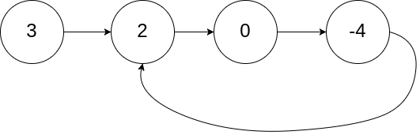
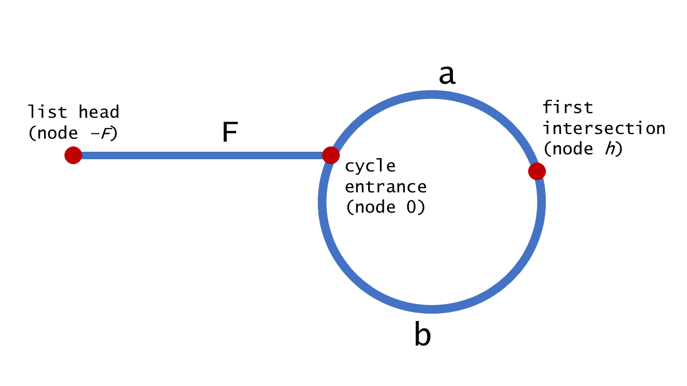

== 142. Linked List Cycle II

:stem: latexmath

https://leetcode.com/problems/linked-list-cycle-ii/[LeetCode - Linked List Cycle II]

Given a linked list, return the node where the cycle begins. If there is no cycle, return `null`.

To represent a cycle in the given linked list, we use an integer `pos` which represents the position (0-indexed) in the linked list where tail connects to. If `pos` is `-1`, then there is no cycle in the linked list.

*Note:* Do not modify the linked list.

.Example 1:
[source]
----
Input: head = [3,2,0,-4], pos = 1
Output: tail connects to node index 1
Explanation: There is a cycle in the linked list, where tail connects to the second node.
----

.Example 2:
[source]
----
Input: head = [1,2], pos = 0
Output: tail connects to node index 0
Explanation: There is a cycle in the linked list, where tail connects to the first node.
----

image::images/0142-2.png[]

.Example 3:
[source]
----
Input: head = [1], pos = -1
Output: no cycle
Explanation: There is no cycle in the linked list.
----

image::images/0142-3.png[]

*Follow-up:*

Can you solve it without using extra space?

=== 解题思路分析

这是 Floyd's Tortoise and Hare (Cycle Detection) 算法。

$$
\begin{aligned}
2 \cdot \text { distance }(\text { tortoise }) &=\text { distance }(\text {hare}) \\
2(F+a) &=F+a+b+a \\
2 F+2 a &=F+2 a+b \\
F &=b
\end{aligned}
$$

这里解释一下：兔子跑的快，相遇时，兔子跑过的距离是乌龟跑过的距离的两倍。兔子沿着环，跑了一圈多，有多跑了 `
` 才相遇，所以距离是： latexmath:[F+a+b+a]。

这个思路还可以用于解决 xref:0287-find-the-duplicate-number.adoc[287. Find the Duplicate Number]。

没想到有这么多环形探测算法！

附加题：尝试其他探测环形算法。

=== 参考资料

. https://en.wikipedia.org/wiki/Cycle_detection[Cycle detection - Wikipedia]
. https://leetcode-cn.com/problems/linked-list-cycle-ii/solution/huan-xing-lian-biao-ii-by-leetcode/[环形链表 II - 环形链表 II - 力扣（LeetCode）]

Given a linked list, return the node where the cycle begins. If there is no cycle, return `null`.

To represent a cycle in the given linked list, we use an integer `pos` which represents the position (0-indexed) in the linked list where tail connects to. If `pos` is `-1`, then there is no cycle in the linked list.

*Note:* Do not modify the linked list.

 

*Example 1:*

[subs="verbatim,quotes,macros"]
----
*Input:* head = [3,2,0,-4], pos = 1
*Output:* tail connects to node index 1
*Explanation:* There is a cycle in the linked list, where tail connects to the second node.
----

image::https://assets.leetcode.com/uploads/2018/12/07/circularlinkedlist.png[]

*Example 2:*

[subs="verbatim,quotes,macros"]
----
*Input:* head = [1,2], pos = 0
*Output:* tail connects to node index 0
*Explanation:* There is a cycle in the linked list, where tail connects to the first node.
----

image::https://assets.leetcode.com/uploads/2018/12/07/circularlinkedlist_test2.png[]

*Example 3:*

[subs="verbatim,quotes,macros"]
----
*Input:* head = [1], pos = -1
*Output:* no cycle
*Explanation:* There is no cycle in the linked list.
----

image::https://assets.leetcode.com/uploads/2018/12/07/circularlinkedlist_test3.png[]

 

*Follow-up*:

Can you solve it without using extra space?

