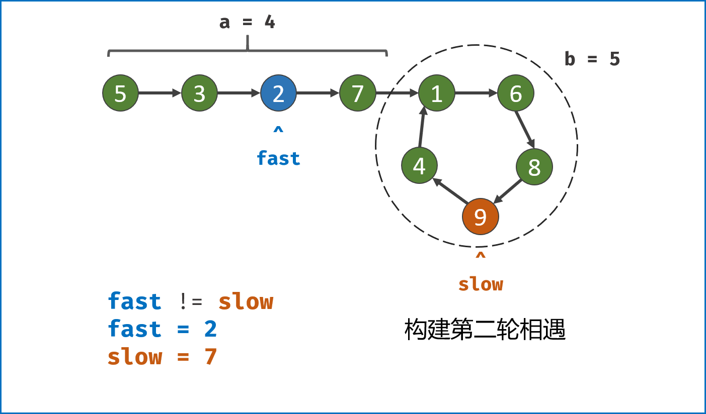

[#0142-linked-list-cycle-ii]
= 142. Linked List Cycle II

:stem: latexmath

https://leetcode.com/problems/linked-list-cycle-ii/[LeetCode - Linked List Cycle II]

Given a linked list, return the node where the cycle begins. If there is no cycle, return `null`.

To represent a cycle in the given linked list, we use an integer `pos` which represents the position (0-indexed) in the linked list where tail connects to. If `pos` is `-1`, then there is no cycle in the linked list.

*Note:* Do not modify the linked list.

.Example 1:
[source]
----
Input: head = [3,2,0,-4], pos = 1
Output: tail connects to node index 1
Explanation: There is a cycle in the linked list, where tail connects to the second node.
----

image::images/0142-01.png[{image_attr}]

.Example 2:
[source]
----
Input: head = [1,2], pos = 0
Output: tail connects to node index 0
Explanation: There is a cycle in the linked list, where tail connects to the first node.
----

image::images/0142-02.png[{image_attr}]

.Example 3:
[source]
----
Input: head = [1], pos = -1
Output: no cycle
Explanation: There is no cycle in the linked list.
----

image::images/0142-03.png[{image_attr}]

*Follow-up:*

Can you solve it without using extra space?

== 思路分析

这是 Floyd's Tortoise and Hare (Cycle Detection) 算法。

image::images/0142-04.png[{image_attr}]

$$
\begin{aligned}
2 \cdot \text { distance }(\text { tortoise }) &=\text { distance }(\text {hare}) \\
2(F+a) &=F+a+b+a \\
2 F+2 a &=F+2 a+b \\
F &=b
\end{aligned}
$$

这里解释一下：兔子跑的快，相遇时，兔子跑过的距离是乌龟跑过的距离的两倍。兔子沿着环，跑了一圈多，有多跑了 `a` 才相遇，所以距离是： latexmath:[F+a+b+a]。

这个思路还可以用于解决 xref:0287-find-the-duplicate-number.adoc[287. Find the Duplicate Number]。

image::images/0142-05.png[{image_attr}]

image::images/0142-06.png[{image_attr}]

image::images/0142-07.png[{image_attr}]

image::images/0142-09.png[{image_attr}]

image::images/0142-11.png[{image_attr}]

image::images/0142-14.png[{image_attr}]

[[src-0142]]
[{java_src_attr}]
----
include::{sourcedir}/_0142_LinkedListCycleII.java[tag=answer]
----

[{java_src_attr}]
----
include::{sourcedir}/_0142_LinkedListCycleII_2.java[tag=answer]
----

== 思考题

没想到有这么多环形探测算法！

尝试其他探测环形算法。

== 参考资料

. https://en.wikipedia.org/wiki/Cycle_detection[Cycle detection - Wikipedia]
. https://leetcode.cn/problems/linked-list-cycle-ii/solutions/441131/huan-xing-lian-biao-ii-by-leetcode-solution/[142. 环形链表 II - 官方题解^]
. https://leetcode.cn/problems/linked-list-cycle-ii/solutions/12616/linked-list-cycle-ii-kuai-man-zhi-zhen-shuang-zhi-/[142. 环形链表 II - 双指针，清晰图解^]

