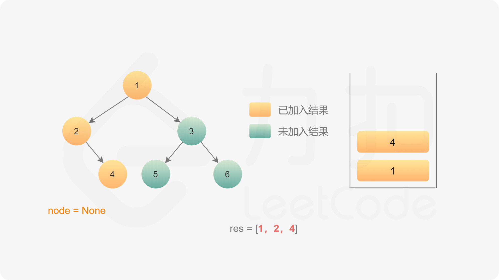
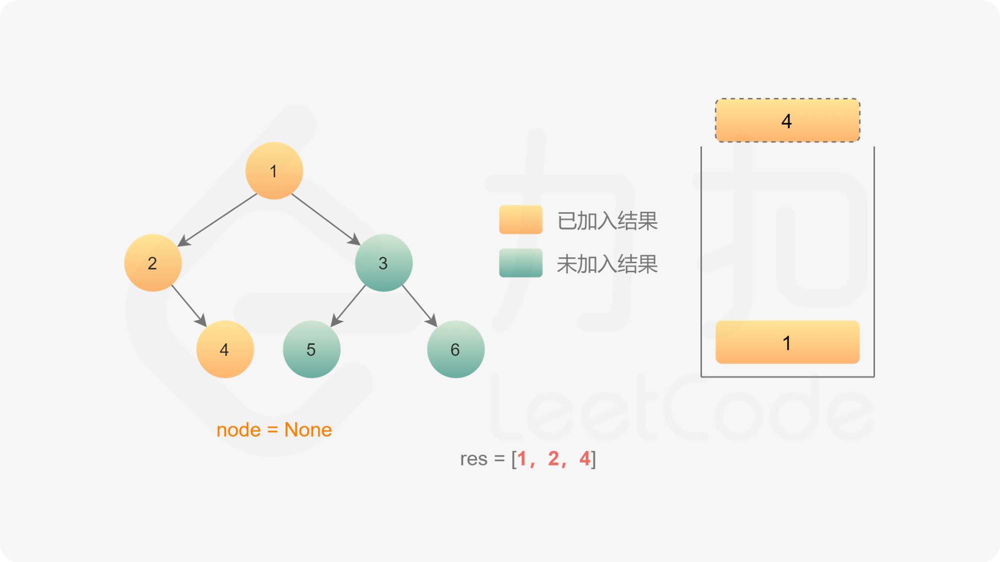
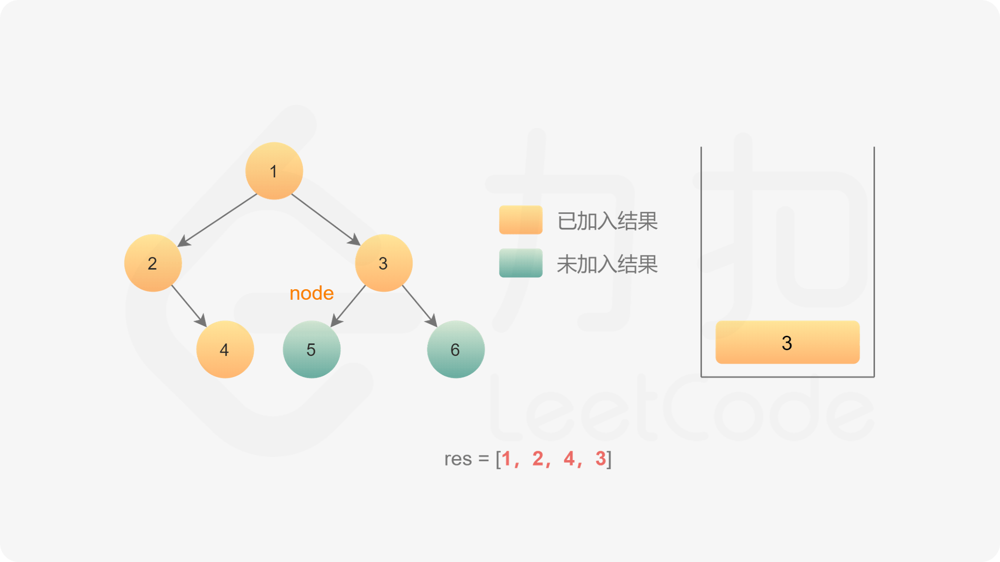
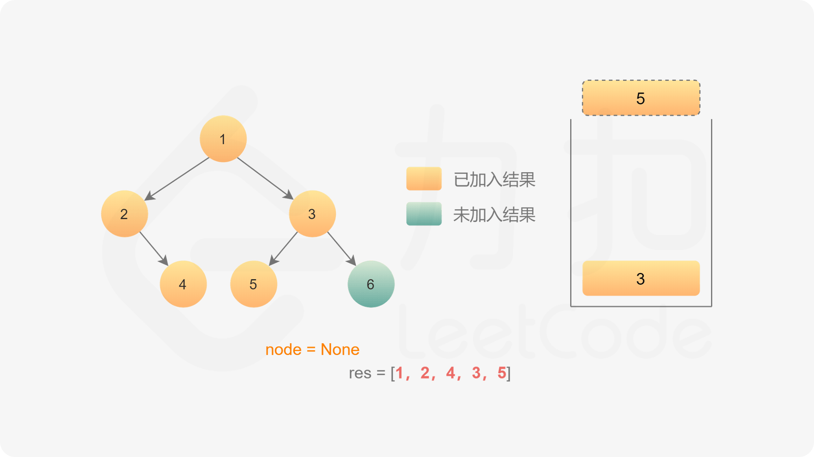
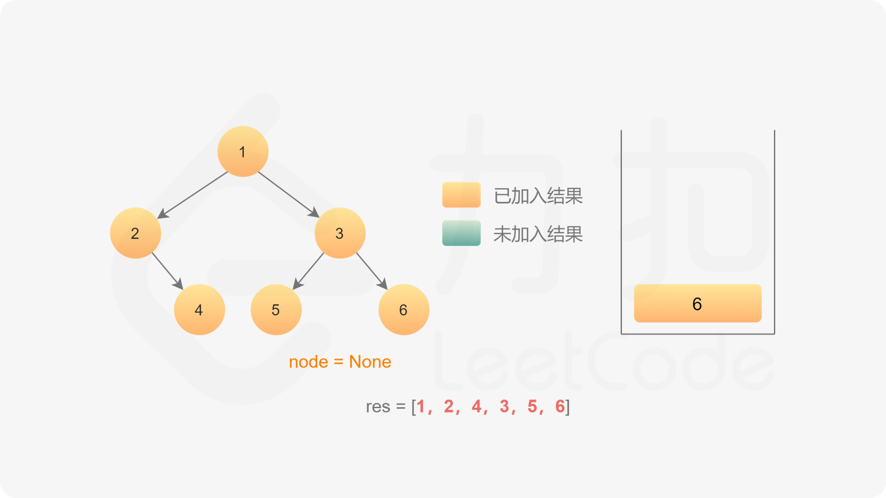
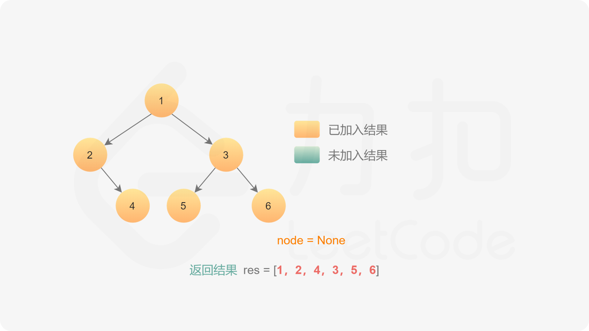

[#0144-binary-tree-preorder-traversal]
= 144. 二叉树的前序遍历

https://leetcode.cn/problems/binary-tree-preorder-traversal/[LeetCode - 144. 二叉树的前序遍历 ^]

给你二叉树的根节点 `root` ，返回它节点值的 *前序* 遍历。

*示例 1：*

*输入：*[.example-io]#root = [1,null,2,3]#

*输出：*[.example-io]#[1,2,3]#

*解释：*

image::images/0144-01.png[{image_attr}]

*示例 2：*

[.example-io]#**输入：**root = [1,2,3,4,5,null,8,null,null,6,7,9]#

[.example-io]#*输出：*[1,2,4,5,6,7,3,8,9]#

*解释：*

image::images/0144-02.png[{image_attr}]

*示例 3：*

[.example-io]#**输入：**root = []#

[.example-io]#*输出：*[]#

*示例 4：*

*输入：*[.example-io]#root = [1]#

[.example-io]#*输出：*[1]#

*提示：*

* 树中节点数目在范围 `[0, 100]` 内
* `+-100 <= Node.val <= 100+`

**进阶：**递归算法很简单，你可以通过迭代算法完成吗？

== 思路分析

凡是用递归能解决的问题，都可以使用遍历来解决。用递归来求解问题，无非就是使用了方法栈来保存相关信息。同样，可以使用 `Stack` 来自己动手维护这些信息。

image::images/0144-11.png[{image_attr}]

image::images/0144-12.png[{image_attr}]

image::images/0144-13.png[{image_attr}]

image::images/0144-14.png[{image_attr}]

image::images/0144-17.png[{image_attr}]

image::images/0144-21.png[{image_attr}]

[[src-0144]]
[tabs]
====
一刷::
+
--
[{java_src_attr}]
----
include::{sourcedir}/_0144_BinaryTreePreorderTraversal.java[tag=answer]
----
--

一刷（迭代）::
+
--
[{java_src_attr}]
----
include::{sourcedir}/_0144_BinaryTreePreorderTraversal_Stack.java[tag=answer]
----
--

二刷::
+
--
[{java_src_attr}]
----
include::{sourcedir}/_0144_BinaryTreePreorderTraversal_Recur.java[tag=answer]
----
--

三刷（Morris遍历）::
+
--
[{java_src_attr}]
----
include::{sourcedir}/_0144_BinaryTreePreorderTraversal_Morris.java[tag=answer]
----
--
====

== 参考资料

. https://leetcode.cn/problems/binary-tree-preorder-traversal/solutions/461821/er-cha-shu-de-qian-xu-bian-li-by-leetcode-solution/[144. 二叉树的前序遍历 - 官方题解^]
. https://leetcode.cn/problems/binary-tree-preorder-traversal/solutions/247053/tu-jie-er-cha-shu-de-si-chong-bian-li-by-z1m/[144. 二叉树的前序遍历 - 图解 二叉树的四种遍历^]
