[#0144-binary-tree-preorder-traversal]
= 144. Binary Tree Preorder Traversal

{leetcode}/problems/binary-tree-preorder-traversal/[LeetCode - Binary Tree Preorder Traversal^]

Given a binary tree, return the _preorder_ traversal of its nodes' values.

*Example:*

[subs="verbatim,quotes,macros"]
----
*Input:* `[1,null,2,3]`
   1
    \
     2
    /
   3

*Output:* `[1,2,3]`
----

*Follow up:* Recursive solution is trivial, could you do it iteratively?

== 解题分析

凡是用递归能解决的问题，都可以使用遍历来解决。用递归来求解问题，无非就是使用了方法栈来保存相关信息。同样，可以使用 `Stack` 来自己动手维护这些信息。

[[src-0144]]
[{java_src_attr}]
----
include::{sourcedir}/_0144_BinaryTreePreorderTraversal.java[tag=answer]
----

[{java_src_attr}]
----
include::{sourcedir}/_0144_BinaryTreePreorderTraversal_Recur.java[tag=answer]
----

[tabs]
====
一刷::
+
--
[{java_src_attr}]
----
include::{sourcedir}/_0144_BinaryTreePreorderTraversal.java[tag=answer]
----
--

二刷::
+
--
[{java_src_attr}]
----
include::{sourcedir}/_0144_BinaryTreePreorderTraversal_Recur.java[tag=answer]
----
--

二刷（Morris遍历）::
+
--
[{java_src_attr}]
----
include::{sourcedir}/_0144_BinaryTreePreorderTraversal_Morris.java[tag=answer]
----
--
====

== 迭代实现

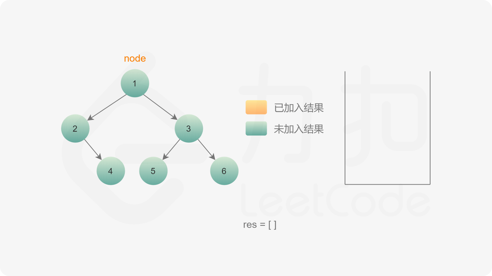

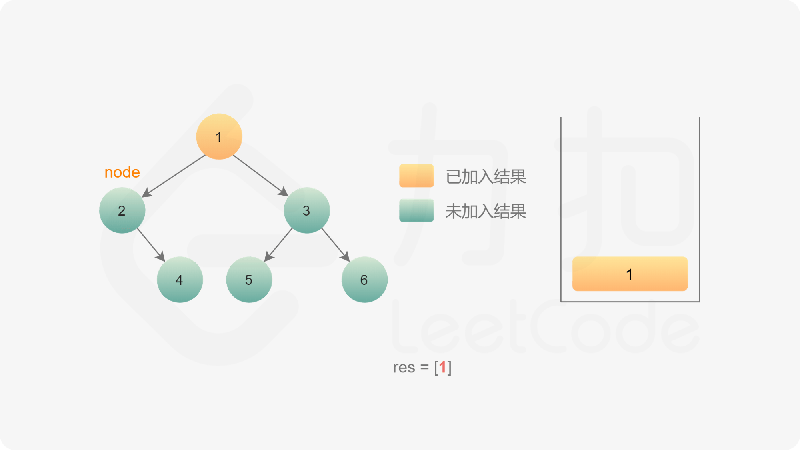

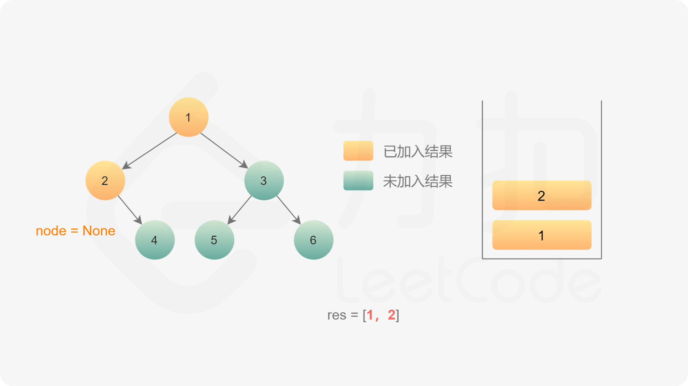

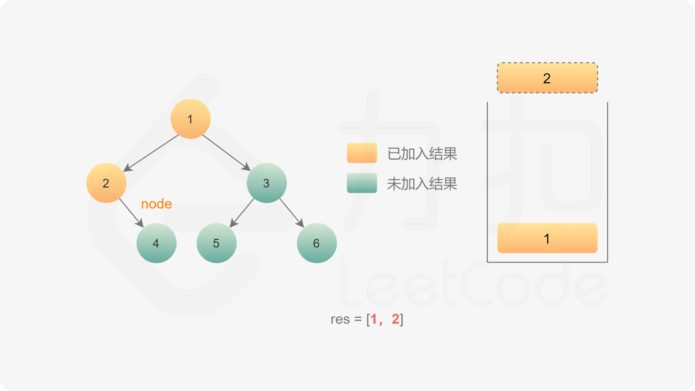

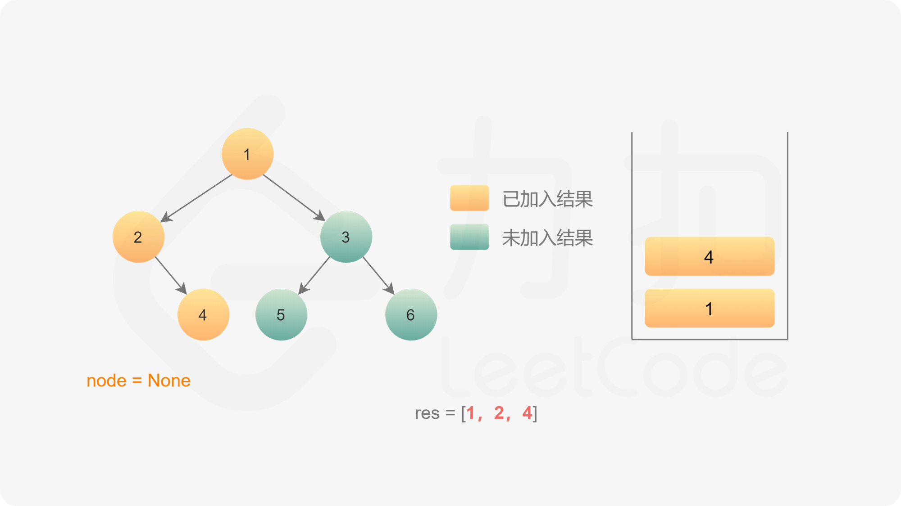

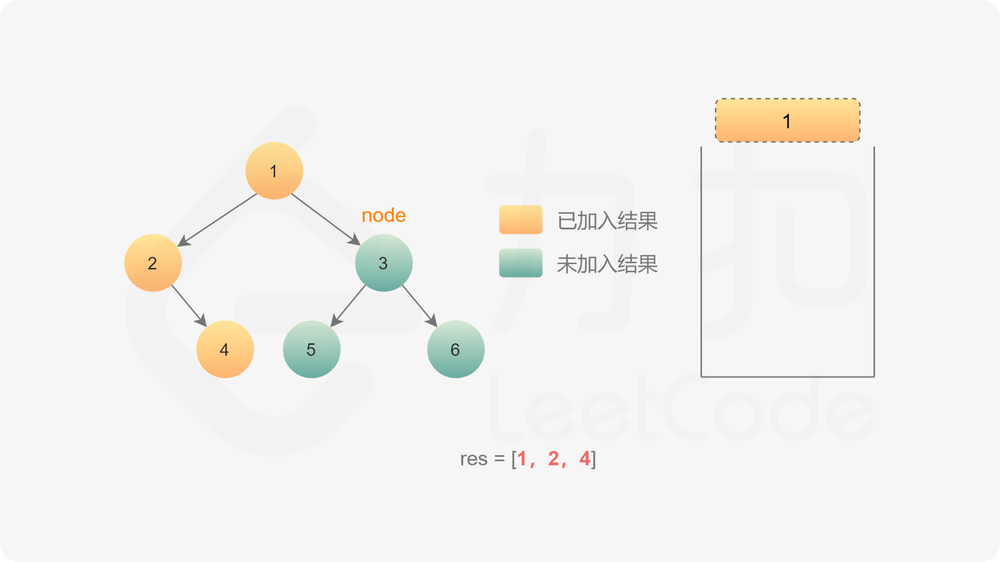

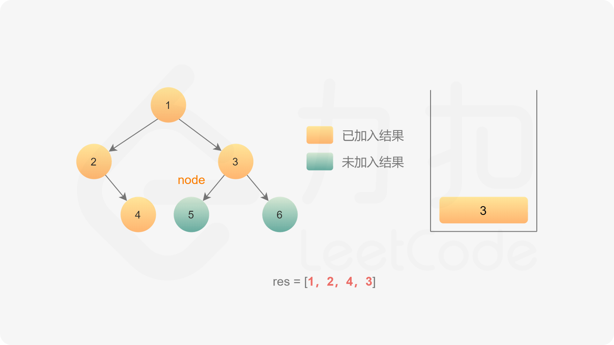

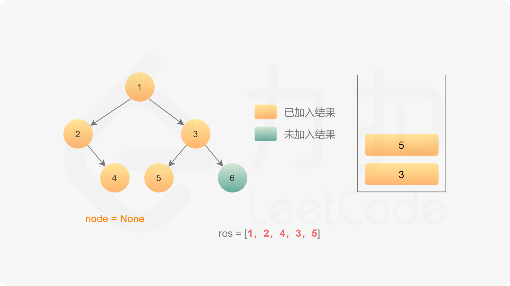

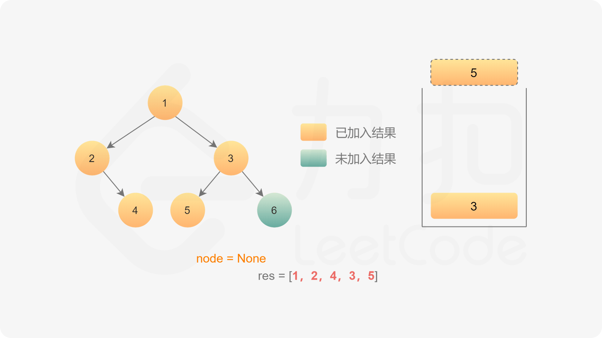

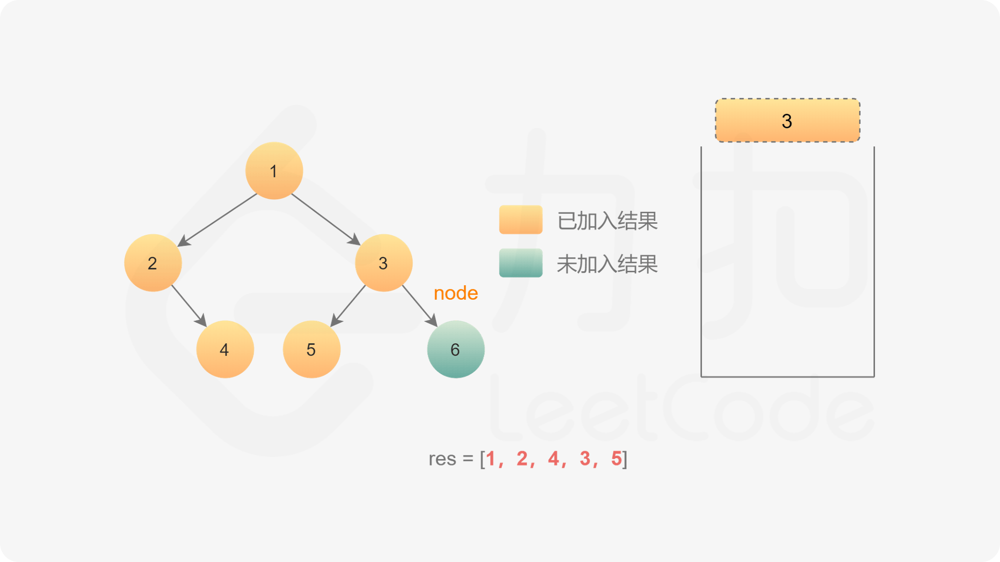

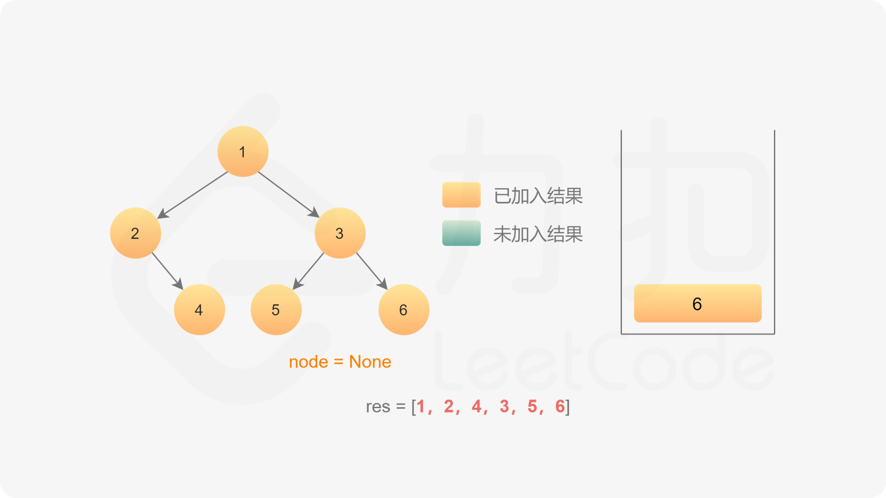

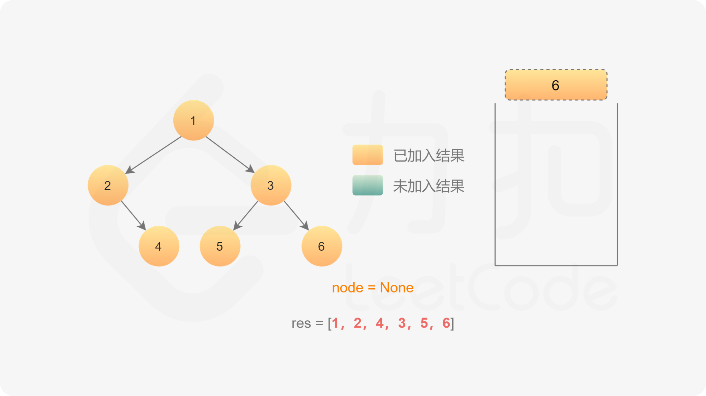

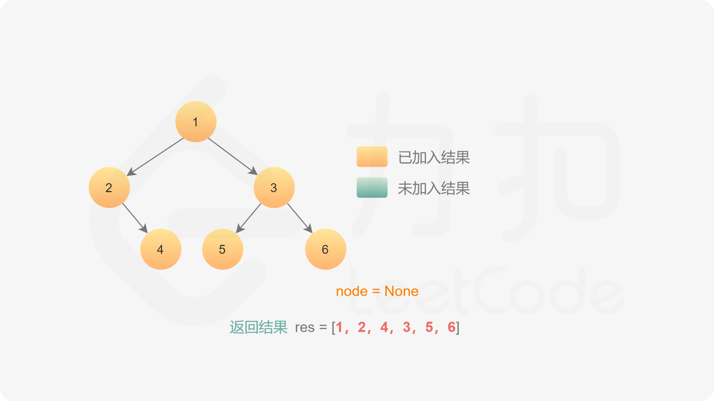

[{java_src_attr}]
----
include::{sourcedir}/_0144_BinaryTreePreorderTraversal_Stack.java[tag=answer]
----

