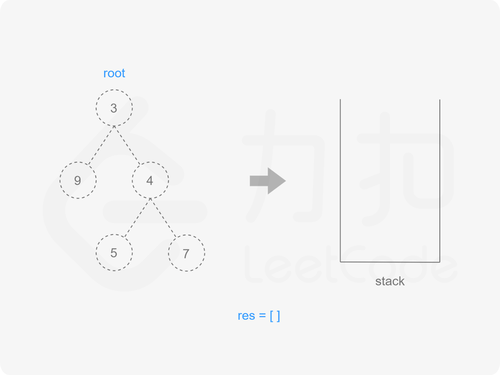
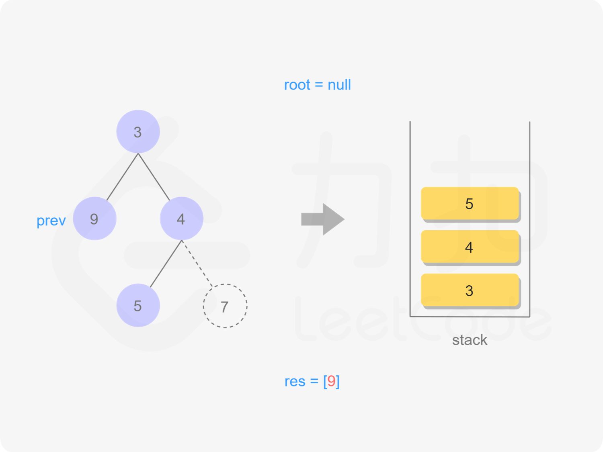
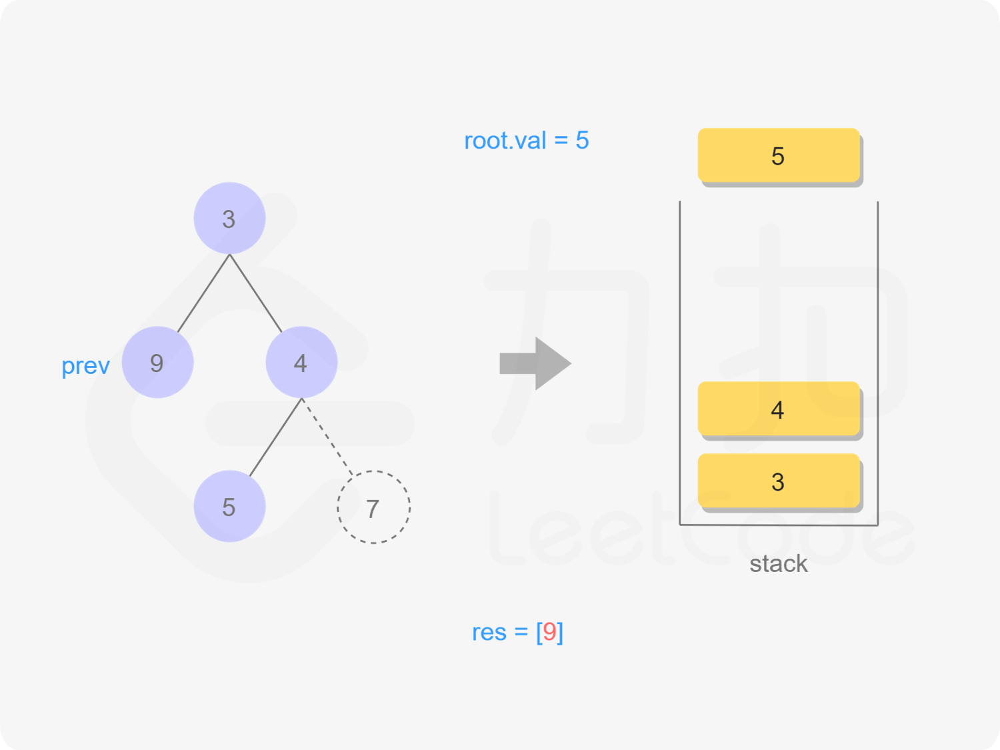
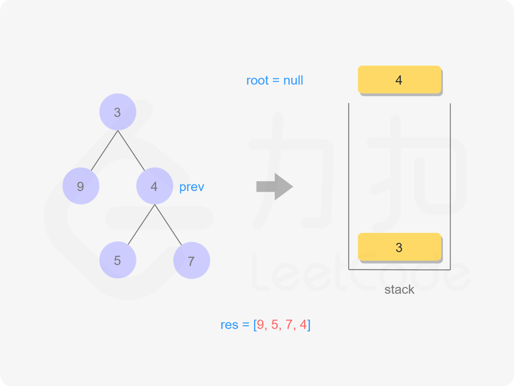

[#0145-binary-tree-postorder-traversal]
= 145. Binary Tree Postorder Traversal

https://leetcode.com/problems/binary-tree-postorder-traversal/[LeetCode - Binary Tree Postorder Traversal]

Given a binary tree, return the _postorder_ traversal of its nodes' values.

*Example:*

[subs="verbatim,quotes,macros"]
----
*Input:* `[1,null,2,3]`
   1
    \
     2
    /
   3

*Output:* `[3,2,1]`
----

*Follow up:* Recursive solution is trivial, could you do it iteratively?

== 解题分析

这个题有些麻烦。

我的解法是使用 `Stack` 和 `Set`（保存处理过子节点，直接弹出，不再处理）。

还可以使用两个 `Stack`。

甚至一个 `Stack`。

[[src-0145]]
[{java_src_attr}]
----
include::{sourcedir}/_0145_BinaryTreePostorderTraversal.java[]
----

[{java_src_attr}]
----
include::{sourcedir}/_0145_BinaryTreePostorderTraversal_Recur.java[]
----

== 迭代实现
TIP: TODO：还需要加强迭代遍历的实现！

核心思想为：

. 每拿到一个 *节点* 就把它保存在 *栈* 中
. 继续对这个节点的 *左子树* 重复 *过程1*，直到左子树为 *空*
. 因为保存在 *栈* 中的节点都遍历了 *左子树* 但是没有遍历 *右子树*，所以对栈中节点 *出栈* 并对它的 *右子树* 重复 *过程1*
. 直到遍历完所有节点

[{java_src_attr}]
----
include::{sourcedir}/_0145_BinaryTreePostorderTraversal_Stack.java[]
----

== 思考题

. 如何使用一个栈来解决这个问题？
. 对比一下前根遍历和后跟遍历的区别。 参考： https://leetcode.cn/problems/binary-tree-postorder-traversal/solutions/12336/die-dai-jie-fa-shi-jian-fu-za-du-onkong-jian-fu-za/[145. 二叉树的后序遍历^]。

