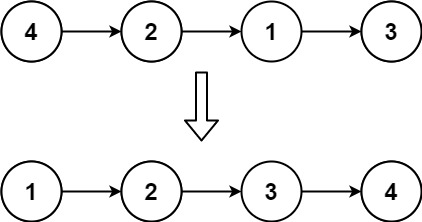

[#0147-insertion-sort-list]
= 147. 对链表进行插入排序

https://leetcode.cn/problems/insertion-sort-list/[LeetCode - 147. 对链表进行插入排序 ^]

给定单个链表的头 `head`，使用 *插入排序* 对链表进行排序，并返回 _排序后链表的头_。

*插入排序* 算法的步骤:

. 插入排序是迭代的，每次只移动一个元素，直到所有元素可以形成一个有序的输出列表。
. 每次迭代中，插入排序只从输入数据中移除一个待排序的元素，找到它在序列中适当的位置，并将其插入。
. 重复直到所有输入数据插入完为止。

下面是插入排序算法的一个图形示例。部分排序的列表(黑色)最初只包含列表中的第一个元素。每次迭代时，从输入数据中删除一个元素(红色)，并就地插入已排序的列表中。

对链表进行插入排序。

image::images/0147-01.gif[{image_attr}]

*示例 1：*

....
输入: head = [4,2,1,3]
输出: [1,2,3,4]
....

*示例 2：*

image::images/0147-03.png[{image_attr}]

....
输入: head = [-1,5,3,4,0]
输出: [-1,0,3,4,5]
....

*提示：*

* 列表中的节点数在 `[1, 5000]`范围内
* `+-5000 <= Node.val <= 5000+`

== 思路分析

首先建立虚拟头节点（头结点的值要足够小），然后从头节点向后遍历，遇到当前值比前一个节点值小，则把这个值摘出来，从头结点向后寻找插入位置。

另外，只有在当前节点比前一个节点大时才需要向后移动当前节点。当大小相反时，因为把当前节点摘出来了，前一个节点的下一个节点的值已经发生了变化。

[[src-0147]]
[tabs]
====
一刷::
+
--
[{java_src_attr}]
----
include::{sourcedir}/_0147_InsertionSortList.java[tag=answer]
----
--

// 二刷::
// +
// --
// [{java_src_attr}]
// ----
// include::{sourcedir}/_0147_InsertionSortList_2.java[tag=answer]
// ----
// --
====

== 参考资料

. https://leetcode.cn/problems/insertion-sort-list/solutions/491124/dui-lian-biao-jin-xing-cha-ru-pai-xu-by-leetcode-s/[147. 对链表进行插入排序 - 官方题解^]
. https://leetcode.cn/problems/insertion-sort-list/solutions/491483/wei-tu-jie-147dui-lian-biao-jin-xing-cha-ru-pai-xu/[147. 对链表进行插入排序 - 「图解」朴素思路，过程演示^]
